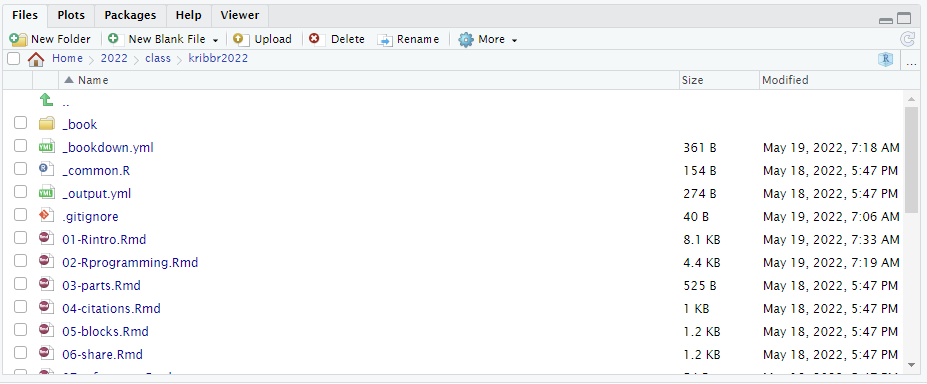

# R/Rstudio basics

## What is R / Rstudio

{width=100}

R은 통계나 생물통계, 유전학을 연구하는 사람들 사이에서 널리 사용되는 오픈소스 프로그래밍 언어 입니다. Bell Lab에서 개발한 S 언어에서 유래했으며 많은 라이브러리 (다른 사람들이 만들어 놓은 코드)가 있어서 쉽게 가져다 사용할 수 있습니다. R은 복잡한 수식이나 통계 알고리즘을 간단히 구현하고 사용할 수 있으며 C, C++, Python 등 다른 언어들과의 병행 사용도 가능합니다. R은 IEEE에서 조사하는 Top programming languages에서 2018년 7위, 2019년 5위, 2020년 6위, 2021년 7위로 꾸준히 높은 사용자를 확보하며 빅데이터, AI 시대의 주요한 프로그래밍 언어로 사용되고 있습니다.

{width=250px}

R은 데이터를 통계분석에 널리 사용되는데 이는 데이터를 눈으로 확인하기 위한 visualization 이나 벡터 연산 등의 강력한 기능 때문에 점점 더 많은 사람들이 사용하고 있습니다. 기존에는 속도나 확장성이 다른 언어들에 비해 단점으로 지적되었으나 R 언어의 계속적인 개발과 업데이트로 이러한 단점들이 빠르게 보완되고 있습니다. R 사용을 위해서는 R 언어의 코어 프로그램을 먼저 설치하고 그 다음 R 언어용 IDE(Integrated Development Environment)인 RStudio 설치가 필요합니다.

{width=150px}

Rstudio는 R 언어를 위한 오픈소스 기반 통합개발환경(IDE)으로 R 프로그래밍을 위한 편리한 기능들을 제공해 줍니다. R언어가 주목을 받고 두터운 사용자 층을 확보할 수 있게된 핵심 동력이 Rstudio 입니다. 자체적으로 최고수준의 오픈소스 개발팀이 있으며 `tidyverse`, \``,`shiny\` 등의 데이터 분석 관련 주요 패키지를 개발하였고 정기적으로 conference 개최를 하면서 기술 보급의 핵심 역할을 하고 있습니다.

{width="550px"}

## R / Rstudio Installation

### R 설치

-   R 사이트에 접속 후 (<https://www.r-project.org/>) 좌측 메뉴 상단에 위치한 CRAN 클릭.
-   미러 사이트 목록에서 Korea의 아무 사이트나 들어감
-   Download R for Windows를 클릭 후 base 링크 들어가서
-   Download R x.x.x for Windows 링크 클릭으로 실행 프로그램 다운로드
-   로컬 컴퓨터에 Download 된 R-x.x.x-win.exe 를 실행 (2022.5 현재 R 버전은 4.2.0).
-   설치 프로그램의 지시에 따라 R 언어 소프트웨어 설치를 완료

### Rstudio 설치

-   사이트에 접속 (<https://www.rstudio.com/>), 상단의 Products \> RStudio 클릭
-   RStudio Desktop 선택
-   Download RStudio Desktop 클릭
-   RStudio Desktop Free 버전의 Download를 선택하고
-   Download RStudio for Windows 클릭, 다운로드
-   로컬 컴퓨터에 다운로드된 RStudio-x.x.x.exe 실행 (2022.5 현재 RStudio Desktop 2022.02.2+485)
-   설치 가이드에 따라 설치 완료

## Rstudio interface

{width="500px"}

-   기본 화면에서 좌측 상단의 공간은 코드편집창, 좌측 하단은 콘솔창
-   각 위치를 기호에 따라서 바꿀 수 있음 (View --\> Pane)

### Keyboard shortcuts

-   참고사이트
    -   <https://support.rstudio.com/hc/en-us/articles/200711853-Keyboard-Shortcuts>
    -   Tools --\> Keyboard shortcut Quick Reference (`Alt + Shift + K`)
-   코드편집창 이동 (`Ctrl + 1`) 콘솔창 이동(`Ctrl + 2`)
-   한 줄 실행 (`Ctrl + Enter`)
-   저장 (`Ctrl + S`)
-   주석처리 (`Ctrl + Shift + C`)
    -   또는 `#`으로 시작하는 라인
-   텝 이동 (`Ctrl + F11`, `Ctrl + F12`)
-   코드편집창 확대 (`Shift + Ctrl + 1`) 콘솔창 확대 (`Shift + Ctrl + 2`)
-   컬럼 편집 (`Alt + 마우스 드레그`)
-   자동 완성 기능 (Tab completion) in RStudio

::: rmdnote
**Exercises**

1.  코드편집창에서 다음을 입력/실행하고 단축키를 사용하여 주석을 넣으시오


-   단축키 `Ctrl + enter`로 코드 실행
-   단축키 `Ctrl + 2`로 커서 콘솔창으로 이동
-   `x`값 `x+y`값 확인
-   단축키 `Ctrl + 1`로 코드편집창 이동
-   단축키 `Ctrl + Shift + C` 사용


```r
# x <- 10
# y <- 20
```
:::

### Environment and Files

{width=400}

{width=400}

## Start a project

프로젝트를 만들어서 사용할 경우 파일이나 디렉토리, 내용 등을 쉽게 구분하여 사용 가능합니다. 아래와 같이 임의의 디렉토리에 `kribbR` 이라는 디렉토리를 생성하고 `lecture1` 프로젝트를 만듭니다. 

> File \> New Project \> New Directory \> New Project \> "kribbR" \> Create Project


시작할 때는 해당 디렉토리의 `xxx.Rproj` 파일을 클릭합니다. Rstudio 오른쪽 상단 프로젝트 선택을 통해서 빠르게 다른 프로젝트의 작업공간으로 이동할 수 있습니다. 


### Hello world

> File \> New File \> R markdown  \> OK


```r
mystring <- "Hello \n world!"
cat(mystring)
print(mystring)
```


## Getting help

R은 방대한 양의 도움말 데이터를 제공하며 다음과 같은 명령어로 특정 함수의 도움말과 예제를 찾아볼 수 있습니다. `?` 명령을 사용하면 되며 구글이나 웹에서도 도움을 얻을 수 있습니다. 


```r
help("mean")
?mean
example("mean")
help.search("mean")
??mean
help(package="MASS")
```

또한 <https://www.rstudio.com/resources/cheatsheets/> 에서는 다양한 R언어의 기능을 한 눈에 알아볼 수 있게 만든 cheatsheet 형태의 문서를 참고할 수 있습니다. 

{width="550px"} 
{width="550px"}

## R packages and Dataset

R 패키지는 함수와 데이터셋의 묶음으로 다른 사람들이 만들어 놓은 코드나 기능을 가져와서 사용하므로써 코드 작성의 수고로움을 줄이고 편리하고 검증된 함수(기능)를 빠르게 도입하여 사용할 수 있다는 장점이 있습니다. 예를 들어 `sd()` 함수는 `stats` package에서 제공하는 함수로써 표준편차 계산을 위한 별도의 함수를 만들어서 사용할 필요가 없이 바로 (stats 패키지는 R 기본 패키지로) 별도 설치 없이 바로 사용 가능합니다.  

이러한 패키지는 인터넷의 `repository`에서 구할 수 있으며 대표적인 `repository`는 The Comprehensive R Archive Network (CRAN) (http://cran.r-project.org/web/views/) 와 생물학자를 위한 Bioconductor (http://www.bioconductor.org/) 가 있습니다. 이러한 패키지의 설치는 아래와 같이 RStudio를 이용하거나 콘솔창에서 `install.packages()` 함수를 이용할 수 있습니다. 


{width=450px} 


패키지를 설치하고 사용하기 위해서는 `library()` 함수를 사용해서 관련 명령어를 사용하기 전에 미리 loading 해 두어야 합니다. 한 번 로딩으로 작업 세션이 끝날때까지 관련된 함수를 사용할 수 있으나 R 세션이나 RStudio를 재시작 할 경우 다시 로딩해야 사용할 수 있습니다. 


```r
library(UsingR)
```

- R 설치 디렉토리
- R 패키지 설치 디렉토리


```r
.libPaths()
path.package()
```


{width=450px}


일반적으로 패키지 안에 관련된 데이터도 같이 저장되어 있으며 `data()` 함수를 이용해서 패키지 데이터를 사용자 작업공간에 복사해서 사용 가능합니다. 


```r
head(rivers)
length(rivers)
class(rivers)
data(rivers)
data(package="UsingR")
library(HistData)
head(Cavendish)
str(Cavendish)
head(Cavendish$density2)
```


------


<a rel="license" href="http://creativecommons.org/licenses/by-nc-nd/4.0/"></a><br />이 저작물은 <a rel="license" href="http://creativecommons.org/licenses/by-nc-nd/4.0/">크리에이티브 커먼즈 저작자표시-비영리-변경금지 4.0 국제 라이선스</a>에 따라 이용할 수 있습니다.
