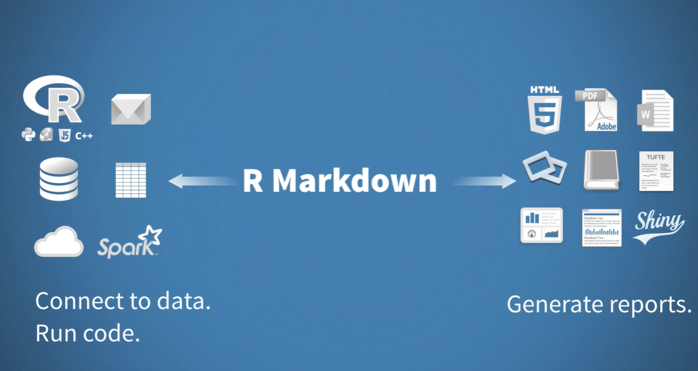
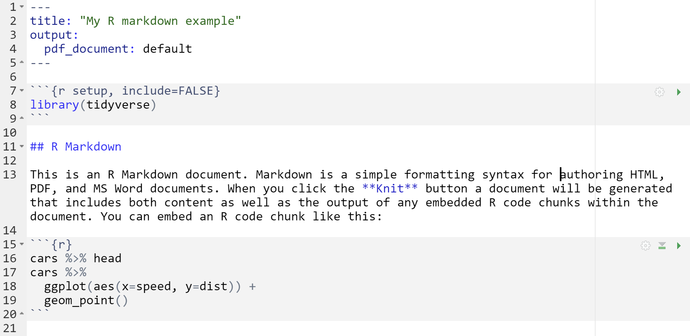
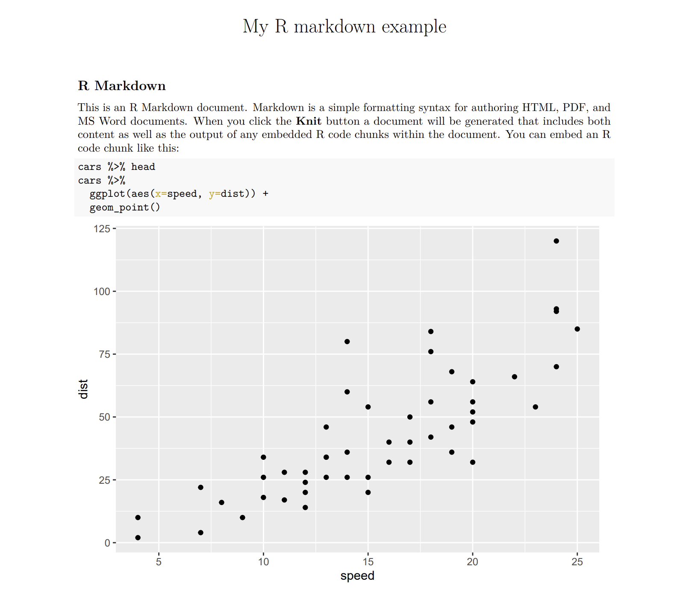

# Rmarkdown

R markdown은 데이터를 분석하는 코드와 리포트를 동시에 수행할 수 있는 일종의 통합 문서입니다. 워드나 아래한글에서 프로그래밍과 데이터분석을 위한 코드를 작성할 수 있는 경우라고 생각해도 됩니다. Plain-text 기반의 markdown 문법을 사용하며 R markdown으로 작성된 문서는 HTML, PDF, MS word, Beamer, HTML5 slides, books, website 등 다양한 포멧의 출력물로 변환할 수 있습니다. 



Rmarkdown 웹사이트에 R markdown 소개 동영상과 [R markdown 공식 사이트 메뉴얼](https://rmarkdown.rstudio.com/lesson-1.html) 관련 서적 [R markdown: The Definitive Guide](https://bookdown.org/yihui/rmarkdown/)를 참고하세요. 또한 R markdown을 사용할 때 [cheatsheet](https://github.com/rstudio/cheatsheets/raw/master/rmarkdown-2.0.pdf)를 옆에 두고 수시로 보면서 사용하시면 많은 도움이 될 수 있습니다.  

## R markdown의 기본 작동 원리

R markdown은 plain text 기반으로 작성되며 Rmd 라는 확장자를 갖는 파일로 저장됩니다. 다음과 같은 텍스트 파일이 Rmd 파일의 전형적인 예 입니다. 

{width=550px} 

위 예제에서 네 가지 다른 종류의 컨텐츠를 볼 수 있습니다. 하나는 - - - 으로 둘러쌓인 내용으로 YAML 이라고 하며 JSON과 같은 데이터 직렬화를 수행하는 하나의 데이터 저장 포멧입니다. 백틱(\`)  으로 둘러쌓인 코드청그(Code Chunks)라고 하는 부분에는 R이나 python 등의 다양한 코드(실재 작동하는)를 넣어서 사용합니다. 그리고 ### 으로 표시된 글은 제목 글을 나타내며 나머지는 일반적인 텍스트를 나타냅니다. 

이러한 R markdown 파일은 `render`라는 명령어로 원하는 포맷의 문서로 변환할 수 있습니다. 다음 예의 파일을 pdf 형식으로 rendering 하기 위해서는 YAML에 pdf 임을 명시하고 아래와 같이 `render`함수를 사용하면 됩니다. 또는 Rstudio 코드 입력창 상단의 Knit 버튼으로 pdf나 html 문서를 생성할 수 있습니다. 

{width=550px} 


```{r, eval=F}
render("examples/test.Rmd", output_format = "pdf_document")
```

{width=550px} 


R markdown의 작동 원리는 Rmd 파일을 만든 후 `render` 함수를 부르면  [knitr](https://yihui.org/knitr/) 소프트웨어가 R 코드를 실행시킨 후 markdown (.md) 파일을 생성합니다. 이 후 .md 파일을 [pandoc](https://pandoc.org/) 이라는 문서변환기가 원하는 문서 형태로 전환해 줍니다.  

## 코드 입력 

R markdown에서 사용하는 코드청크는 CTRL+ALT+I 단축키를 사용해서 넣을 수 있으며 다음과 같은 몇 가지 옵션으로 코드 스니펫들의 실행/숨김 여부를 결정할 수 있습니다. 

- `include = FALSE` : 코드는 실행되지만 보고서에 결과와 코드가 보여지지 않음
- `echo = FALSE` : 코드는 실행되고 보고서에 결과가 포함되지만 코드는 보여지지 않음
- `eval = FALSE` : 코드가 실행되지 않지만 보고서에 코드는 보여짐
- `message = FALSE`, `warning=FALSE`, `error=FALSE` : 코드에 의해서 발생되는 메세지/경고/에러가 보고서에 보여지지 않음
- `fig.cap = "..."` : 코드로 그려지는 그래프에 캡션을 붙일 수 있음


{width=300px} 

```{r}
# default
n <- c(1, 2, 3)
mean(n)
```

```{r, eval=F}
# eval=FALSE
n <- c(1, 2, 3)
mean(n)
```

```{r, echo=F}
# echo=FALSE
n <- c(1, 2, 3)
mean(n)
```


R markdown에서는 `r ` 을 사용해서 코드청크가 아닌 곳에 R 코드를 넣을 수 있습니다. 예를 들어 n은 `r n` 값을 가지는 벡터 입니다. 또한 R 언어 외에도 `Python`, `SQL`, `Bash`, `Rcpp`, `Stan`, `JavaScript`, `CSS` 등의 다양한 프로그래밍 언어에 대해서도 지원합니다. 그런데 이러한 언어들이 사용 가능해지기 위해서는 해당 언어들을 실행해주는 엔진이 있어야 하며 python의 경우 `reticulate` 라는 패키지가 이러한 기능을 담당합니다. 이 패키지를 설치할 경우 miniconda라는 가상환경 및 데이터 분석을 위한 오픈소스 패키지가 자동으로 설치됩니다. 


```{python, eval=F}
x = "hello, python in R"
print(x.split(' '))
```


## Markdown 문법

마크다운은 plain text 기반의 마크업 언어로서 마크업 언어는 태그 등을 이용해서 문서의 데이터 구조를 명시하는데 이러한 태그를 사용하는 방법 체계를 마크업 언어라고 합니다. 가장 대표적으로 html 이 있습니다. 

```
<html>
  <head>
    <title> Hello HTML </title>
  </head>
  <body>
  Hello markup world!
  </body>
</html>

```

마크다운도 몇 가지 태그를 이용해서 문서의 구조를 정의하고 있으며 상세한 내용은 [Pandoc 마크다운 문서](https://rmarkdown.rstudio.com/authoring_pandoc_markdown.html)를 참고하시기 바랍니다. 마크다운언어의 철학은 쉽게 읽고 쓸 수 있는 문서입니다. plain text 기반으로 작성되어 쓰기 쉬우며 (아직도 사람들이 메모장 많이 사용하는 이유와 같습니다) 태그가 포함되어 있어도 읽는데 어려움이 없습니다. html 언어와 rmd 파일의 예를 보시면 그 철학을 어렵지 않게 알 수 있습니다. 

마크다운에서는 Enter를 한 번 입력해서 줄바꿈이 되지 않습니다. `<br>` 또는 문장 마지막에 공백을 두 개 입력하면 되겠습니다. 

이 문장은 줄바꿈이 
되지 않습니다

이 분장은 줄바꿈이  
됩니다


마크다운 테그를 몇 가지 살펴보면 먼저 # 을 붙여서 만드는 header 가 있습니다. 

~~~
# A level-one header
## A level-two header
### A level-three header
~~~

~~~
# A level-one header {#l1-1}
## A level-two header {#l2-1}
### A level-three header {#l3-1}

# A level-one header {#l1-2}
## A level-two header {#l2-2}
### A level-three header {#l3-2}
~~~


Block quotations

> This is block quote. This
> paragraph has two lines


> This is a block quote. This
paragraph has two lines.


> This is a block quote.
>
> > A block quote within a block quote.


>      code with five spaces


*Italic*


**Bold**


[Naver link](https://www.naver.com/)

이미지를 직접 삽입하고 가운데 정렬합니다.

<center>

{width=300}

</center>


1. 첫 번째
2. 두 번째
3. 세 번째


- 아이템 1
- 아이템 2
- 아이템 3
  - 아이템 3-1
  - 아이템 3-2
  
소스코드 그대로 표현하기 위해서는 `~~~` 를 사용합니다. 

~~~
<div>
  소스코드 
</div>
~~~

## YAML 헤더 

R markdown 파일에서 YAML의 가장 중요한 기능은 output 포멧을 지정하는 것이며  title, author, date, 등을 설정할수도 있습니다. 

~~~
---
layout: page
title: "R프로그래밍"
subtitle: "R markdown 활용법"
output:
  html_document:
    css: style.css
    includes:
      in_header: header.html
      after_body: footer.html
    theme: default
    toc: yes
    toc_float: true
    highlight: tango
    code_folding: show
    number_sections: TRUE
mainfont: NanumGothic
---
~~~

## Output format

주요 문서 포멧으로 다음과 같은 몇 가지가 있습니다. 상세한 내용은 [Rmarkdown output format](https://rmarkdown.rstudio.com/lesson-9.html)을 참고하시기 바랍니다. 

- html_document - HTML document w/ Bootstrap CSS
- pdf_document - PDF document (via LaTeX template)
- word_document - Microsoft Word document (docx)
- ioslides_presentation - HTML presentation with ioslides
- beamer_presentation - PDF presentation with LaTeX Beamer
- powerpoint_presentation: PowerPoint presentation


------


<a rel="license" href="http://creativecommons.org/licenses/by-nc-nd/4.0/"></a><br />이 저작물은 <a rel="license" href="http://creativecommons.org/licenses/by-nc-nd/4.0/">크리에이티브 커먼즈 저작자표시-비영리-변경금지 4.0 국제 라이선스</a>에 따라 이용할 수 있습니다.