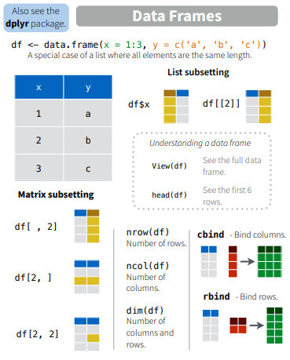
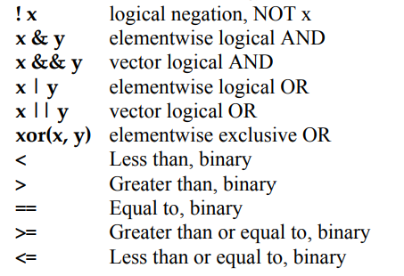

# R programming

## Console calculator

콘솔에서 바로 계산을 수행할 수 있습니다. 참고로 이전에 수행한 명령은 콘솔에 커서가 있는 상태에서 위 아래 화살표를 누르면 볼 수 있고 엔터를 눌러 재사용 할 수 있습니다. `;`을 사용하면 두 개의 명령을 동시에 수행할 수 있습니다. 

$$ 2 + 2 $$
$$ ((2 - 1)^2 + (1 - 3)^2)^{1/2} $$

```{r, eval=FALSE}
2 + 2
((2 – 1)^2 + (1 – 3)^2 )^(1/2)
2 + 2; 2 - 2
```


::: rmdnote
### Exercise {-}

다음 공식들을 계산하는 R 코드를 작성하시오

$$ \sqrt{(4+3)(2+1)} $$

$$ 2^3 + 3^2 $$

$$ \frac{0.25 - 0.2}{\sqrt{0.2 (1-0.2)/100}}$$
:::


## What is a programming language 

{width=600px} 
{width=620px} 

R은 programming language로서 다른 프로그래밍 언어와 같이 몇 가지 공통적 개념을 가집니다 (`변수`, `자료형`, `함수`, `조건문`, `반복문`)


### Terminology

-   Session: R 언어 실행 환경
-   Console: 명령어 입력하는 창
-   Code: R 프로그래밍 변수/제어문 모음
-   Object: 변수, 함수 등 프로그래밍에서 사용되는 모든 객체 (Data structure)
    -   array: 1D, 2D, 3D, ... 형태 값들의 모임
    -   vector: 1차원 형태 값들의 모임 combine function `c()` EX: c(6, 11, 13, 31, 90, 92)
    -   matrix: 2차원 형태 값들의 모임 (같은 타입 값으로 구성) 
    -   data frame: 2차원 형태 값들의 모임 (다른 타입 값 구성 가능)
    -   list:  vector, matrix, data.frame 및 list 등 다양한 객체를 원소로 가집
-   function: 특정 기능 수행, [함수이름, 입력값 (arguments), 출력값 (return)] 으로 구성
-   Data (value): 값 - 자료형 (Data type)
    -   Integers
    -   doubles/numerics
    -   logicals
    -   characters
    -   factor: 범주형
-   Conditionals (조건, 제어):
    -   `if`, `==`, `&` (AND), `|` (OR) Ex: `(2 + 1 == 3) & (2 + 1 == 4)`
    -   `for`, `while`: 반복 수


## Data and variables

### Data

일반적으로 데이터의 의미는 사실을 나타내는 수치입니다.

- 맥도너 정보경제학 (1963)
  + 지혜 (wisdom) : 패턴화된 지식
  + 지식 (knowledge) : 가치있는 정보
  + 정보 (information) : 의미있는 데이터
  + 데이터 (data) : 단순한 사실의 나열


```{r, eval=F}
library(UsingR)
exec.pay
?exec.pay
```


데이터는 속성에 따라서 다음과 같이 분류할 수 있습니다. 

- 범주형 - 질적 데이터, 숫자로 나타낼 수 있으나 의미 없음
  + 명목형 (Nominal) - 사람 이름
  + 순서형 (Ordinal) – 달리기 도착 순서
- 수치형 - 숫자로 나타내며 데이터 속성을 그대로 지님님
  + 구간형 (Interval) – 선수1, 선수2 종점통과 시간
  + 비율형 (Ratio) – 출발시간 기준 종점 통과 시간

{width=400px} 

- Data type in R
  + Numeric (수치형)
    + Discrete (이산형) data - 카운트, 횟수 
    + Continuous (연속형) data - 키, 몸무게, Cannot be shared
    + Date and time 
  + Factors (범주형)
    - Categories to group the data 
    + Character data - Identifiers (범주형)
  
### Variables  

변수는 데이터를 저장하는 공간으로 이해할 수 있습니다. 

- Assignment operator ( `<-` OR `=` )
  - Valid object name `<-` value 
  - 단축키: `Alt + -` (the minus sign)
- 내장 변수 Built-in variables

```{r, eval=FALSE}
x <- 2
y <- x^2 – 2*x + 1
y
x <- "two"  
some_data <- 9.8
pi
```

- 변수이름 작명법 
  - Characters (letters), numbers,  “_”,  “.”
  - A and a are different symbols
  - Names are effectively unlimited in length

```{r, eval=F}
i_use_snake_case <- 1
otherPeopleUseCamelCase <- 2
some.people.use.periods <- 3
And_aFew.People_RENOUNCEconvention <- 4
```


## Object (Data structure)

변수, 함수 등 프로그래밍에서 사용되는 모든 개체를 말합니다. 

### vector

`vector`는 R의 기본 데이터 구조입니다. numeric vector, logical vector, character vector 등 저장되는 값의 타입에 따라 크게 세가지로 나눌 수 있습니다. `class()` 함수를 이용해서 값의 타입을 알아낼 수 있습니다. Combine function인 `c()`를 활용하여 만들며 값을 순차적으로 붙여갈 수 있습니다. 다음과 같은 Univariate (단변량, Single variable)을 표현할 때 사용됩니다. 

$$ x_1, x_2, ..., x_n $$

```{r, eval=FALSE}
x <- c(10.4, 5.6, 3.1, 6.4, 21.7) 
class(x)
y <- c("X1", "Y2",  "X3",  "Y4")
class(y)
z <- c(T, F, F, T)
class(z)
```

#### numeric

numeric 형식의 벡터는 다음과 같은 다양한 편의 함수들을 사용해서 만들수 있습니다. 

```{r, eval=F}
1:5
seq(1,5, by=1)
seq(0, 100, by=10)
seq(0, 100, length.out=11)
?seq

rep(5, times=10)
rep(1:3, times=4)
rep(1:3, each=3)
```


::: rmdnote
#### Exercise {-}
odds라는 이름의 변수에 1부터 100까지의 홀수만을 저장하시오 (`seq()` 함수 사용) 
:::

#### logical

Logical 벡터는 `True` 또는 `False`를 원소로 갖는 벡터 입니다. 앞글자가 대분자로 시작하는 것을 기억하시고 `T` 또는 `F`와 같이 한 문자로 표현할 수도 있습니다. 특정 조건에 대한 판단 결과를 반환할 경우에도 논리값을 사용합니다. 이 경우 조건을 판단 후 인덱싱 방법으로 해당 값들을 뽑아내기도 합니다. 

```{r, eval=F}
is.na(1)
is.numeric(1)
is.logical(TRUE)

x <- 1:20
x > 13
temp <- x > 13
class(temp)

ages <- c(66, 57, 60, 41,  6, 85, 48, 34, 61, 12)
ages < 30
which(ages < 30)
i <- which(ages < 30)
ages[i]
any(ages < 30)
all(ages < 30)
```

::: rmdnote
#### Exercise {-}
1부터 100까지의 수를 n이라는 이름의 변수에 저장하고 이 중 짝수만을 뽑아내서 출력하시오 (`which()`함수 사용) 
:::


#### character

Character(문자형) 벡터의 경우 문자열을 다루는데 자주 쓰이는 `paste()` 함수의 사용법을 알아두면 편리합니다. `paste()` 함수는 서로 다른 문자열을 붙이는데 주로 사용됩니다. 참고로 문자열을 나누는 함수는 `strsplit()` 입니다. `paste()`에서 붙이는 문자 사이에 들어가는 문자를 지정하는 파라메터는 `sep` 이고 `strsplit()`함수에서 자르는 기준이 되는 문자는`split` 파라메터로 지정해 줍니다 (`?split` 또는 `?paste` 확인).


```{r, eval=F}
paste("X", "Y", "Z", sep="_")
paste(c("Four","The"), c("Score","quick"), c("and","fox"), sep="_")
paste("X", 1:5, sep="")
paste(c("X","Y"), 1:10, sep="")

x <- c("X1", "Y2", "X3", "Y4", "X5")
paste(x[1], x[2])
paste(x[1], x[2], sep="")
paste(x, collapse="_")

strsplit("XYZ", split="")
```


::: rmdnote
#### Exercise {-}

`m`이라는 변수에 "Capital of South Korea is Seoul" 문자열을 저장하고 "Capital of South Korea"를 따로 뽑아내 `m2`에 저장하시오 (`substr()` 사용)
:::

#### factor

Factor형은 범주형데이터를 저장하기 위한 object 이며 R 언어에서 특별히 만들어져 사용되고 있습니다. `factor()` 함수를 이용해 생성하며 생성된 객체는 다음과 같이 `level`이라는 범주를 나타내는 특성값을 가지고 있습니다.   


```{r, eval=F}
x <- c("Red", "Blue", "Yellow", "Green", "Blue", "Green")
y <- factor(x)
y
```
 
새로운 범주의 데이터를 추가할 경우 다음과 같이 해당되는 level을 먼저 추가하고 값을 저장해야 합니다. 

```{r, eval=F}
levels(y)
y[1] <- "Gold"
y

levels(y) <- c(levels(y), "Gold")
levels(y)
y
y[1] <- "Gold"
y
```


`factor`는 기본적으로 `level`에 표시된 순서가 위치 (정렬) 순서입니다. 이를 바꾸기 위해서는 다음과 같이 `levels` 함수를 이용해서 순서를 바꿀 수 있습니다. 
 
```{r, eval=F}
#library(UsingR)
str(Cars93)
x <- Cars93$Origin
plot(x)
levels(x) <- c("non-USA", "USA")
levels(x)
plot(x)
```
 
#### Attribute

vector 들은 다음과 같은 builtin 함수들을 사용해서 해당 변수의 attribute를 알아낼 수 있습니다. attribute에는 원소 이름, 타입, 길이 등 vector형 변수가 가질 수 있는 특성을 말합니다. 

```{r, eval=F}
head(precip)
class(precip)
length(precip)
names(precip)

test_scores <- c(100, 90, 80)
names(test_scores) <- c("Alice", "Bob", "Shirley")
test_scores
```


#### indexing

인덱싱은 vector 데이터의 일부 데이터를 참조할 때 사용하는 방법입니다. 

```{r, eval=F}
x[1]
x[1:3]
i <- 1:3
x[i]
x[c(1,2,4)]
y[3]

head(precip)
precip[1]
precip[2:10]
precip[c(1,3,5)]
precip[-1]
precip["Seattle Tacoma"]
precip[c("Seattle Tacoma", "Portland")]
precip[2] <- 10
```

#### Missing values

특정 값이 "Not available" 이거나 "Missing value" 일 경우 벡터의 해당 원소 자리에 데이터의 이상을 알리기 위해 `NA`를 사용합니다. 따라서 일반적인 연산에서 `NA`가 포함되어 있는 경우 데이터의 불완전성을 알리기 위해 연산의 결과는 `NA`가 됩니다. `is.na()` 함수는 해당 변수에 `NA` 값이 있는지를 검사해주는 함수이며 R에는 이 외에도 다음과 같은 특수 값들이 사용되고 있습니다. 

* NA: Not available, The value is missing 
* NULL: a reserved value
* NaN: Not a number (0/0)
* Inf: (1/0)

```{r, eval=F}
hip_cost <- c(10500, 45000, 74100, NA, 83500)
sum(hip_cost)
sum(hip_cost, na.rm=TRUE)
?sum
```


#### Useful functions

다음은 벡터형 변수와 같이 쓰이는 유용한 함수들입니다. 

```{r, eval=F}
z <- sample(1:10, 100, T)
head(z)
sort(z)
order(z)
table(z)
p <- z/sum(z)
round(p, digits=1)
digits <- as.character(z)
n <- as.numeric(digits)
d <- as.integer(digits)
```


### matrix

매트릭스는 2차원 행렬로 같은 형식의 데이터 값 (numberic, character, logical) 으로만 채워진 행렬을 말합니다. 메트릭스를 만드는 방법은 아래와 같으며 `nrow` 와 `ncol` 파라메터에 행과 열의 수를 넣고 각 셀에 들어갈 값은 가장 앞에 위치한 data 파라메터에 넣어 줍니다 (`?matrix`로 파라메터 이름 확인). 메트릭스 인덱싱은 메트릭스 안의 값을 저장하거나 참조할때 (빼올때) 사용하는 방법입니다. 메트릭스 변수이름 바로 뒤에 대괄호를 이용해서 제어를 하며 대괄호 안에 콤마로 구분된 앞쪽은 row, 뒷쪽은 column 인덱스를 나타냅니다. 

```{r eval=FALSE}
mymat <- matrix(0, nrow=100, ncol=3) # 1
mymat[,1] <- 1:100 # 2
mymat[,2] <- seq(1,200,2) # 3
mymat[,3] <- seq(2,200,2) # 4
```

매트릭스의 row나 column에 이름이 주어져 있을 경우 이름을 따옴표(")로 묶은 후 참조가 가능합니다. row나 column의 이름은 `rownames()` 또는 `colnames()`로 생성하거나 변경할 수 있습니다. row나 column의 개수는 `nrow()` 또는 `ncol()` 함수를 사용합니다. 

```{r eval=FALSE}
colnames(mymat)
colnames(mymat) <- c("A", "B", "C")
colnames(mymat)
colnames(mymat)[2] <- "D"
colnames(mymat)
rownames(mymat) <- paste("No", 1:nrow(mymat), sep="")
rownames(mymat)
```


여러 row나 column을 참조할 경우 아래와 같이 combine 함수를 사용하여 묶어줘야 하며 스칼라값을 (임의의 숫자 하나) 더하거나 뺄 경우 vector / matrix 연산을 기본으로 수행합니다. 

```{r eval=FALSE}
mymat[c(2,3,4,5),2] # 5
mymat-1 # 6
mysub <- mymat[,2] - mymat[,1] #7
sum(mysub) #8
sum(mysub^2) #8
```


::: rmdnote
#### Exercise {-}

* score 라는 변수에 1부터 100까지 중 랜덤하게 선택된 20개의 수로 10 x 2 matrix를 만드시오 (`sample()` 사용)
* score의 row 이름을 문자형으로 Name1, Name2, ..., Name10으로 지정하시오 (`paste()` 사용)
* score의 column 이름을 문자형으로 math와 eng로 지정하시오
* 이 matrix의 첫번째 컬럼과 두 번째 컬럼의 수를 각각 더한 후 `total_score`라는 변수에 저장하시오
* `total_score`의의 오름차순 순서를 나타내는 인덱스 (`order()`함수 사용)를 `o`라는 변수에 저장하시오 
* score를 `o`순서로 재배치하고 score_ordered 변수에 저장하시오 
:::


### data.frame

데이터프레임은 형태는 매트릭스와 같으나 컬럼 하나가 하나의 변수로서 각 변수들이 다른 모드의 값을 저장할 수 있다는 차이가 있습니다. `$` 기호를 이용하여 각 구성 변수를 참조할 수 있습니다. 컬럼 한 줄이 하나의 변수 이므로 새로운 변수도 컬럼 형태로 붙여 넣을 수 있습니다. 즉, 각 row는 샘플을 나타내고 각 column은 변수를 나타내며 각 변수들이 갖는 샘플의 개수 (row의 길이, vector 의 길이)는 같아야 합니다. R 기반의 데이터 분석에서는 가장 선호되는 데이터 타입이라고 볼 수 있습니다.

```{r eval=FALSE}
## data.frame
ids <- 1:10
ids
idnames <- paste("Name", ids, sep="")
idnames
students <- data.frame(ids, idnames)
students
class(students$ids)
class(students$idnames)
students$idnames
str(students)

students <- data.frame(ids, idnames, stringsAsFactors = F)
class(students$idnames)
students$idnames
students[1,]
str(students)
```

데이터프레임에서도 변수 이름으로 인덱싱이 가능합니다.  

```{r, eval=F}
## data frame indexing 
students$ids
students[,1]
students[,"ids"]
```

::: rmdnote
#### Exercise {-}

* `math`라는 변수에 1부터 100까지 중 랜덤하게 선택된 10개의 수를 넣으시오
* `eng`라는 변수에 1부터 100까지 중 랜덤하게 선택된 10개의 수를 넣으시오 
* `students`라는 변수에 문자형으로 Name1, Name2, ..., Name10으로 지정하시오 (`paste()` 사용)
* `math`와 `eng`라는 벡터에 저장된 값들의 이름을 `students` 변수에 저장된 이름으로 지정하시오 
* `math`와 `eng` 벡터를 갖는 `score` 라는 `data.frame`을 만드시오 
* `math`와 `eng` 변수를 지우시오 (`rm()`사용)
* `score` data frame의 `math`와 `eng`를 각각 더한 후 `total_score`라는 변수에 저장 하시오
:::

### list

리스트는 변수들의 모임이라는 점에서 데이터프레임과 같으나 구성 변수들의 길이가 모두 같아야 하는 데이터프레임과는 달리 다른 길이의 변수를 모아둘 수 있는 점이 다릅니다. 즉, R언어에서 두 변수를 담을 수 있는 데이터 타입은 `list`와 `data frame` 두 종류가 있는데 `list` 변수 타입은 `vector` 형태의 여러개의 element를 가질 수 있으며 각 `vector의` 길이가 모두 달라도 됩니다. list의 인덱싱에서 `[` `]`는 리스트를 반환하고 `[[` `]]`는 vector element들을 반환합니다. 


{width=400px} 


```{r eval=FALSE}
## list
parent_names <- c("Fred", "Mary")
number_of_children <- 2
child_ages <- c(4, 7, 9)
data.frame(parent_names, number_of_children, child_ages)
lst <- list(parent_names, number_of_children, child_ages)
lst[1]
lst[[1]]
class(lst[1])
class(lst[[1]])
lst[[1]][1]
lst[[1]][c(1,2)]
```

{width=500px} 


## A script in R

R 프로그래밍을 통해서 사용자가 원하는 기능을 수행하는 방법은 다음과 같이 스크립트를 만들어서 실행하는 것 입니다. 일반적으로 R을 이용한 스크립트 명령을 어떻게 실행하는지 알아보겠습니다. 다음 예제는 입력 값들의 평균을 계산해서 출력해 주는 스크립트 명령입니다. R base 패키지에서 기본으로 제공되는 `mean()`이라는 함수가 있지만 사용하지 않고 `sum()`과 `length()` 함수를 사용했습니다.

```{r, eval=F}

numbers <- c(0.452, 1.474, 0.22, 0.545, 1.205, 3.55)
cat("Input numbers are", numbers, "\n")
numbers_mean <- sum(numbers)/length(numbers)
out <- paste("The average is ", numbers_mean, ".\n", sep="")
cat(out)

```

상황에 따라 다르긴 하지만 보통 위 스크립트를 실행할 때 R 파일을 하나 만들고 `source()`라는 함수를 사용해서 파일 전체를 한번에 읽어들이고 실행을 시킵니다. 위 코드를 `myscript.R` 이라는 새로운 R 파일을 하나 만들고 저장 후 다음과 같이 실행할 수 있습니다. 참고로 위 파일은 현재 Working directory와 같은 위치에 저장해야 합니다.

```{r eval=F}
source("myscript.R")
```

그러나 위와 같은 식으로 실행할 경우 다음 몇 가지 문제가 있습니다. 하나는 입력 값이 바뀔 때마나 파일을 열어 바뀐 값을 저장해 줄 필요가 있습니다. 결과 값에 대해서 다른 처리를 하고 싶을 경우 또한 파일을 직접 수정해 주어야 합니다. 또한 모든 변수들이 전역변수로 사용되어 코드가 복잡해질 경우 변수간 간섭이 생길 가능성이 높습니다.


## Functions

함수(Function)란 사용자가 원하는 기능을 수행하는 코드의 모음으로서 반복적으로 쉽게 사용할 수 있도록 만들어 놓은 코드 입니다. 특정 데이터를 입력으로 받아 원하는 기능을 수행한 후 결과 데이터를 반환하는 구조를 가집니다. 함수는 일반적으로 다음과 같은 포멧으로 구현할 수 있습니다.

```{r, eval=FALSE}
my_function_name <- function(parameter1, parameter2, ... ){
  ##any statements
  return(object)
}
```

예를 들어 다음과 같은 `my_sine` 함수를 만들 수 있으며 parameter (매개변수)는 `x`이고 `y`는 반환값을 저장하는 지역변수 입니다.

```{r, eval=FALSE}
my_sine <- function(x){
	y <- sin(x)
	return(y)
}
```

만들어진 함수는 다음과 같이 사용할 수 있습니다. 만들어진 함수는 처음에 한 번 실행해 주어 실행중인 R session에 등록한 후 사용할 수 있습니다. 여기서 함수로 전달되는 값 `pi`는 argument (전달인자) 라고 합니다. 전달인자는 함수에서 정의된 매개변수의 갯수와 같은 수의 전달인자를 입력해 주어야 합니다.

```{r, eval=F}
my_sine(pi)
my_sine(90)
sin(90)
```

-   Terminology

    -   function name: `my_sine`
    -   parameter: `x`
    -   argument: `pi`
    -   return value: `y`

이제 위 스크립트 ('myscript.R') 에서 사용된 코드를 함수로 바꿔봅니다. numbers (전달인자)를 받는 매개변수를 x로 하고 함수 이름은 `mymean` 이고 평균값 (numbers_mean)을 반환하는 합수입니다.

```{r, eval=F}
numbers <- c(0.452, 1.474, 0.22, 0.545, 1.205, 3.55)

mymean <- function(x){
  cat("Input numbers are", x, "\n")
  numbers_mean <- sum(x)/length(x)
  out <- paste("The average is ", numbers_mean, ".\n", sep="")
  cat(out)
  return(numbers_mean)
}

retval <- mymean(numbers)
cat(retval)

```

`myscript.R`이라는 파일을 열고 작성된 스크립트에 더해서 아래처럼 함수 코드를 만들 경우 `source()` 함수로 함수를 세션으로 읽어오고 바로 사용할 수 있습니다. 위와 같이 함수를 만들 경우 입력 값을 언제든 바꿔서 사용할 수 있고 반환값에 대한 추가적인 연산도 쉽게 수행 할 수 있습니다.

```{r, eval=F}
new_values <- c(1:10)
retval <- mymean(new_values)
retval
```


::: rmdnote
#### Exercise {-}

1.  변수 `x`에 1, 3, 5, 7, 9를, 변수 `y`에 2, 4, 6, 8, 10을 저장하는 코드를 작성하시오

2.  `x`와 `y`를 더한 값을 `z`에 저장하는 코드를 작성하시오

3.  `mysum` 이라는 이름의 함수를 작성하되 두 변수를 입력으로 받아 더한 후 결과를 반환하는 코드를 작성하시오

4.  `mymean` 이라는 이름의 함수를 작성하되 두 변수를 입력으로 받아 평균을 구한 후 결과를 반환하는 코드를 작성하시오
:::


::: rmdnote
#### Exercise {-}

1)  `mysd`라는 이름의 (표본)표준편차를 구하는 함수를 `myscript.R` 파일에 구현하시오 (`sd()`함수 사용하지 않고, 다음 표준편차 공식 이용)

$$ 
\sigma = \sqrt{\frac{\sum(x-mean(x))^2}{length(x)-1}} 
$$

코드는 아래와 같음

```{r, eval=F}
mysd <- function(x){
  numbers_sd <- sqrt(sum((x - mymean(x))^2)/(length(x)-1))  
  return(numbers_sd)
}

```

2)  1부터 100까지의 값을 `x`에 저장하고 mysd 함수를 사용해서 표준편차를 구하시오

```{r, eval=F}
x <- 1:100
mysd(x)
```


3)  앞서 작성한 `mymean` 함수와 `mysd` 함수를 같이 사용하여 `x`를 표준화 하고 `z`로 저장하시오. 표준화 공식은 다음과 같음

$$ 
z = \frac{x - mean(x)}{sd(x)}
$$


```{r eval=F}
z <- (x - mymean(x))/mysd(x)
```


4)  `x` 와 `z`를 갖는 `y`라는 이름의 `data.frame`을 생성하시오

:::


### local and global variables

다음 코드를 보면 전역변수 `x`, `y`는 지역변수 `x`, `y`와 독립적으로 사용됨을 알 수 있습니다.

```{r, eval=F}
my_half <- function(x){
  y <- x/z
  cat("local variable x:", x, "\n")
  cat("local variable y:", y, "\n")
  cat("global variable z:", z, "\n")
  return(y)
}
y <- 100
x <- 20
z <- 30
cat("Global variable x:", x, "\n")
cat("Global variable y:", y, "\n")
cat("Global variable z:", z, "\n")
my_half(5)

my_half <- function(x, z){
  y <- x/z
  cat("local variable x:", x, "\n")
  cat("local variable y:", y, "\n")
  cat("local variable z:", z, "\n")
  return(y)
}

my_half(5, 10)

```

`log`, `sin`등의 함수들은 Built-in function으로 같은 이름의 함수를 만들지 않도록 주의합니다.

```{r, eval=F}
x <- pi
sin(x)
sqrt(x)
log(x)
log(x, 10)
x <- c(10, 20, 30)
x + x
mean(x)
sum(x)/length(x)
```

### Vectorized functions

초기에 R이 다른 프로그래밍 언어에 비해서 경쟁력을 갖는 이유 중 하나가 바로 이 벡터 연산 기능 이였습니다. `vector` 변수에 들어있는 각 원소들에 대해서 특정 함수나 연산을 적용하고 싶을 경우 전통 방식의 `C`나 `Java`등의 언어에서는 원소의 개수만큼 반복문을 돌면서 원하는 작업을 수행 했습니다. 그러나 R의 벡터 연산 기능은 별도의 반복문 없이 vector 안에 있는 원소들에 대한 함수 실행 또는 연산을 수행할 수 있습니다.

```{r, eval=F}
x <- c(10, 20, 30)
x + x
sqrt(x)
sin(x)
log(x)
x-mean(x)

length(x)
test_scores <- c(Alice = 87, Bob = 72, James= 99)
names(test_scores)
```

::: rmdnote
#### Exercise {-}

다음은 한 다이어트 프로그램의 수행 전 후의 다섯 명의 몸무게이다.

|        |     |     |     |     |     |
|--------|-----|-----|-----|-----|-----|
| Before | 78  | 72  | 78  | 79  | 105 |
| after  | 67  | 65  | 79  | 70  | 93  |

1)  각각을 before 와 after 이름의 변수에 저장 후 몸무게 값의 변화량을 계산하여 diff 라는 변수에 저장하시오

2) diff에 저장된 값들의 합, 평균, 표준편차를 구하시오
:::


::: rmdnote
#### Exercise {-}

다음 네 학생이 있으며 "John","James","Sara", "Lilly" 각 나이는 21, 55, 23, 53 이다. ages 라는 변수를 생성하고 각 나이를 저장한 후 who라는 이름의 함수를 만들어서 50살 이상인 사람의 이름을 출력하는 함수를 만드시오.

-   `ages`라는 변수에 나이 저장, c() 함수 이용, vector 형태 저장
-   names() 함수 이용해서 각 `ages` 벡터의 각 요소에 이름 붙이기
-   which() 함수 사용해서 나이가 50보다 큰 인덱스 찾고 해당 인덱스 값들을 `idx`에 저장
-   `ages`에서 `idx`에 해당하는 인덱스를 갖는 값을 `sel_ages`에 저장 
-   `names()`함수를 이용해서 `sel_ages`의 이름을 `sel_names`에 저장
-   위 설명을 참고해서 `input`이라는 파라메터를 갖고 `sel_names`라는 50살 이상인 사람의 이름을 반환하는 `who50`이라는 이름의 함수 만들기 
-   `who50` 함수의 사용법은 `who50(ages)` 임

```{r, eval=F, echo=F}
ages <- c(21, 55, 23, 53)
names(ages) <- c("John","James","Sara", "Lilly")

who <- function(input){
  idx <- which(input > 50)
  sel_ages <- input[idx]
  sel_names <- names(sel_ages)
  return(sel_names)
}

who(ages)
```
:::


## Flow control

### if statements

R에서의 제어문의 사용은 다른 프로그래밍 언어와 거의 유사합니다. 먼저 `if` 는 다음과 같은 형식으로 사용되며 `()` 안에 특정 조건 판단을 위한 표현이 들어갑니다. 

```{r, eval=F}
if(condition){
  expr_1
}else{
  expr_2
}
```

특히 `condition`은 하나의 원소에 대한 조건 판단문으로 `T` 또는 `F` 값 하나만을 반환하는 문장이어야 합니다. 위 코드는 만약 `condition` 조건이 `True` 이면 expr_1를 실행하고 `False`이면 expr_2를 실행하라는 명령입니다. `condition` 안에서 사용되는 비교 연산자들은 다음과 같습니다. 




```{r, eval=F}
x <- 2
if(x%%2 == 1){
  cat("Odd")
}else{
  cat("Even")
} 

x <- 5
if(x > 0 & x < 4){
  print("Positive number less than four")
}

if(x > 0) print("Positive number")

x <- -5
if(x > 0){
  print("Non-negative number")
} else if(x <= 0 & x > -5){
  print("Negative number greater than -5")
} else {
  print("Negative number less than -5")
}

if(x > 0)
  print("Non-negative number")
else
  print("Negative number")


```

## ifelse statements

`if`는 하나의 조건만 비교하는데 사용할 수 있습니다. 그러나 변수에는 여러 값이 벡터형식으로 들어가고 벡터연산을 수행할 경우의 결과도 벡터형식으로 나오지만 `if`문은 이들을 한 번에 처리하기 어렵습니다. `ifelse`는 이러한 단점을 보완하여 여러 값을 한번에 처리할 수 있습니다. 
```{r eval=F}
ifelse (condition, True일 때 리턴값, False일 때 리턴값)
```


```{r eval=F}

x <- c(1:10)
if(x>10){
  cat("Big")
}else{
  cat("Small")
}

ifelse(x>10, "Big", "Small")

```

그러나 출력만 가능하며 조건별로 다른 명령 수행은 불가능하다는 단점이 있습니다. 


::: rmdnote
#### Exercise {-}

다음은 median (중간값)을 구하는 공식이며 x의 길이가 (n이) 홀수일 경우와 짝수일 경우에 따라서 다른 공식이 사용된다. 다음 공식과 코드를 이용하여 mymedian 이라는 이름의 함수를 만들고 입력 값들의 중간값을 구해서 반환하는 함수를 만드시오. (`%%` 나머지 연산, `if`문 사용, 아래 중간값 코드 참고)

$$
median(X) =
\begin{cases}
\frac{1}{2} X[\frac{n}{2}] + \frac{1}{2} X[1+\frac{n}{2}] & \mbox{if } n \mbox{ is even} \\
X[\frac{n+1}{2}] & \mbox{if } n \mbox{ is odd}
\end{cases}
$$
```{r, eval=F}
sorted_x <- sort(x)
# 만약 짝수이면 
retval <- sort_x[n/2]/2 + sort_x[1+(n/2)]/2
# 만약 홀수이면 
retval <- sort_x[(n+1)/2]
```
:::


## for, while, repeat

`for` 문은 반복적으로 특정 코드를 실행하고자 할 때 사용됩니다. 다음과 같은 형식으로 사용할 수 있습니다. 
```{r, eval=F}
for(var in seq){
  expression
}
```

`var`는 반복을 돌 때마다 바뀌는 변수로 `{}` 안에서 사용되는 지역 변수 입니다. `seq`는 vector 형식의 변수로 반복을 돌 때마다 순차적으로 `var`에 저장되는 값들 입니다.  

```{r, eval=F}
x <- 1:10
for(i in x){
  cat(i, "\n")
  flush.console()
}

sum_of_i <- 0
for(i in 1:10){
  sum_of_i <- sum_of_i + i
  cat(i, " ", sum_of_i, "\n");flush.console()
}

```

`while`문도 `for`문과 같이 반복적으로 특정 코드를 수행하고자 할 때 사용합니다. 사용하는 문법은 다음과 같으며 `cond`는 `True` 또는 `False` 로 반환되는 조건문을 넣고 `True` 일 경우 계속해서 반복하면서 `expressions`를 수행하며 이 반복은 `cond`가 `False`로 될 때 까지 계속됩니다. 

```{r, eval=F}
while(cond){
  expression
}
```

`while`문을 사용할 경우 다음과 같이 `indicator`라 불리우는 변수를 하나 정해서 반복 할 때마다 값이 바뀌도록 해 주어야 합니다. 그렇지 않으면 무한 루프를 돌게 되는 문제가 발생합니다. 

```{r, eval=F}
i <- 10
f <- 1
while(i>1){
  f <- i*f
  i <- i-1
  cat(i, f, "\n")
}
f
factorial(10)
```

`repeat` 명령은 조건 없이 블럭 안에 있는 코드를 무조건 반복하라는 명령 입니다. 따라서 블럭 중간에 멈추기 위한 코드가 필요하고 이 명령이 `break` 입니다. 

```{r, eval=F}
repeat{
  expressions
  if(cond) break
}

i <- 10
f <- 1
repeat {
  f <- i*f
  i <- i-1
  cat(i, f, "\n")
  if(i<1) break
}
f
factorial(10)

```

## Avoiding Loops

R에서는 가능하면 loop문을 사용하지 않는 것이 좋습니다. 이는 다른 언어들 보다 반복문이 느리게 수행된다는 이유 때문이기도 합니다. 그러나 R에서는 반복문을 수행하는 것 보다 훨씬 더 빠르게 반복문을 수행 한 것과 같은 결과를 얻을 수 있는 다양한 방법들이 제공되고 있습니다. 차차 그런 기법들에 대한 학습을 진행하도록 하겠습니다.

```{r, eval=F}
x <- 1:1E7
sum(x)
system.time(sum(x))

st <- proc.time()
total <- 0
for(i in 1:length(x)){
  total <- total + x[i]
}
ed <- proc.time()
ed-st

```


## Object Oriented Programming (Advanced)

OOP는 객체지향 프로그래밍 이라고 합니다. OOP를 이용해서 프로그래밍으로 풀고자 하는 문제를 좀 더 명확하게 개념을 수립하고 복잡한 코드를 명료하게 만들 수 있습니다. 그런데 R에서 OOP는 다른 언어보다는 좀 더 어려운 개념적인 이해가 필요합니다. `S3`, `S4`, 그리고 `Reference class` 가 있으며 `S3`, `S4`는 `Generic function`을 이용하며 다른 언어에서 사용하는 OOP 개념과는 다릅니다. `Reference class`는 다른 언어에서 사용하는 OOP 개념과 유사하며 `R6` 패키지를 이용해서 사용할 수 있습니다. 


------


<a rel="license" href="http://creativecommons.org/licenses/by-nc-nd/4.0/"></a><br />이 저작물은 <a rel="license" href="http://creativecommons.org/licenses/by-nc-nd/4.0/">크리에이티브 커먼즈 저작자표시-비영리-변경금지 4.0 국제 라이선스</a>에 따라 이용할 수 있습니다.