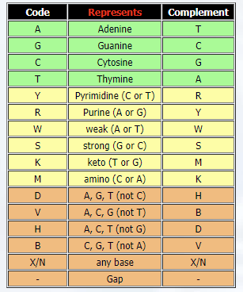
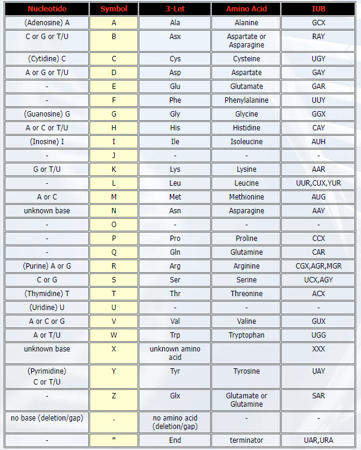

# Tools for sequences

## Sequences from NCBI

전세계 연구자들이 서열 데이터를 분석하는데 가장 많이 이용하는 사이트 중 하나가 NCBI 이며 따라서 NCBI에서는 연구자들이 데이터베이스에 접근하기위한 편리한 방법을 제공하고 있고 그 중 하나가 Entrez 입니다. 

R에서도 Entrez 기능을 도입한 package들이 제공되고 있으며 그 중 하나가 `rentrez` 입니다. https://www.ncbi.nlm.nih.gov/books/NBK25500/ 이 곳의 Downloading Full Records 를 참고하시면 좋습니다. Entrez는 대략적으로 다음 9개의 유틸리티를 제공합니다. 


> EInfo (database statistics)  
> ESearch (text searches)  
> EPost (UID uploads)  
> ESummary (document summary downloads)  
> EFetch (data record downloads)  
> ELink (Entrez links)  
> EGQuery (global query)  
> ESpell (spelling suggestions)  
> ECitMatch (batch citation searching in PubMed)  

이 중 `ESerach`, `EPost`, `ESummary`, `EFetch` 등이 많이 사용하는 유틸이며 정보를 다운로드 받을 경우는 `EFetch` 를 주로 사용하게 됩니다. rentrez 는 위와 같은 NCBI Eutils API를 활용하여 R 환경에서 탐색이나 다운로드 등 NCBI 데이터베이스와 상호작용이 용이하도록 만들어 놓은 tool 입니다. [rentrez landing page](https://cran.r-project.org/web/packages/rentrez/vignettes/rentrez_tutorial.html) `entrez_dbs`명령은 NCBI에서 제공하는 데이터베이스의 리스트를 볼 수 있으며 특정 DB에 대한 설명은 `entrez_db_summary`를 사용하면 되겠습니다. `entrez_search`는 각종 키워드를 사용한 검색 기능을 제공합니다. 

```{r, eval=F}
library(rentrez)
require(Biostrings)

entrez_dbs()
entrez_db_summary("nuccore")

covid_paper <- entrez_search(db="pubmed", term="covid19")
covid_paper$ids

names(covid_paper)
covid_paper$ids


covid_link <- entrez_link(db="all", id=covid_paper$ids, dbfrom="pubmed")
names(covid_link)
names(covid_link$links)
head(covid_link$links$pubmed_pubmed)

```

`entrez_search`에서 검색어를 입력하는 방식은 [이곳](https://cran.r-project.org/web/packages/rentrez/vignettes/rentrez_tutorial.html#building-search-terms)을 참고하세요. 검색으로 찾아진 특정 오브젝트(객체)에 대한 내용은 `entrez_summary` 함수를 사용하여 조회할 수 있으며 `extract_from_esummary`로 조회된 아이템들에 대한 정보를 추출할 수 있습니다. 특정 id에 대한 서열 등 다양한 타입의 데이터를 실제로 다운로드 받는 기능은 `entrez_fetch` 함수가 제공하고 있습니다.  `entrez_fetch` 함수의 `rettype` 옵션에서 지원하는 데이터 타입을 다운로드 받을 수 있으며  rettype (return type)의 자세한 정보는 [Eutils table](https://www.ncbi.nlm.nih.gov/books/NBK25499/table/chapter4.T._valid_values_of__retmode_and/) 또는 [NCBI Eutils](https://www.ncbi.nlm.nih.gov/books/NBK25499/) 페이지를 참고하시기 바랍니다. 


```{r, eval=F}
# popset database is a collection of related DNA sequences derived from population
katipo_search <- entrez_search(db="popset", term="Latrodectus katipo[Organism]")
katipo_search$ids

katipo_summs <- entrez_summary(db="popset", id=katipo_search$ids)
names(katipo_summs)
katipo_summs$`41350664`
class(katipo_summs)
methods(class="esummary_list")

titles <- extract_from_esummary(katipo_summs, "title")
unname(titles)

print(katipo_summs)
katipo_summs$`1790798044`$gi


COI_ids <- katipo_search$ids[c(2,6)]
trnL_ids <- katipo_search$ids[4]
COI <- entrez_fetch(db="popset", id=COI_ids, rettype="fasta")
trnL <- entrez_fetch(db="popset", id=trnL_ids, rettype="fasta")

write(COI, "COI.fasta")
write(trnL, "trnl.fasta")

#library(Biostrings)
coi <- readDNAStringSet("COI.fasta")
trnl <- readDNAStringSet("trnl.fasta")
```


::: rmdnote
**Exercises **


뎅기바이러스 서열 4종에 대한 NCBI의 accession 번호가 다음과 같음 NC_001477, NC_001474, NC_001475, NC_002640 해당 DNA 서열을 fasta 형식으로 `nuccore` 데이터베이스에서 다운로드 하시오. (참고로 `strwrap` 함수 사용법을 익혀두면 좋습니다)


```{r, eval=FALSE, echo=F}

##
acc <- c("NC_001477", "NC_001474", "NC_001475", "NC_002640")
all_recs <- entrez_fetch(db="nuccore", id=acc[1:2], rettype="fasta")
all_recs
write(all_recs, file="mydang.fasta")
dang <- readDNAStringSet("mydang.fasta", format="fasta")

cat(strwrap(substr(all_recs, 1, 500)), sep="\n")
```

:::


::: rmdnote
**Exercises **

1. popset 데이터베이스에서 "Covid-19" 단어가 들어간 유전자 40개를 찾고 (`entrez_search`에서 `retmax=40` 옵션 사용) 이들의 요약 정보 중 title 속성을 출력하시오 (`entrez_summary`와 `extract_from_esummary` 함수 사용). 


```{r, eval=F, echo=F}
search_result <- entrez_search(db="popset", term="Covid-19", retmax=40)
summary_record <- entrez_summary(db="popset", id=search_result$ids)
extract_title <- extract_from_esummary(summary_record, "title")
extract_title


```


2. 위 결과에서 찾아진 유전자들 각각이 몇 개의 서열 샘플에 (population) 대해서 연구된 것인지 각각의 서열을 fasta 형태로 다운로드 받고 샘플의 개수에 대한 `barplot`을 그리시오

- `summary_record` 결과를 받아서 `extract_from_esummary`로 title을 추출 후 `data.frame`으로 변환 
- `tidyverse`의 `rownames_to_column()` 함수로 uid 정보 변수로 변환, mydata 이름으로  저장
- `entrez_fetch` 함수로 모든 uid에 대한 샘플 서열 `fasta` 파일 다운로드 후 파일 저장 (`write`함수 사용)
- `readDNAStringSet` 함수로 읽은 후 앞서 title 정보 비교를 통해서 앞서 mydata 와 병합
- 각 uid 별로 몇 개의 서열 샘플이 있는지 정보를 추출 후 barplot 그리기 


```{r, eval=F, echo=F}
require(tidyverse)

extract_title <- extract_from_esummary(summary_record, "title")
mydata <- data.frame(extract_title) %>% 
  rownames_to_column()

fetch_results <- entrez_fetch(db="popset", id=search_result$ids, rettype="fasta")
write(fetch_results, file="batgene.fasta")

covidgenes <- readDNAStringSet("batgene.fasta")
names(covidgenes)

hist(nchar(covidgenes),)


```


:::


::: rmdnote
**Exercises **

[Comparative sequence analysis of SARS-CoV-2 suggests its high transmissibility and pathogenicity](https://www.ncbi.nlm.nih.gov/pmc/articles/PMC7938774/) 논문을 참고하여 COVID-19 서열의 NCBI accession 번호를 찾고 `nuccore` 데이터베이스에서 `fasta` 포멧과 `genbank` 포멧의 정보를 다운로드 하시오. (데이터는 "covid_table.csv" 파일에 저장되어 있음)

```{r, eval=F}
covid <- data.frame(
species = c(rep("Human", 7), c("Civet", "Civet"), rep("Bat", 3), "Pangolin"),
coronavirus = c("SARS-CoV-2", "SARS-CoV-2", "SARS-CoV-1", "SARS-CoV-1", "SARS-CoV-1", "H-CoV-OC43", "MERS-CoV", "SARS-CoV", "SARS-CoV", "SL-CoV", "SL-CoV", "SL-CoV", "SL-CoV"),
isolate = c("Wuhan Hu-1", "USA-WA-1", "Urbani", "Tor2", "GD03T10013", "UK/London",	"EMC-2012", "SZ3", "Civet007", "ZXC21",	"WIV16", "RaTG13", "MP789"),
year = c("2020", "2020", "2002", "2002", "2003", "2011", "2011", "2003", "2004", "2015", "2013", "2013", "2020"),
gbacc = c("NC_045512.2", "MN985325.1", "AY278741.1", "AY274119.3", "AY525636.1", "KU131570.1", "NC_019843.3", "AY304486.1", "AY572034.1", "MG772934.1", "KT444582.1", "MN996532.1", "MT084071.1"))
write.csv(covid, file = "covid_table.csv", quote = F, row.names=F)
```


```{r}
require(kableExtra)

download.file(url = "https://raw.githubusercontent.com/greendaygh/kribbr2022/main/covid_table.csv", destfile = "covid_table2.csv")

covid19 <- read.csv("covid_table2.csv")
kable_classic(kable(covid19))

```

```{r, eval=F, echo=F}
require(Biostrings)
##
recs <- entrez_fetch(db="nuccore", id=covid19$gbacc, rettype="fasta")
#cat(strwrap(substr(recs, 1, 500)), sep="\n")
write(recs, file="covid19.fasta")
covid19seq <- readDNAStringSet("covid19.fasta", format="fasta")


```


:::


## Align two sequences

서열 정렬은 match, mismatch, penalty 등의 scoring rule을 기반으로 최적의 score를 갖는 서열 정렬을 찾는 알고리즘 입니다. Biostrings 패키지에는 두 개의 서열에 대해 local, global alignment를 수행할 수 있는 `pairwiseAlignment` 함수를 제공하고 있습니다. 첫 번째 파라메터는 pattern이며 두 번째는 subject 로서 pattern은 query로서 해당 서열이 subject (target)에 있는지를 보는 것과 같습니다. 

```{r, eval=F}

covid19seq

?pairwiseAlignment
aln <- pairwiseAlignment(covid19seq[1], covid19seq[2])
class(aln)
methods(class="PairwiseAlignmentsSingleSubject")
?PairwiseAlignmentsSingleSubject

```

위에서 서열 정렬이 된 결과를 `DNAString` class의 변수에 저장한 후 해당 class에서 제공하는 다양한 함수를 동일하게 적용할 수 있습니다. 또한 `writePairwiseAlignments` 함수는 두 서열의 비교 결과를 보기 좋게 출력해주는 기능을 수행합니다. `summary` 함수를 사용하면 염기가 다른 곳의 위치를 출력해주며 `consensusString`은 50% 초과하는 서열에 대한 문자열을 출력해 줍니다. 이 외에도 `score`, `consensusMatrix` 등 다양한 help 함수들이 있습니다. 

```{r, eval=F}
alnseqs <- c(alignedPattern(aln), alignedSubject(aln))
class(alnseqs)

aln

writePairwiseAlignments(aln, block.width=50)
writePairwiseAlignments(aln, file="covidalign.txt",  block.width=30)

summary(aln)

consensusMatrix(aln)[1:4,1:10]
consensusString(aln)

score(aln)
```

참고로 아래와 같이 별도의 정보 테이블을 만들고 서열의 이름은 간단히 id 만 사용해서 분석하는 것이 더 효율적입니다. 문자열을 다루는 코드를 익혀두시기 바랍니다. 

```{r, eval=F}
names(covid19seq)

ids <- strsplit(names(covid19seq), split=" ") %>% 
  lapply(function(x){x[1]}) %>% 
  unlist

titles <- strsplit(names(covid19seq), split=" ") %>% 
  lapply(function(x){
    paste(x[-1], collapse=" ")
    }) %>% 
  unlist

covid19info <- data.frame(ids, titles)
names(covid19seq) <- covid19info$ids

aln <- pairwiseAlignment(covid19seq[1], covid19seq[2])
writePairwiseAlignments(aln, block.width=50)


```

## Multiple sequence alignment

Multiple sequence alignment(MSA) tool은 서열 데이터의 양과 계산량의 문제로 linux 기반 commandline 프로그램들이 많습니다. 대표적으로 [CLUSTAL-Omega](https://www.ebi.ac.uk/Tools/msa/clustalo/), [MUSCLE](https://www.ebi.ac.uk/Tools/msa/muscle/). window 기반 환경에서는 docker 등을 활용해서 관련 분석을 수행할 수 있습니다. 

[DECIPHER](https://www.bioconductor.org/packages/release/bioc/html/DECIPHER.html) 패키지는 서열 alignment나 primer design 등을 수행할 수 있는 패키지로 다음과 같이 별도 메모리에 서열을 저장하고 빠르게 alignment를 수행할 수 있어서 중소 규모의 서열에 대한 분석으로 유용하게 사용될 수 있습니다. 다음은 관련 서열을 SQLite 데이터베이스에 저장하고 그 내용을 쉽게 볼 수 있는 기능들 입니다. `dbDisconnect` 함수를 실행하면 모든 저장된 데이터가 사라지며 매모리는 다시 사용할 수 있게 됩니다. 

```{r, eval=F}
library(DECIPHER)

dbConn <- dbConnect(SQLite(), ":memory:")
Seqs2DB(covid19seq, "XStringSet", dbConn, "covid19")
BrowseDB(dbConn)

l <- IdLengths(dbConn)
Add2DB(l, dbConn)
BrowseDB(dbConn)

Seqs2DB(trnl, "XStringSet", dbConn, identifier = "trnl")
BrowseDB(dbConn)

Seqs2DB(coi, "XStringSet", dbConn, "coi")
BrowseDB(dbConn)

l <- IdLengths(dbConn, identifier = "trnl")
Add2DB(l, dbConn)
BrowseDB(dbConn)

dbDisconnect(dbConn)
```

다중서열을 정렬하는 `AlignSeqs` 함수와 `BrowseSeqs` 함수를 활용해서 html 형태로 정렬된 서열을 볼 수 있습니다. 특히 `patterns` 옵션을 사용해서 원하는 서열이 존재하는지도 확인할 수 있습니다. 


```{r, eval=F}

## extract sequences
covid19seq2 <- SearchDB(dbConn, identifier = "covid19")
subcovid19seq <- subseq(covid19seq2, 1, 2000)
aln <- AlignSeqs(subcovid19seq)
aln

BrowseSeqs(aln, colWidth = 100)
BrowseSeqs(aln, colWidth = 100, patterns=DNAStringSet(c("ACTG", "CSC")))
BrowseSeqs(aln, colWidth = 100, patterns="-", colors="black")
?BrowseSeqs

aln2 <- AlignTranslation(subcovid19seq, type="AAStringSet")
BrowseSeqs(aln2, colWidth = 100)
BrowseSeqs(aln2, colWidth = 100, highlight=1)

```


DECIPHER 패키지의 `DigestDNA`함수를 이용하면 enzyme digestion을 시뮬레이션할 수 있는 기능을 활용할 수 있습니다. 단 숫자 등 필요없는 문자를 제거하기 위해서 stringr 패키지를 사용합니다. 

```{r, eval=F}

data(RESTRICTION_ENZYMES)
RESTRICTION_ENZYMES
rsite <- RESTRICTION_ENZYMES["BsmBI"]
rsite <- RESTRICTION_ENZYMES["BsaI"]

d <- DigestDNA(rsite, covid19seq2[1])
unlist(d)
#writeXStringSet(unlist(d), file="covid19bsmbi.fasta")
pos <- DigestDNA(rsite, covid19seq2[1], type="positions")
unlist(pos)


library(stringr)
library(stringi)


BrowseSeqs(covid19seq2[1], colWidth = 100, patterns=rsite)
sub("(^[[:alpha:]]*).*", "", rsite)

rsite2 <- paste(str_extract_all(rsite, "[[A-Z]]", simplify = T), collapse="")
rsite3 <- as.character(reverseComplement(DNAString(rsite2)))
BrowseSeqs(covid19seq2[1], colWidth = 100, patterns=c(rsite2, rsite3))


```


::: rmdnote
**Exercises **


1. 앞서 다운로드 받은 Latrodectus katipo 서열 데이터를 읽어들이고 100bp 단위로 출력하시오  

2. MSA 를 수행하고 정렬된 결과를 100bp 단위로 출력하시오 

3. `ConsensusSequence` 함수를 이용하여 정렬된 결과로부터 consensus 서열을 추출하시오 

```{r, eval=F, echo=F}
coi <- readDNAStringSet("COI.fasta")
BrowseSeqs(coi)
alignedcoi <- AlignSeqs(coi)
BrowseSeqs(alignedcoi)
class(alignedcoi)

conseq <- ConsensusSequence(alignedcoi)


```


:::

참고로 염기와 아미노산의 Standard Ambiguity Codes는 각각 다음과 같습니다. 

- DNA ambiguity code


- Amino acid ambiguity code



## BLAST result analysis

BLAST를 로컬컴퓨터에 설치하거나 docker를 이용해서 활용할 수 있으나 본 강의에서는 직접 BLAST를 수행하는 대신 NCBI에서 실행한 BLAST 출력물을 분석하는 경우에 대해서 설명을 진행하겠습니다. 예시로는 PET를 분해하는 단백질로 알려진 IsPETase의 서열과 유사한 서열을 찾아서 분석해 보겠습니다. IsPETase 정보는 다음과 같습니다 Genes encoding I. sakaiensis 201-F6 IsPETase (WT PETase) (accession number: A0A0K8P6T7). 


::: rmdnote
**Exercises **

1) NCBI BLAST 사이트에서 A0A0K8P6T7 단백질에 대한 BLASTp를 수행하시오 (db: nr)

2) 결과물을 (100개) 다운로드 하고 (fasta와 hit table 각 1개 파일씩) 작업디렉토리로 복사하시오

3) fasta 와 hit 데이터를 각각 읽어들이시오 

```{r, eval=F, echo=F}

petase_hittable <- read.csv("F7NRDXG8016-Alignment-HitTable.csv", header=F)
petase_sequences <- readAAStringSet("seqdump.txt")

```

4) 100개의 서열을 DECIPHER 패키지를 활용해서 정렬하고 100bp 단위로 출력해보시오 

```{r, eval=F, echo=F}

library(DECIPHER)

alignedseq <- AlignSeqs(petase_sequences)
BrowseSeqs(alignedseq)

```


5) align된 결과에서 consensus 서열을 추출하고 각 위치별로 어떤 아미노산이 많은지 bar 그래프를 그려보시오 

```{r, eval=F, echo=F}
require(tidyverse)

conseq <- ConsensusSequence(alignedseq, threshold = 0.5, ambiguity=F, noConsensusChar="N")
nchar(toString(conseq))

tmp <-consensusMatrix(alignedseq)
alignaa <- as.data.frame(t(tmp))
dim(alignaa)

newd <- alignaa %>% 
  filter(`-` < 80) %>% 
  rowid_to_column("id") %>% 
  mutate(id2=as.character(id)) %>% 
  select(-c(id, `-`)) %>% 
  pivot_longer(-id2) 

ggplot(newd, aes(x=id2, y=value, fill=name)) +
  geom_bar(stat="identity") +
  scale_x_discrete(limits = 1:10) +
  xlab("Position") +
  ylab("Fraction")
```

:::


## Phylogenetic trees with clustering

DECIPHER 패키지에는 XStringSet 서열의 거리를 계산해주는 `DistanceMatrix` 함수가 있습니다. 이 함수를 이용하면 역시 같은 패키지에서 제공하는 `IdClusters` 함수를 이용해서 유사한 서열끼리 묶어주는 tree 를 만들 수 있습니다. 


```{r, eval=F}
dm <- DistanceMatrix(alignedseq)
class(dm)
dim(dm)
dm[1:2,1:2]

tree <- IdClusters(dm, cutoff=10, method="NJ", showPlot=TRUE, type="dendrogram")
class(tree)
methods(class="dendrogram")
plot(tree)

str(tree)

```


계통학 등에서 tree 형태의 가시화를 위해 다양한 포멧의 파일이 개발되었고 `treeio`는 이들 다양한 포맷의 파일을 쉽게 변환하기 위해 만들어진 패키지 입니다. 다음은 Newick tree 포멧의 예 입니다. 

~~~
    ((t2:0.04,t1:0.34):0.89,(t5:0.37,(t4:0.03,t3:0.67):0.9):0.59); 
~~~

가장 널리 사용되는 포멧은 `phylo` 형태로서 이는 `ape`라는 phylogenetic 분석의 대표적인 패키지에서 처음 제안되어 사용되고 있습니다. 최근 ggplot 형태의 [ggtree](https://yulab-smu.top/treedata-book/chapter12.html), [reference](https://www.molecularecologist.com/2017/02/08/phylogenetic-trees-in-r-using-ggtree/)이 개발되어 계통도를 좀더 세밀하게 그릴 수 있으며 ggtree는 `phylo` 형태의 포맷을 주로 사용하지만 `dendrogram` class도 사용할 수 있습니다. 


```{r, eval=F}
if (!requireNamespace("BiocManager", quietly = TRUE))
    install.packages("BiocManager")

BiocManager::install("ggtree")
BiocManager::install("treeio")

library(ggtree)
library(treeio)
library(tidytree)
library(ape)

tree <- rtree(n = 20)
class(tree)           
methods(class="phylo")
ggtree(tree)

ggplot(tree) +
  geom_tree() +
  theme_tree()

ggtree(tree, branch.length="none")

ggtree(tree, layout="circular") +
  geom_tiplab(size=3, aes(angle=angle))

ggtree(tree, layout="circular", branch.length="none") +
  geom_tiplab(size=3, aes(angle=angle))

ggtree(tree) +
  theme_tree2()

```

다양한 레이아웃에 대한 정보는 [Layouts of a phylogenetic tree](https://yulab-smu.top/treedata-book/chapter4.html#tree-layouts) 이 곳을 참고하시면 되겠습니다. 


특정 그룹을 highlight 하기 위해서 `geom_hilight` 함수를 사용합니다. 

```{r, eval=F}

ggtree(tree) +
  theme_tree2() +
  geom_tiplab() +
  geom_hilight(node=20, fill="steelblue", alpha=.4) 

```

노드를 알아보기 위해서 `tidytree`를 사용할 수 있습니다. 

```{r, eval=F}
as.tibble(tree)

d <- data.frame(node=c(20, 20, 22), type=c("T1", "T1", "T2"))

ggtree(tree) +
  theme_tree2() +
  geom_tiplab() +
  geom_hilight(d, aes(node=node, fill=type), alpha=.4) +
  scale_fill_manual(values=c("steelblue", "darkgreen"))


```

앞서 우리가 수행한 `dendrogram` class도 적용 가능하며 `phylo`로 변환 후 분석을 수행할 수도 있습니다. 


```{r, eval=F}
dm <- DistanceMatrix(alignedseq)
tree <- IdClusters(dm, cutoff=10, method="NJ", showPlot=TRUE, type="dendrogram")

ggtree(tree, layout="circular") +
  geom_tiplab()

ggtree(tree, layout="circular") +
  geom_tiplab() + 
  theme(plot.margin = unit(c(100,30,100,30), "mm"))

ggsave("myphylo.pdf", width = 50, height = 50, units = "cm", limitsize = FALSE)

```


dendrogram class를 hclust를 거처 phylo class 형태로 변환할 수도 있으며 이 때는 tidytree 패키지를 활용할 수 있다는 장점이 있습니다.  


```{r, eval=F}
## convert to dendrogram -> hclust -> phylo 

cl <- as.hclust(tree)
py <- as.phylo(cl)
class(py)
ggtree(py)
as.tibble(py)
```


---


<a rel="license" href="http://creativecommons.org/licenses/by-nc-nd/4.0/"></a><br />이 저작물은 <a rel="license" href="http://creativecommons.org/licenses/by-nc-nd/4.0/">크리에이티브 커먼즈 저작자표시-비영리-변경금지 4.0 국제 라이선스</a>에 따라 이용할 수 있습니다.

