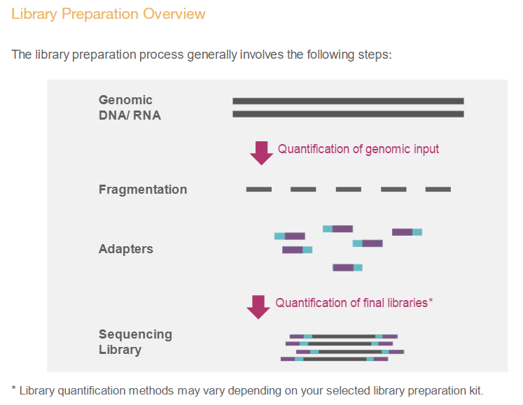
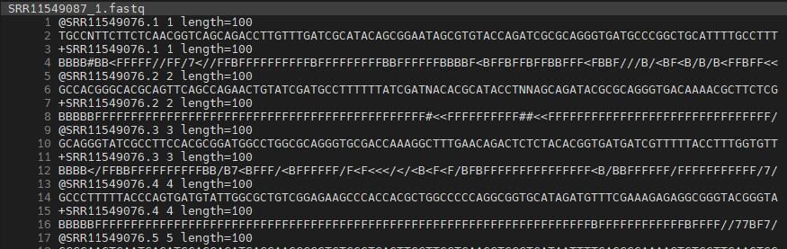
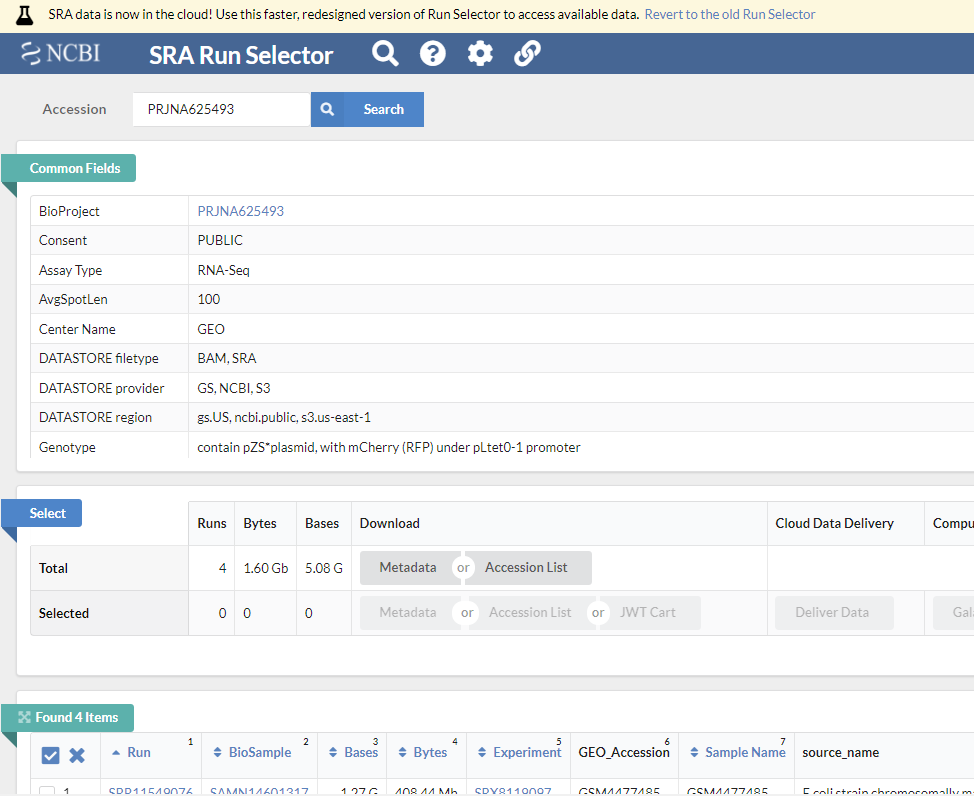
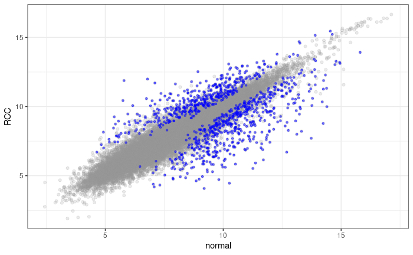

# High-throughput data 


## Next-generation sequencing

Next-generation sequencing (NGS) 는 DNA나 RNA 서열을 해독하는 기술로 2005년 개발될 초기에는 기존의 Sanger sequencing과는 다르게 여러 DNA 가닥을 동시에 해독하는 특징으로 "massively-parallel sequencing" 으로 불리우기도 했습니다. 

{width=600}


NGS에 대한 자세한 설명은 illuina 사에서 제공하는 [튜토리얼](https://sapac.illumina.com/science/technology/next-generation-sequencing/beginners/tutorials.html)의 다음 사이트들을 참고하시기 바랍니다. 

- [Sequencing Fundamentals](https://support.illumina.com/content/dam/illumina-support/courses/sequencing-fundamentals/story_html5.html?iframe) 
- [Sequencing Illumina Technology](https://support.illumina.com/content/dam/illumina-support/courses/Sequencing_Illumina_Technology/story_html5.html?iframe)
- [Illumina Sequencing by Synthesis](https://www.youtube.com/watch?v=fCd6B5HRaZ8&ab_channel=Illumina)

(Shor read) NGS 워크플로는 다음과 같은 네 단계를 순차적으로 수행합니다.  

{width=500}

각 단계별로 보면 다음과 같습니다. 

{width=500}


{width=500}


{width=500}

{width=500}


위 단계 중 Secondary analysis에 해당하는 분석이 일반적으로 우리가 수행하는 RNA-Seq 등의 분석입니다. 시퀀싱 장비에서 읽힌 이미지 정보는 Binary Base Call (BCL) 파일로 변환됩니다. 우리가 일반적으로 다루는 FASTQ 파일은 서열 정보와 quality 정보를 text 형태로 저장한 파일로서 BCL 파일로부터 만들어집니다.  

{width=500}

## FASTQ preprocessing


FASTQ 파일에는 타깃 서열정보뿐만아니라 바코드나 인덱스 등의 서열이 포함되어 있습니다. 



따라서 분석을 위해서는 위 서열들을 제거하고 quality에 따라서 read 들을 필터링 하는 작업이 필요합니다. 기존에는 linux 스크립트 기반의 소프트웨어들이 사용되었으나 본 강의에서는 Rstudio에서 바로 설치해서 활용할 수 있는 Rfastq 패키지를 사용하겠습니다. Rfastq는 quality control과 polyX trimming, adapter trimming, paired-ed reads merging 등의 기능을 제공하고 있습니다. 


```{r, eval=F}
if (!require("BiocManager", quietly = TRUE))
    install.packages("BiocManager")

BiocManager::install("Rfastp")
```


examples 디렉토리 생성 후 예시 fastq 파일 다운로드, `rfastq` 실행으로 로딩과 필터링을 수행합니다. 참고로 Q10은 약 90%의 정확도, Q20은 약 99%의 정확도, Q30은 약 99.9% 정확도를 갖는 read의 개수 입니다. 


```{r, eval=F}
library(Rfastp)

download.file(url = "https://github.com/greendaygh/kribbr2022/raw/main/fastq/SRR11549076_1.fastq", destfile = "examples/SRR11549087_1.fastq")

fqfiles <- dir(path = "examples", pattern = "*.fastq")

#?rfastp
fastq_report <- rfastp(read1 = file.path("examples", fqfiles[1]), 
                       outputFastq = file.path("examples", paste0("filtered_", fqfiles[1])))

round(qcSummary(fastq_report), 2)

```

 

## NGS database


**Sequence Read Archive**

[SRA](https://www.ncbi.nlm.nih.gov/sra) SRA (Sequence Read Archive)는 High-throughput 시퀀싱 데이터의 공개 데이터베이스 중 가장 큰 규모의 미국 국립 보건원(NIH)의 1차 데이터베이스로서 서열데이터 뿐만 아니라 메타데이터, 유전체, 및 환경 데이터를 포함합니다. NCBI와 EBI(European Bioinformatics Institute), DDBJ(DNA Database of Japan) 간 국제적 제휴를 통해 세 기관에서 제출 받은 데이터는 서로 공유되고 있습니다. 


간략한 사용법은 [NBK569238](https://www.ncbi.nlm.nih.gov/books/NBK569238/) 또는 [SRA download 문서](https://www.ncbi.nlm.nih.gov/sra/docs/sradownload/) 이곳을 참고하시기 바랍니다. 


데이터를 다운로드 할 수 있는 [NCBI SRA Toolkit](https://github.com/ncbi/sra-tools/wiki/01.-Downloading-SRA-Toolkit)을 제공하며 이 중 [MS Windows 64 bit architecture](https://ftp-trace.ncbi.nlm.nih.gov/sra/sdk/3.0.0/sratoolkit.3.0.0-win64.zip) 를 다운로드 받아 압축을 풀고 사용할 적절한 디렉토리로 옮겨 줍니다. 여기서는 `D:\sratoolkit.3.0.0-win64`이 곳에 이동해 두었고 전체 디렉토리 구성은 다음과 같습니다. 

{width=600}

명령을 어느 디렉토리에서나 사용하고 싶다면 위 경로의 `bin` 디렉토리를 `path`로 잡아주는 과정이 필요합니다. 다음 위치로 이동 후 "내PC > 속성 > 고급 시스템 설정 > 환경변수" 를 클릭하면 다음 창이 생성됩니다. 


Path를 선택후 편집을 클릭하면 다음 화면이 생성되고 새로만들기를 누른 후 `D:\sratoolkit.3.0.0-win64\bin`라고 입력해주고 모든 창에서 `확인`을 눌러주면 되겠습니다. 


이제 파일 탐색기로 파일을 다운로드 받을 작업 디렉토리로 이동한 후 주소창에 `cmd`이라고 입력해서 프롬프트가 있는 명령창을 실행합니다. 

fastq-dump.exe를 사용해서 다운로드 받을 수 있으며 최근에는 [fasterq-dump](https://github.com/ncbi/sra-tools/wiki/HowTo:-fasterq-dump)를 사용해서 더욱 빠르게 다운로드를 받을 수 있습니다. 

{width=600}

뒤에서 설명할 GEO 데이터베이스에서 [GSE148719](https://www.ncbi.nlm.nih.gov/geo/query/acc.cgi?acc=GSE148719) 데이터를 다운로드 해보겠습니다. 위 링크를 클릭해서 들어가면 화면 하단의 SRA Run Selector 라는 링크가 있고 이를 클릭하면 다음과 같은 화면이 보입니다. 

{width=600}

Metadata (SraRunTable.txt) 와 Accession list (SRR_Acc_List.txt)를 파일 형태로 다운로드 받은 후 적절한 전처리 후 사용하면 되겠습니다. 

~~~
prefetch --option-file SRR_Acc_List.txt
~~~

만약 하나의 fastq 데이터만 다운로드 받을 경우 다음과 같습니다. 

~~~
prefetch SRR11549076
~~~


이후 fasta 파일로 변환해 줍니다 

~~~
fasterq-dump --split-files SRR11549076
~~~

100000개 read만 별도로 저장 

~~~
fastq-dump -X 10000 --split-files SRR11549076
~~~


**Gene expression omnibus (GEO)**

GEO는 microarray, next-generation sequencing 등의 high-throughput 유전체 데이터를 보유한 공공 저장소입니다. 

* 대규모 기능유전체 데이터베이스 
* 데이터 기탁 쉽게 만들고 고수준 QC 유지
* 사용하기 쉬운 인터페이스 유지

[GEO](https://www.ncbi.nlm.nih.gov/geo/)

Platform, Sample, Series로 구성되어 있으며 Platform은 사용된 어레이 플랫폼에 대한 설명과 데이터 테이블로 구성되어 있습니다. GPLXXX 형태의 GEO 액세스 번호가 할당되며 하나의 플랫폼은 많은 샘플들에 사용될 수 있습니다. Sample은 개별 샘플이 처리된 조건 등의 설명이 있는 테이블로 구성되며 GSMxxx 형태의 GEO 등록 번호가 할당됩니다. Sample은 하나의 Platform만 참조 가능하며 여러 Series에 포함될 수 있습니다. Series는 관련된 샘플을 그룹화하고 전체 연구의 주요 설명을 제공합니다. GEO 등록 번호 GSExxx가 할당됩니다.


{width=600}


위 세 가지 타입 외에 Datasets 이 있으며 Datasets은 GDSxxx 아이디를 가집니다. 앞서 Series (GSExxx) 데이터가 연구자들이 업로드한 raw 데이터라고 한다면 Datasets (GDSxxx)는 관리자들에 의해 큐레이션된 데이터로 볼 수 있습니다. [브라우져](https://www.ncbi.nlm.nih.gov/geo/summary/)를 통해 쉽게 검색할 수 있습니다. Bioconductor에서는 `GEOquery`라는 패키지로 관련 파일들을 다운로드 받을 수 있습니다.  


```{r, eval=F}
if (!requireNamespace("BiocManager", quietly = TRUE))
    install.packages("BiocManager")

BiocManager::install("GEOquery")

library(GEOquery)
#browseVignettes("GEOquery")
```

The `GDS` class

```{r, eval=F}
gds <- getGEO(filename=system.file("extdata/GDS507.soft.gz",package="GEOquery"))
class(gds)
methods(class=class(gds))
Table(gds)
Columns(gds)
```

The `GSM` class - 샘플의 실제 측정값과 실험 조건 등 샘플별 정보 포함. 참고로 MAS 5.0 알고리즘은 서열의 Perfect-Match (PM)과 Mismatch (MM)를 이용해서 유전자의 발현을 정량화 하는 방법으로 (logged) PM-MM의 평균으로 계산함. 

```{r, eval=F}
gsm <- getGEO(filename=system.file("extdata/GSM11805.txt.gz",package="GEOquery"))
methods(class=class(gsm))
head(Meta(gsm))
Table(gsm)
Columns(gsm)
```


The `GPL` class - 사용된 칩의 기본 Annotation 정보 

```{r, eval=F}
gpl <- getGEO(filename=system.file("extdata/GPL97.annot.gz",package="GEOquery"))
gpl

```


The `GSE` class - 관련된 샘플, annotation 들의 집합 (실험) 

```{r, eval=F}
gse <- getGEO(filename=system.file("extdata/GSE781_family.soft.gz",package="GEOquery"))
methods(class=class(gse))
Meta(gse)
head(GSMList(gse))
gsm <- GSMList(gse)[[1]]
Meta(gsm)
Table(gsm)
Columns(gsm)


GPLList(gse)
gpl <- GPLList(gse)[[1]]
class(gpl)
```


## ExpressionSet

`Biobase` 패키지는 지놈 데이터를 관리하기 위한 표준화된 데이터 구조 class인 `ExpressionSet`를 제공합니다. ExpressionSet은 HT assay 데이터와 실험 meta를 포함하고 있습니다.

{width=600}
출처[BS831 lecture note](https://montilab.github.io/BS831/articles/docs/ExpressionSet.html)


GES 데이터 받기 [GSE2553](https://www.ncbi.nlm.nih.gov/geo/query/acc.cgi?acc=GSE2553) 

```{r, eval=F}
gse2553 <- getGEO('GSE2553',GSEMatrix=TRUE)
gse2553
class(gse2553)
class(gse2553[[1]])
mygse <- gse2553[[1]]
?ExpressionSet
methods(class=class(mygse))
mypdata <- pData(mygse)
myfdata <- fData(mygse)
myexdata <- exprs(mygse)


## rownames , data.frame
as.data.frame(myexdata)

## filtering
table(mypdata$description)


```


```{r, eval=F}
mypdata

class(myexdata)

```


GDS 데이터를 ExpressionSet class로 변환하기 
```{r, eval=F}
gds <- getGEO(filename=system.file("extdata/GDS507.soft.gz",package="GEOquery"))
class(gds)
eset <- GDS2eSet(gds, do.log2=TRUE)
eset
pData(eset)
```

** Example **

다음 예제는 GEOquery 패키지에 있는 데이터셋을 활용하여 간단한 DEG 분석을 수행하는 코드로서 DEG 분석의 원리 이해와 해석을 위해 학습하는 예제입니다. 다음 장에 소개되는 통계(추정과 검정)을 먼저 참고하고 실습해 보아도 좋겠습니다. 


`GEOquery` 패지키에 포함된 GDS507 dataset을 읽어서 ExpressionSet으로 변환합니다. ExpressionSet class를 활용하는 edgeR, DESeq2 등의 패키지를 사용하지는 않지만 변환 후 필요한 데이터를 추출해서 사용하겠습니다. 

```{r, eval=F}
gds <- getGEO(filename = system.file("extdata/GDS507.soft.gz",package="GEOquery"))
gds
eset <- GDS2eSet(gds, do.log2=TRUE)
eset

myexp <- data.frame(exprs(eset))
myfeature <- fData(eset)
mypheno <- pData(eset)
```

위 세 종류의 데이터 테이블을 추출한 후 샘플들 두 그룹별로 평균을 계산하기 위해서 matrix transpose가 필요합니다. tidyverse는 (대부분의 통계 데이터는) row에 샘플이 위치하고 column에 feature (변수)가 있는 반면 위 myexp는 (ExpressionSet) 특성상 샘플이 컬럼에 위치하므로 transpose 수행 후 평균을 계산할 필요가 있습니다. 

```{r, eval=F}
table(mypheno$disease.state)

## transpose
mydat1 <- myexp %>% 
  rownames_to_column() %>% 
  pivot_longer(cols = -rowname) %>% 
  pivot_wider(names_from = rowname, values_from = value)  

mydat2 <- mypheno %>% 
  dplyr::select(sample, disease.state) %>% 
  left_join(mydat1, by = c("sample" = "name"))

```

이 후 그룹별로 평균을 계산후 다시 transpose 시켜줍니다. 

```{r, eval=F}
mymean <- mydat2 %>% 
  group_by(disease.state) %>% 
  summarise(across(where(is.numeric), mean))

mymean2 <- mymean %>% 
  pivot_longer(-disease.state) %>% 
  pivot_wider(names_from=disease.state, values_from = value)
```

두 그룹의 평균 값에 대한 각 유전자(feature)들의 산포도를 그릴 수 있습니다. 

```{r, eval=F}
ggplot(mymean2, aes(x=normal, y=RCC)) +
  geom_point()


```
위 데이터는 feature 별로 normal과 RCC 값들의 평균을 가지고 있습니다. 유사한 방법으로 표준편차 값을 구한 후 t값을 계산할 수 있으나 코드가 길어지게 됩니다. 기존 lecture에서는 apply 함수를 활용해서 t.test를 수행하여 p-value를 구할 수 있었으나 더 간단히 아래와 같이 tidyverse 타입의 함수를 사용해서 t.test 를 사용할 수도 있습니다. 

```{r, eval=F}
ttestval <- mydat2 %>%
  #dplyr::select(1:10) %>% 
  summarise(across(where(is.numeric), function(x){
    z <- t.test(x[disease.state=="normal"], x[disease.state=="RCC"])
    c(z$p.value, z$statistic)
    }))

ttestval
```

평균값과 pvalue, tstatistic 등의 값들을 하나의 테이블로 만들기 위해서 위 ttestval 데이터를 transpose 시킨 후 mymean2 데이터와 병합합니다. 

```{r, eval=F}

ttestvalt <- ttestval %>% 
  mutate(rnames = c("pvalue", "tstat")) %>% 
  #column_to_rownames(var="rnames") %>% 
  pivot_longer(-rnames) %>% 
  pivot_wider(names_from = rnames)

finaldat <- mymean2 %>% left_join(ttestvalt, by="name")
finaldat
```
유의한 데이터를 선별하고 가시화 합니다. 


```{r, eval=F}

sigdat <- finaldat %>% 
  filter(pvalue < 0.001)

ggplot(finaldat, aes(x=normal, y=RCC)) +
  geom_point(alpha=0.2, color="#999999") +
  geom_point(data=sigdat, aes(x=normal, y=RCC), color="blue", alpha=0.5, shape=20) +
  theme_bw()

```

참고로 아래 결과는 p-value 가 0.001 이하인 probe들을 표현한 결과로서 정확한 결과 도출을 위해서는 multiple testing correction을 수행 후 수정된 유의확율을 이용할 필요가 있습니다. 

{width=500}


## SummarizedExperiment 

ExpressionSet은 일반적으로 행이 feature (유전자) 인 마이크로어레이 기반 실험 및 유전자 발현 데이터에 사용되었습니다. 그러나 유전체 분석을 위해서는 유전자 정보 외에도 유전체상의 위치 정보 등이 필요하며 이는 앞서 배운  GenomicRanges 형태의 데이터가 필요합니다. 따라서 최근에는 새로운 버전인 SummarizedExperiment class가  [SummarizedExperiment](https://bioconductor.org/packages/release/bioc/html/SummarizedExperiment.html) 개발되어 사용되고 있습니다.


```{r, eval=F}
library(SummarizedExperiment)

#if (!requireNamespace("BiocManager", quietly = TRUE))
#    install.packages("BiocManager")

#BiocManager::install("airway")

library(airway)
data(airway, package="airway")
se <- airway
se
?RangedSummarizedExperiment 

# assay data
assay(se)

# Row (features)
rowRanges(se)

# Column (sample)
colData(se)

# Experiment-wide metadata
metadata(se)

```


`SummarizedExperiment` 생성


```{r, eval=F}
nrows <- 200
ncols <- 6
counts <- matrix(runif(nrows * ncols, 1, 1e4), nrows)
rowRanges <- GRanges(rep(c("chr1", "chr2"), c(50, 150)),
                     IRanges(floor(runif(200, 1e5, 1e6)), width=100),
                     strand=sample(c("+", "-"), 200, TRUE),
                     feature_id=sprintf("ID%03d", 1:200))
colData <- DataFrame(Treatment=rep(c("ChIP", "Input"), 3),
                     row.names=LETTERS[1:6])

se <- SummarizedExperiment(assays=list(counts=counts),
                     rowRanges=rowRanges, colData=colData)

# Row (regions-of-interest) data
rowRanges(se)

# Column (sample) data
colData(se)

# Experiment-wide metadata
metadata(se)

```


---


<a rel="license" href="http://creativecommons.org/licenses/by-nc-nd/4.0/"></a><br />이 저작물은 <a rel="license" href="http://creativecommons.org/licenses/by-nc-nd/4.0/">크리에이티브 커먼즈 저작자표시-비영리-변경금지 4.0 국제 라이선스</a>에 따라 이용할 수 있습니다.

