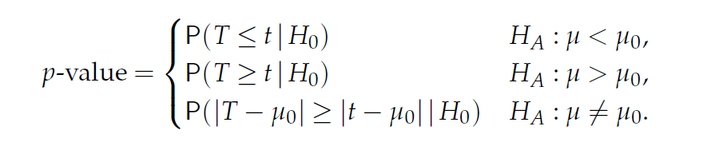

# Inference and test


{width=600}

{width=600}


통계적 추정이란 모집단으로부터 임의 추출된 표본을 이용하여 모집단을 추정하는 과정을 의미합니다. 

* 모집단 (population) - 전체 대상
* 모수 (Parameter) - 모집단의 분포를 설명하는 대푯값
* 표본 (sample) - 모집단으로부터 임의 추출된 관측값의 모음
* 통계량 (statistics) - 표본의 평균, 분산과 같은 대푯값으로 표본의 특징을 수치화한 값
* 확률변수 (random variable) - 확률적으로 따라 값이 결정되는 변수
* 확률분포 및 확률 질량/밀도 함수  
* 표본분포 (sampling distribution) - 통계량의 분포

다음은 표준정규분포 모집단에서 (모수: $\mu=0, \sigma=1$) 16개 표본을 임의 추출하여 평균을 (통계량) $\bar{x}$ 구하고 이 과정을 10번 반복한 상황을 표현한 그림으로 통계적 추론의 과정을 보여 줍니다. 즉, 표본을 뽑고 그 평균을 (표본평균) 구하는 과정을 반복할 경우 표본평균의 평균이 모평균에 수렴하고 표본평균의 분산이 표본들의 분산보다 더 작다는 것을 보여줍니다.   


* 어떤 임의 표본에 대해서 $\bar{x}$의 표본분포는 $\mu$ 근처에 위치
* 어떤 임의 표본에 대해서 $\bar{x}$의 표본분포의 표준편차는 $\sigma/\sqrt{n}$ 로 표현 ($\sigma$는 모분산, 표본들의 분산보다 작음)
* 모분포가 정규분포이면 $\bar{x}$도 정규분포임


## Simulation

이번 장에서는 시뮬레이션을 통해 추정의 개념을 이해하는 것을 목적으로 합니다. 확률과 공식의 유도를 통한 추정과정의 이해도 중요하지만 컴퓨팅 기반의 시뮬레이션도 통계적 추정의 개념을 이해하는데 큰 도움이 될 수 있습니다. R에서 분포관련한 시뮬레이션은 앞서 소개한 `d`, `r`, `p`, `q` 함수를 이용할 수 있습니다. 


**[EXERCISE]** $N(0, 1)$의 분포를 `dnorm()`을 이용해 그리시오 ($-4 \le x \le 4$)

```{r, eval=F, echo=T}
library(tidyverse)

x <- seq(-4, 4, by=0.01)
y <- dnorm(x, 0, 1)
dat <- data.frame(x, y)
ggplot(dat, aes(x, y)) +
  geom_line()

```

지수분포의 경우, 파라미터 ($\lambda$) 값에 따른 그래프 변화

```{r, eval=F}
x <- seq(0, 4, by=0.01)
y1 <- dexp(x, 1)
y2 <- dexp(x, 2)
y3 <- dexp(x, 3)
dat <- data.frame(x, y1, y2, y3)
datlong <- dat %>% pivot_longer(cols=c(y1, y2, y3))
ggplot(datlong, aes(x=x, y=value, col=name)) +
  geom_line(size=2)

```


**[EXERCISE]** 표준정규분포로부터 16개의 표본을 뽑아 평균을 구하고 각 표본과 평균 값들을 $y=1$ 위치에 점으로 표현하시오 (`rnorm()`사용)

```{r, eval=F}
nsample <- 16
x <- rnorm(nsample, 0, 1)
y <- rep(1, nsample)
xbar <- mean(x)
dat <- data.frame(x, y)
ggplot(dat, aes(x, y)) +
  geom_point() +
  geom_point(aes(x=mean(x), y=1), colour="blue", size=5, shape=15)

```


**[EXERCISE]** 위 예제와 같이 표준정규분포로부터 16개의 표본을 뽑아 평균을 구하는 과정을 두 번 반복하되 두 번째 데이터는 $y=0.9$ 위치에 표현하시오

```{r, eval=F, echo=T}
nsample <- 16
x <- rnorm(nsample*2, 0, 1)
y <- c(rep(1, nsample), rep(0.9, nsample))
g <- factor(c(rep(1, nsample), rep(2, nsample)))
dat <- data.frame(x, y, g)

ggplot(dat, aes(x, y)) +
  geom_point() +
  geom_point(aes(x=mean(x[1:nsample]), y=1), colour="blue", size=5, shape=15) +
  geom_point(aes(x=mean(x[(nsample+1):length(x)]), y=0.9), colour="blue", size=5, shape=15) +
  scale_y_continuous(limits=c(0, 1.2))

```

**[EXERCISE]** 위 예제를 10번 반복하되 각 반복 데이터는 각각 $y=1, 0.9, 0.8, ..., 0.1$ 위치에 그리시오

```{r, eval=F, echo=T}
nsample <- 16
nrep <- 10

x <- rnorm(nsample*nrep, 0, 1)
tmpy <- seq(0.1, 1, length.out=nrep)
y <- rep(tmpy, each=nsample)
## ?rep
g <- factor(y)

dat <- data.frame(x, y, g)
head(dat)
## sample means
dat_mean <- dat %>% 
  group_by(g) %>% 
  summarise(mean=mean(x))
head(dat_mean)

ggplot() + 
  geom_point(data=dat, aes(x, y)) +
  geom_point(data=dat_mean, 
             aes(x=mean, y=as.numeric(as.character(g))), 
             colour="blue", 
             size=5, 
             shape=15) +
  theme_bw()
  
```

**[EXERCISE]** 위 예제에서 사용된 샘플들의 정규분포 곡선과 $\bar{x}$의 분포를 같이 그리시오 ($-4 \le x \le 4$, 앞서 예제의 `dat`와 `dat_mean` 사용)

```{r, eval=F}

head(dat)
head(dat_mean)

x <- seq(-4, 4, by=0.01)
# distribution of the samples 
y <- dnorm(x, mean(dat$x), sd(dat$x))
# distribution of the sample means
y2 <- dnorm(x, mean(dat_mean$mean), sd(dat_mean$mean))
dat2 <- data.frame(x, y, y2)
dat2_long <- dat2 %>% 
  pivot_longer(cols=c(y, y2))
head(dat2_long)

ggplot(dat2_long, aes(x=x, y=value, color=name)) +
  geom_line(size=1.2) +
  labs(y="Density") +
  theme_bw() +
  scale_color_manual(name="Type", 
                     labels=c("Samples", "Sample Means"),
                     values=c("red", "blue"))

```

위와 같이 표본들의 분포보다 표본평균들의 분포가 분포가 더 중심에 가깝다는 것을 볼 수 있습니다.


## z-statistics with simulation 

정규분포에서 추출된 표본들의 평균(표본평균)은 $n$의 수가 많지 않더라도 정규분포를 따릅니다 ($n$이 충분히 많은 경우, 중심극한정리에 의해서 모집단의 분포와 상관없이 표본평균의 분포는 정규분포 입니다). 통계적 유의성 판단의 기본 룰은 특정 확률변수 $X$의 분포를 가정한 후에 특정 사건의 관측한 값이 $X$의 확률분포 어디에 위치하는지 찾고 확률을 계산하여 해당 사건이 일어날만한 일이였으면 가정이 맞는 것으로 사건이 일어날 확률이 적게 나오면 가정이 틀린 것으로 판단하는 것입니다. 

유사한 방법으로 모집단이 정규분포로 알려진 표본들을 가지고 표본평균을 구했을때 이 표본평균이 정규분포에서 어디에 위치하는지와 그 확률을 계산하여 관측한 표본평균의 유의성을 판단할 수 있습니다. 이 과정에 사용하는 통계량이 z-score (z값) 입니다. 관측값을 z-score로 변환해줄 경우 표준정규분포 ($N(0, 1)$)로부터 확률을 쉽게 계산할 수 있습니다. 

$$ 
z= \frac{\bar{x} - \mu}{(\sigma/\sqrt{n})}
$$

z-score는 표본평균에 대한 z-score로서 모평균을 빼주고 모분산/$\sqrt{n}$ 값을 사용합니다. 


**[EXERCISE]** A 제과 업체에는 그들이 생산하는 사탕의 평균 무게가 평균 100g이고 표준편차가 16인 정규분포를 따른다고 주장한다. 그런데 소비자들은 이 사탕의 평균 무게가 100g보다 낮다고 의심을 하고 표본 10개를 추출하고 평균을 구했더니 90g이 관측되었다. z-score를 계산하고 표준정규분포에서 위치를 표시하시오. 

```{r, eval=F}
zstat <- function(x, mu, sigma){
  z <- (mean(x)-mu)/(sigma/sqrt(length(x)))
  return(z)
}

xobs <- c(90, 75, 89, 103, 95, 110, 73, 93, 92, 80)
z <- zstat(xobs, 100, 16)


x <- seq(-5, 5, length.out=100)
y <- dnorm(x, 0, 1)
# distribution of the sample means
dat <- data.frame(x, y)
p <- ggplot(dat, aes(x=x, y=y)) +
  geom_area(data=filter(dat, x < z), fill="red") +
  geom_line(size=1.2) +
  labs(y="Density") +
  theme_bw() +
  # geom_segment(aes(x=-1, xend=z, y=0.05, yend=0), 
  #              arrow = arrow(length = unit(0.1, "inches")), 
  #              size=1) +
  annotate("text", label=round(z,2), x=-0.7, y=0.07) 
  
p

```

정규분포에서 관측값보다 더 작은 값이 관측될 확률 ($p(\bar{X} < 90)=p(Z<-1.98)$)은 `pnorm` 함수를 사용해서 구할 수 있으며 시뮬레이션을 이용할 수도 있습니다. 

```{r, eval=F}
p + geom_segment(aes(x=-2.2, xend=-2.2, y=0.1, yend=0.01), 
                 arrow = arrow(length = unit(0.1, "inches")),
                 size=1) + 
  annotate("text", label=round(pnorm(z, 0, 1),3), x=-2.2, y=0.12)


## simulation
n <- 1000
x <- rnorm(n, 0, 1)
sum(x < z)/n

```


이제 $p(X<90)=0.024$ 값의 의미를 생각해 봅니다. 이 확률은 회사측이 주장하는 $\mu$ = 100 이라는 가설을 전재로 합니다. 즉, $p(X<90|\mu=100)=0.024$ 입니다. 이는 X < 90 라는 사건이 굉장히 낮은 확률로 일어났다고도 볼 수 있으나 가설이 틀렸다고 보는 것이 합리적입니다. 따라서 회사측이 주장하는 사탕 평균 무게 100g의 주장을 기각하며 소비자측의 주장 $\mu < 100$ 즉 사탕이 100g 보다 작다는 주장을 강하게 지지하는 결과 입니다.


## t-statistics 

위와 같은 z-score를 계산하기 위해서는 모표준편차가 필요하지만 모분산은 일반적으로 알려져있지 않기 때문에 z-score를 사용한 검정의 활용은 한정적 입니다. 모표준편차 대신 표본의 표준편차를 사용하는 통계량이 t-statistic 입니다. t 통계량은 t분포를 가지며 t분포는 $n$ 이 무한에 가까워지면 표준정규분포와 같아집니다. 표본의 표준편차가 모표준편차보다 작은 경우 t 통계량 값이 z 값보다 커지게 되어 분포 양측 tail쪽 값이 많아지고 더 두꺼운 tail 분포 모양을 가지게 됩니다. 

$$ 
t = \frac{\bar{x} - \mu}{(s/\sqrt{n})}
$$

시뮬레이션을 통해 분포를 그려보겠습니다. $N(0,1)$ 분포에서 랜덤하게 $n$={4, 10, 20, 50, 100, 1000} 개의 표본을 뽑는 과정을 1000회 반복한 후 boxplot을 그려보겠습니다. 

```{r, eval=F}
tstat <- function(x, mu){
  (mean(x)-mu)/(sd(x)/sqrt(length(x)))
}

mu <- 0
sigma <- 1
M <- 1000
n <- c(4, 10, 20, 50, 100, 1000)

tstat_array <- replicate(M, 
                         sapply(n, function(x){
                           tstat(rnorm(x, mu, sigma), mu)
                           }))
dim(tstat_array)

## transposition
tstat_array <- t(tstat_array)
dim(tstat_array)
colnames(tstat_array) <- as.character(n)
boxplot(tstat_array)

tstat_df_long <- as.data.frame(tstat_array) %>% 
  pivot_longer(cols=everything())
ggplot(tstat_df_long, aes(x=name, y=value)) +
  geom_boxplot()

tstat_df_long <- as.data.frame(tstat_array) %>% 
  pivot_longer(cols=everything()) %>% 
  mutate(name=fct_relevel(name, "4", "10", "20", "50", "100", "1000"))
ggplot(tstat_df_long, aes(x=name, y=value)) +
  geom_boxplot()


```


**[EXERCISE]** 두 그룹 데이터에서 임으로 10명을 두 번 뽑아 그 평균의 차이를 계산하시오 

```{r, eval=F}

caf <- c(245, 246, 246, 248, 248, 248, 250, 250, 250, 252)
no_caf <- c(242, 242, 242, 244, 244, 245, 246, 247, 248, 248)
dat <- c(caf, no_caf) 
obs <- mean(caf) - mean(no_caf)

x <- sample(dat, 10, replace=T)
y <- sample(dat, 10, replace=T)

mean(x) - mean(y)
```


**[EXERCISE]** 위 예제의 과정을 1000번 반복하고 계산된 차이값들로 분포를 그리시오(for 문 이용)

```{r, eval=F}
diff_vals <- rep(0, 1000)
for(i in 1:1000){
  x <- sample(dat, 10, replace=T)
  y <- sample(dat, 10, replace=T)
  diff_vals[i] <- mean(x) - mean(y)
}

ggplot(data.frame(diff_vals), aes(x=diff_vals)) +
  geom_histogram()

```

 
 

**[EXERCISE]** 분포에서 실제 관측한 3.5 값의 위치를 표시하고 관측값보다 더 극단적인 경우가 나올 경우의 비율을 계산하시오 (위 예제 코드의 연속)

```{r, eval=F}
emp_pval <- sum(diff_vals > obs)/length(diff_vals)

textstring <- paste("p(X > ", obs, ") = ", emp_pval, sep="")
ggplot(data.frame(diff_vals), aes(x=diff_vals)) + 
  geom_histogram() +
  # geom_segment(aes(x = obs, 
  #                  y = 30, 
  #                  xend = obs, 
  #                  yend = 5), 
  #              arrow = arrow(), 
  #              size=2) +
  annotate("text", 
           label = obs, 
           x = obs, 
           y = 35, 
           size = 5) +
  annotate("text", 
           label = textstring, 
           x = 2.5, 
           y = 100, 
           size = 5) +
  labs(x="X", y="Count")

```

관측된 차이 3.5는 가능한 차이값들을 모두 그려본 분포에서 가장자리에 위치합니다. 관측값이 중심에 가까울수록 흔하게 관측되는 것으로 두 그룹간 차이가 랜덤하게 나누어도 높은 확률로 관측 가능한 값이라는 의미입니다. 반면 가장자리에 위치할수록 그룹간의 차이가 랜덤이 아닌 특정 요인이 작용해서 발생한 사건으로 해석할 수 있습니다.


$p(X>3.5)$는 위 사건이 발생한 경우(3.5)보다 극단적으로 큰 값의 사건이 발생할 확률을 말하며 이는 $1-p(X \le 3.5)$ 이며 $p(X \le 3.5)$는 누적분포함수, `qnorm`으로 구할 수 있습니다. 예제에서는 이 값이 0.003으로 관측값 3.5는 랜덤으로는 거의 일어나기 힘든 확률의 사건임을 알 수 있습니다.

통계적 유의성 검정의 측면에서 생각해 보면 위 두 그룹의 데이터를 랜덤하게 섞은 후 그룹을 다시 나누는 것은  그룹간 차이가 없다는 것을 가정하는 것 입니다. 즉, $\mu_1 = \mu_2$ 이며 이 상태에서 $X=\mu_1 - \mu_2$ 인 확률변수라 할 때 $p(X > 3.5)$, 즉,  $p(\mu_1 - \mu_2 > 3.5 | \mu_1 = \mu_2)$를 계산 한 값입니다. 이 값이 0.001 이라는 것은 희박한 확률로 3.5가 관측되었다고 볼 수 있으나 가정이 틀렸다고 보는 것이 더욱 합리적 입니다. 따라서 $\mu_1 = \mu_2$를 받아들이지 않고 (기각하고) $\mu_1 \ne \mu_2$를 지지하는 확률이 높아지게 되는 것 입니다. 

   


## Significance test


유의성 검정은 분포를 가정한 상태에서 모수에 대한 특정 값을 추정한 후 (점추정) 해당 값이 가정된 분포로부터 관측될 확률을 계산하여 가설에 대한 판단을 수행합니다. 

유의성검정을 재판 과정의 검사와 배심원 입장으로 생각하면 이해가 쉬울 수 있습니다. 검사는 피의자가 유죄임을 주장하며 배심원들을 설득합니다. 배심원들은 피의자가 유죄라는 확정적 증거가 없는 한 무고하다는 가정을 하고 있으며 증거가 많아질수록 자신들이 가정한 무죄가 아닐 확률은 점점 적어집니다. 즉, 확률이 충분히 작으면 무죄라는 가정을 버리고 검사의 주장을 받아들이게 됩니다. 


## Errors in significance tests

다른 예를 들어봅시다. 어떤 영업사원이 A 회사에서 판매하는 기계의 영점이 평균 0으로 맞춰저 있다고 주장을 하며 해당 기계를 팔고 있습니다. 실제로 판매하는 기계의 영점이 0으로 맞춰져 있을 때 (0이 참) 우리 입장에서는 영업사원의 말은 당장 증명할 수 없는 가설일 뿐입니다. 그래도 그 가설을 믿고 (채택하고) 기계를 구입할 경우 오류 없는 정상적인 거래가 됩니다. 그런데 우리가 영점이 2라고 의심을 하며 영업사원의 말을 믿지 않고 (가설을 기각하고) 기계를 구입하지 않는다면 오류가 발생한 것입니다. 이 상황을 그래프로 알아봅니다 (편의상 기계 영점의 분산은 1이라고 가정). 


```{r, eval=F}

x1 <- seq(-6, 6, by=0.01)
y1 <- dnorm(x1, 0, 1)
z <- data.frame(x1, y1)
pval <- round(1-pnorm(2,0,1), 4)
ggplot(z) +
  geom_line(aes(x1, y1), color="purple") +
  geom_vline(xintercept = 2) +
  geom_hline(yintercept = 0) +
  geom_area(data=filter(z, x1 > 2), 
            aes(x1, y1), 
            fill="#80008055") +
  annotate("text", x=3, y=0.1, label=pval) 

```

위 그래프에서 실제 기계들의 평균 영점이 0임인 분포만을 생각하면 면적의 넓이 0.0228은 2보다 큰 영점을 가지는 기계가 생산될 확률입니다. 이 실제 사실에 더하여 "영점이 0이다"라는 가설의 분포를 생각하면 (가설과 사실의 분포가 겹쳐있음) 면적의 넓이 0.0228 부분은 2를 기준으로 가설을 받아들이지 않는 (기각하는) 경우로 볼 수 있으며 결국 실제 사실도 받아들이지 않는 오류를 범할 확률을 나타냅니다. 이 오류를 우리는 "제1종오류 ($\alpha$)" 라고 합니다. 

이제 영업사원의 가설이 거짓일 경우를 생각해 봅니다. 즉, 어떤 이유로 A회사 기계의 영점이 평균 3일 경우 영업사원의 "영점이 0이다"라는 주장은 거짓이 됩니다. 이 상황에서도 우리는 두 가지 경우를 생각할 수 있습니다. 영업사원의 가설을 믿고 (채택하고) 기계를 구입할 경우는 오류가 발생하는 상황과 영점이 2라는 의심으로 영업사원의 가설을 믿지않고 (기각하고) 기계를 구입하지 않는 올바른 판단을 한 상황 입니다. 


```{r, eval=F}

x1 <- seq(-6, 6, by=0.01)
y1 <- dnorm(x1, 0, 1)
x2 <- seq(-1, 11, by=0.01)
y2 <- dnorm(x2, 3, 1)
z <- data.frame(x1, y1, x2, y2)
#pval <- round(1-pnorm(2,0,1), 4)
ggplot(z) +
  geom_line(aes(x1, y1), color="blue") +
  geom_line(aes(x2, y2), color="red") +
  geom_vline(xintercept = 2) +
  geom_hline(yintercept = 0) +
  geom_area(data=filter(z, x1 > 2), 
            aes(x1, y1), 
            fill="#0000ff55") +
  geom_area(data=filter(z, x2 < 2), 
            aes(x2, y2), 
            fill="#ff000055") +
  annotate("text", x=3, y=0.1, label=pval) 

```

이 때는 실제 사실의 분포와(red) 가설의 분포가(blue) 다릅니다. 실제 사실의 분포 입장에서 2를 기준으로 가설을 기각하는 상황은 올바른 판단을 하는 상황입니다. 그러나 2를 기준으로 가설을 받아들이는 경우, 실제 사실은 받아들이지 않게 되는 오류가 발생합니다. 이 오류를 "제2종오류 ($\beta$)"라고 합니다. 

일반적으로 실제 사실은 모집단의 모수와 같이 알 수 없는 값입니다. 따라서 우리는 가설의 분포를 가지고 판단을 하게되며 이 때 $\alpha$와 $\beta$ 오류는 위 그림이 보여주는 것처럼 서로 trade off 관계에 있게 됩니다. 즉, 임의의 가설을 기반으로 특정 관측값의 유의성을 판단할 때 제1종오류를 최소화 하려하면 제2종오류는 최대화 되고 그 반대로 제2종오류를 최소화 하면 제1종오류는 오히려 커지게 되는 것 입니다. 


유의성검정에서 $H_0$는 귀무가설(Null hypothesis)이고 $H_1$을 대립가설(alternative hypothesis)이라 합니다. 일반적으로 $H_1$이 사람들이 관심있는 주장이고 유의성검정을 위해서 사람들의 주장의 반대인 $H_0$를 가정합니다. 만약 $H_0$ 가정 하에서 만들어진 통계량의 관측될 확률이 작으면 가정이 틀린 것으로 $H_0$를 기각하고 사람들이 주장하는 $H_1$을 채택합니다. 여기서 계산된 통계량이 관측될 확률을 유의확률(p-value) 이라 하며 유의성검정은 p-value를 계산하는 것과 같습니다. 위 그림에서 0.0228 값이 p-value 입니다. 

$$
\text{p-value} = P(\text{test statistic is the observed value or is more extreme}|H_0)
$$


p-value의 크고 작음을 판단하는 대략적인 범위는 다음과 같습니다.


{width=600}


유의성검정에서는 $H_0$가 참인지 거짓인지 판별하기 보다는 유의수준(significance level, $\alpha$)이라는 기준에 따라서 H0를 기각할지 안할지를 판단하게 됩니다. 위 영점 예제에서 제1종오류 $alpha$가 유의수준과 같은 의미 입니다. 일반적인 유의수준은 0.01, 0.05, 0.1 정도로 p-value가 이들 값보다 작게 나오면 $H_0$를 기각합니다. 앞서 기계 영점에 대한 예제에서와 같이 $\alpha$를 기준으로 $H_0$를 기각 할 경우 두 가지 오류, 제1종오류 (type-I error)와 제2종오류 (type-II error)가 발생할 수 있습니다. 

{width=600}


귀무가설 참 --> 채택 (o)   
귀무가설 참 --> 기각  (오류)   
귀무가설 거짓 --> 채택  (오류)   
귀무가설 거짓 --> 기각 (o)   


앞서 재판의 경우를 예로 들면 제1종오류는 죄가 없는 사람($H_0$가 참)을 죄가 있다고 판단 ($H_0$기각) 하는 경우로 가능하면 일어나서는 안되는 상황입니다. 따라서 $\alpha$는 보수적인 기준으로 정하게 되나 $\alpha$가 작아지면 자동적으로 $\beta$가 큰 값으로 결정되어 두 오류를 동시에 작게 만족시키는 유의수준은 정하기 어렵습니다. 따라서 가능한 제1종 오류를 작게 유지하면서 power ($1-\beta$)를 가능한 높게 되도록 검정을 디자인할 필요가 있습니다. 


**[Example]** 어떤 기계의 영점이 N(0,1)의 분포를 가지고, 영점이 맞지 않을 경우 N(1,1)의 분포를 가진다고 한다. 기계로 부터 측정한 값이 0.7일 경우 기계의 영점이 맞춰져 있는지 아닌지를 판단하시오

$$
H_0: \mu = 0 \text{ vs } H_1: \mu = 1
$$

{width=600}


만약 영점이 맞춰진 상태에서 관측된 값이라면 $Z = {0.7-\mu}/sd = 0.7$ 이므로 p-value는  ```1-pnorm(0.7, 0, 1)=0.2419``` 이므로 가설을 기각할만한 증거가 충분치 않습니다. 즉, $H_0: \mu=0$를 받아들이는 상황인 것인데 그렇지만 0.7은 분명히 0보다는 1에 가까운 ($H_1$) 값입니다. 이러한 경우에 1 sd 대신 1/sqrt(10) 값을 사용하면 훨씬더 명확한 판단을 내릴 수 있습니다. 

```{r, eval=F}

1-pnorm(0.7, 0, 1/sqrt(10))

```

즉, p-value가 충분히 작으므로 귀무가설 $H_0$를 기각하고 대립가설을 지지하게 됩니다. 1 standard deviation unit 대신 1/10 unit을 사용함므로써 더욱 명확한 판단을 내릴 수 있게 된 것입니다.   


위와 같은 p-value는 가설을 검정하는데 사용되는 핵심 기준이 되며 가설을 검정하기위한 p-value 계산법은 일반적으로 다음과 같습니다. 

 * 데이터에 맞는 분포를 정함 (모수 정의)
 * H0와 H1를 정함
 * 검정 통계량 정의
 * 데이터 수집
 * 검정 통계량 계산
 * p-value 계산 
 

유의성 검정의 목적은 추정한 모수가 얼마나 통계적으로 유의한지를 판단하기 위한 것 입니다. 모형에 (분포) 따라서 모수가 달라지므로 다음과 같이 몇 가지 경우에 대한 유의성 검정 방법들이 있습니다.  


## Significance test for the mean (t-test)

이번에는 미지의 모평균에 대한 검정을 수행하는 방법을 알아봅니다. 검정 방법은 앞서 배운 검정 과정과 유사하며 통계량은 신뢰구간을 학습할 때 배웠던 t통계량과 같습니다.

$$
\begin{split}
H_0: \mu = \mu_0 \\
\\
H_1: \mu > \mu_0, H_1: \mu < \mu_0, H_1: \mu \neq \mu_0 \\
\\
T = \frac{\bar{x} - E(\bar{x}|H_0)}{SE(\bar{x}|H_0)} = \frac{\bar{x} - \mu_0}{s / \sqrt{n}} = \frac{\text{observed} - \text{expected}}{SE} 
\end{split}
$$

이제 데이터 $x_1, x_2, ..., x_n$을 얻고 이로부터 $t = (\bar{x}-\mu_0)/(s/\sqrt{n})$을 구할 경우 p-value는 다음과 같습니다. 

{width=500}


**[Example]** 새 SUV 자동차의 연비가 17miles / gallon 으로 알려져 있다. 소비자 그룹에서는 그러나 이보다 낮은 것으로 의심하고 있다. 다음 데이터들이 관측 되었을 때 해당 신차의 연비가 17mile 보다 작은지 검정하시오. 

```{r, eval=F}
mpg <- c(11.4, 13.1, 14.7, 14.7, 15, 15.5, 15.6, 15.9, 16, 16.8)
xbar <- mean(mpg)
s <- sd(mpg)
n <- length(mpg)
tstat <- (xbar-17)/(s/sqrt(n))
```


$$
\begin{split}
&H_0: \mu = 17 \\
\\
&H_1: \mu < 17 \\
\\
T &= \frac{14.87 - 17}{1.582 / 3.162} =  -4.284
\end{split}
$$


```{r, eval=F}
x <- seq(-5, 5, length=100)
y <- dt(x, df=n-1)
dat <- data.frame(x, y)
ggplot(dat, aes(x, y)) +
  geom_line() +
  geom_vline(xintercept = tstat)

pt(tstat, df=9, lower.tail=T)
```


**[EXERCISE]** 위 예제를 `t.test` 를 사용해서 구현하시오 

```{r, eval=F, echo=F}
t.test(mpg, mu=17, alternative="less")
```


## Two sample significance tests

두 그룹의 데이터 (표본)을 가지고 있을 때 두 그룹이 통계적으로 차이가 있는지를 검증하는 방법으로 (코흐트 데이터, Case-control 데이터) 확률 분포를 이용한 통계적 검증을 알아보겠습니다. 

카페인(커피)이 초초한 상태를 유발하는가? 라는 질문에 답하기 위해서 다음 데이터를 얻었습니다. 다음 값들은 커피를 제공한 그룹과 그렇지 않은 그룹의 손가락 탭핑 횟수를 비디오로 분석한 데이터 입니다. 이럴 경우 일반적으로 두 그룹의 평균의 차이를 비교합니다. 

```{r, eval=F}
coff <- c(245, 246, 246, 248, 248, 248, 250, 250, 250, 252)
nocoff <- c(242, 242, 242, 244, 244, 245, 246, 247, 248, 248)
obsdiff <- mean(coff) - mean(nocoff)
obsdiff
```

차이는 3.5가 나왔지만 이 차이가 얼마나 통계적으로 유의한지를 알아야 합니다. (보충 필요)


