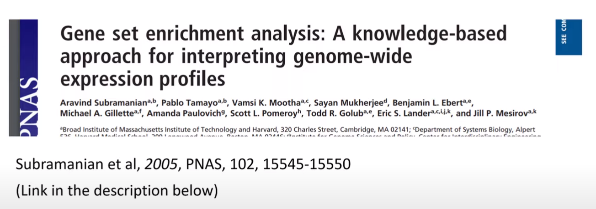

# GSEA 

-   <https://yulab-smu.top/biomedical-knowledge-mining-book/index.html>
-   <https://yulab-smu.top/biomedical-knowledge-mining-book/enrichment-overview.html>
-   <https://github.com/hawn-lab/workshops_UW_Seattle/tree/master/2021.07.14_GSEA>

{width="500"}

```{r message=FALSE, warning=FALSE, eval=F}
library(tidyverse)
library(msigdbr)
library(clusterProfiler)
library(fgsea)

packageVersion("msigdbr")


# if (!require("BiocManager", quietly = TRUE))
#     install.packages("BiocManager")
# 
# BiocManager::install("org.EcK12.eg.db")

```

-   clusterProfiler 패키지 사용을 위해서는 다음과 같이 설치를 수행함
-   만약 설치시 `libglpk.so.40` 관련 에러가 발생할 경우 `apt-get install libglpk40` 수행

```{r, eval=F}
#if (!require("BiocManager", quietly = TRUE))
#    install.packages("BiocManager")

#BiocManager::install("clusterProfiler")

# if (!require("BiocManager", quietly = TRUE))
#     install.packages("BiocManager")
# 
# BiocManager::install("ReactomePA")

# if (!require("BiocManager", quietly = TRUE))
#     install.packages("BiocManager")
# 
# BiocManager::install("enrichplot", force = TRUE)


library(clusterProfiler)
library(tidyverse)
library(org.EcK12.eg.db)
library(ReactomePA)
library(enrichplot)
library(Biostrings)

library(genbankr)
```

## Geneset database

A gene set is an unordered collection of genes that are functionally related. A pathway can be interpreted as a gene set by ignoring functional relationships among genes.

-   Gene Ontology (GO)
-   Kyoto Encyclopedia of Genes and Genomes (KEGG)
-   Reactome (<https://reactome.org/>)
-   org.db

```{r, eval=F}
library(org.EcK12.eg.db)

str(org.EcK12.eg.db)
class(org.EcK12.eg.db)
columns(org.EcK12.eg.db)

ls("package:org.EcK12.eg.db")

x <- org.EcK12.egENZYME
mapped_genes <- mappedkeys(x)
xx <- as.list(x[mapped_genes]
xx <- as.list(org.EcK12.egENZYME2EG)
              
as.list(org.EcK12.egALIAS2EG)[1:10]
as.list(org.EcK12.egACCNUM2EG)[1:2]


as.list(org.EcK12.egPATH)
?org.EcK12.egPATH
x <- org.EcK12.egPATH
mapped_genes <- mappedkeys(x)
xx <- as.list(x[mapped_genes])

as.list(org.EcK12.egACCNUM) %>% head
as.list(org.EcK12.egACCNUM2EG) %>% head
as.list(org.EcK12.egPATH)

```

## Read essential data

-   Essential 데이터 읽고 분류
-   cgenes: CNN 모형이 예측한 결과
-   apgenes: APT 모형이 예측한 결과

```{r, eval=F}
library(Biostrings)
fileno <- "040"

name_md = paste0(fileno, "-AP_ConvLSTM_relEC")
name_date = "-220619"

tmps <- readDNAStringSet(paste0("06-PredData/", name_md, name_date, "_trainingset_results.fasta"))

geneinfo <- strsplit(names(tmps), split="__") %>% 
  do.call(rbind, .) %>% 
  as.data.frame 
colnames(geneinfo) <- c("no", "ess", "pred", "id", "acc")
essdata <- geneinfo %>% 
  mutate(esstrue=ess=="ess", esspred=pred==1) %>% 
  dplyr::select(-c(no, ess, pred))


table(essdata$esstrue, essdata$esspred)

geneinfo2 <- essdata %>% 
  filter(acc!="-") %>% 
  #separate(Gene, c("bnum", "accnum"), sep="__") %>% 
  separate(acc, c("accnum", "tmp"), sep="\\.") %>% 
  dplyr::select(-tmp)

  # mutate(egnum = {
  #   x = as.list(org.EcK12.egACCNUM2EG)[accnum]
  #   x[sapply(x, is.null)] <- NA
  #   unlist(x, use.names = FALSE)
  #   }) %>% 
  # mutate(fcval = C_Prob + 1) ## for the use of gseGO
```

-   read genbank file

```{r, eval=F}
#gbinfo <- readGenBank("03-PrepData/BW25113_CP009273.gb")
```

```{r, eval=F}
geneinfo3 <- mcols(gbinfo@cds) %>% 
  as.data.frame %>% 
  dplyr::select(gene, locus_tag) %>% 
  left_join(geneinfo2, by=c("locus_tag"="id")) %>% 
  mutate(egnum = {
    x = as.list(org.EcK12.egSYMBOL2EG)[gene]
    x[sapply(x, is.null)] <- NA
    unlist(x, use.names = FALSE)
    })


#selgenes018 <- geneinfo3
selgenes040 <- geneinfo3

selgenes018 %>% 
  inner_join(selgenes040, by=c("locus_tag"="locus_tag")) %>% 
  filter(esstrue.x == T & esstrue.y == T)


```

## GO enrichment analysis

-   ACCnumber를 Entrez gene id로 전환
-   `enrichGO` 함수 사용

```{r, eval=F}

selgenes <- geneinfo3 %>%
  filter(esspred==T & esstrue==F)

ggo <- groupGO(gene     = selgenes$egnum,
               OrgDb    = org.EcK12.eg.db,
               ont      = "CC",
               level    = 3,
               readable = TRUE)

ggo@result %>% 
  filter(Count > 0) %>% 
  arrange(desc(Count))
  


egobp <- enrichGO(gene          = selgenes$egnum,
                OrgDb         = org.EcK12.eg.db,
                ont           = "BP",
                pAdjustMethod = "BH",
                pvalueCutoff  = 0.1,
                qvalueCutoff  = 0.5,
        readable      = TRUE)
goplot(egobp)
egobp@result %>% 
  filter(p.adjust < 0.1 & qvalue < 0.5)
  

egocc <- enrichGO(gene          = selgenes$egnum,
                OrgDb         = org.EcK12.eg.db,
                ont           = "CC",
                pAdjustMethod = "BH",
                pvalueCutoff  = 0.1,
                qvalueCutoff  = 0.5,
        readable      = TRUE)
#goplot(egocc)
egocc@result

egomf <- enrichGO(gene          = selgenes$egnum,
                OrgDb         = org.EcK12.eg.db,
                ont           = "MF",
                pAdjustMethod = "BH",
                pvalueCutoff  = 0.1,
                qvalueCutoff  = 0.5,
        readable      = TRUE)
#egomf@result %>% 
#  filter(if_any(where(is.numeric), ~!is.na(.))) 
#goplot(egomf)
egomf@result


```


    GO:0009244 lipopolysaccharide core region biosynthetic process
    GO:0046401    lipopolysaccharide core region metabolic process
    GO:0009103             lipopolysaccharide biosynthetic process
    GO:0008653                lipopolysaccharide metabolic process
    GO:1903509                    liposaccharide metabolic process
    GO:0009312                oligosaccharide biosynthetic process
    GO:0006629                             lipid metabolic process
    GO:0044255                    cellular lipid metabolic process
    GO:0034637          cellular carbohydrate biosynthetic process
    GO:0008610                          lipid biosynthetic process
    GO:0051246             regulation of protein metabolic process
    GO:0033692        cellular polysaccharide biosynthetic process
    GO:0009628                        response to abiotic stimulus


## KEGG enrichment analysis

-   KEGG
-   Supported organisms (<http://www.genome.jp/kegg/catalog/org_list.html>)

```{r, eval=F}
search_kegg_organism('eco', by='kegg_code')
ecoli <- search_kegg_organism('Escherichia coli', by='scientific_name')

```

-   over-representation analysis

```{r, eval=F}

selgenes <- selgenes018 %>% 
  filter(esspred==T & esstrue==F) 

kk <- enrichKEGG(gene         = selgenes$egnum,
                 organism     = 'eco',
                 keyType = "ncbi-geneid",
                 pvalueCutoff = 0.1)

kk@result %>% 
  dplyr::select(Description, qvalue)

selgenes <- selgenes040 %>% 
  filter(esspred==T & esstrue==F) 
kk <- enrichKEGG(gene         = selgenes$egnum,
                 organism     = 'eco',
                 keyType = "ncbi-geneid",
                 pvalueCutoff = 0.1)

kk@result %>% 
  dplyr::select(Description, qvalue)


```

    018

    eco00540    Lipopolysaccharide biosynthesis 0.00531493  
    eco00030    Pentose phosphate pathway   0.12748791  
    eco00650    Butanoate metabolism    0.17372322  
    eco03440    Homologous recombination    0.20574266  
    eco01250    Biosynthesis of nucleotide sugars   0.20574266

    040
    eco00540    Lipopolysaccharide biosynthesis 0.002359464
    eco00650    Butanoate metabolism    0.050898735
    eco02020    Two-component system    0.156421239
    eco01250    Biosynthesis of nucleotide sugars   0.156421239
    eco02010    ABC transporters    0.185342182
    eco00030    Pentose phosphate pathway   0.396099588

```{r, eval=F}
library(pathview)

browseKEGG(kk, 'eco00540')
browseKEGG(kk, 'eco00030')
browseKEGG(kk, 'eco00650')

tmp <- pathview(gene.data  = selgenes$egnum,
                     pathway.id = "eco00540",
                     species    = "eco")

tmp <- pathview(gene.data  = selgenes$egnum,
                     pathway.id = "eco00030",
                     species    = "eco")

tmp <- pathview(gene.data  = selgenes$egnum,
                     pathway.id = "eco00650",
                     species    = "eco")

kk@result


```

-   gene set enrichment analysis

```{r, eval=F}

fcval <- selgenes$fcval
names(fcval) <- selgenes$egnum
fcval <- sort(fcval, decreasing = T)

kk <- gseKEGG(gene         = fcval,
                 organism     = 'eco',
                 keyType = "ncbi-geneid",
                  scoreType = "pos",
                 pvalueCutoff = 1)

mkk2 <- gseMKEGG(geneList = fcval,
                 organism     = 'eco',
                 keyType = "ncbi-geneid",
                 scoreType = "pos",
                 pvalueCutoff = 1)

kk@result

selgenes018 %>% 
  inner_join(selgenes040, by=c("locus_tag"="locus_tag"))


```

## Reactome

