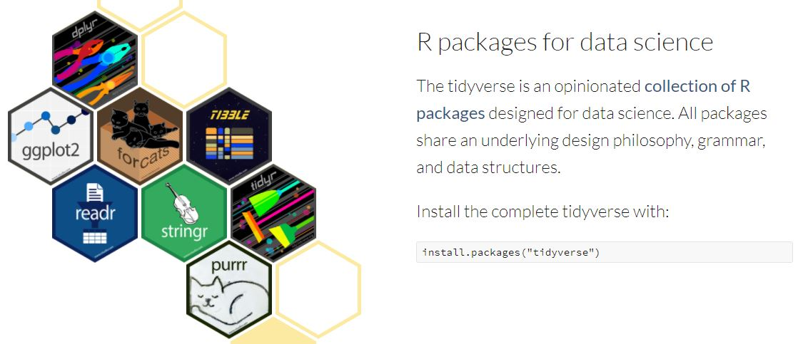
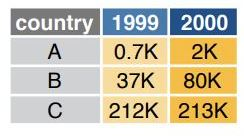
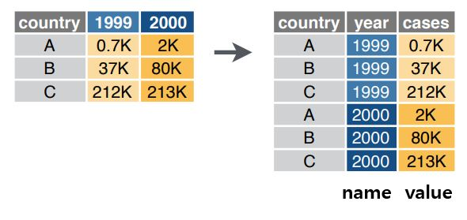

# tidyverse


tidyverse (https://www.tidyverse.org/)는 데이터 사이언스를 위한 R 기반의 독창적인 패키지들의 모음입니다. Rstudio의 핵심 전문가인 해들리위컴이 (Hadley Wickham) 중심이 되어 만들어 졌으며 기존의 툴보다 쉽고 효율적으로 데이터 분석을 수행할 수 있습니다. 

{width=550px}

데이터사이언스는 넓은 범위의 개념과 방법적인 정도가 있는 것은 아닙니다. 그러나 tidyverse의 목적은 데이터 분석을 위한 핵심이되는 고효율의 툴을 제공하는 것이며 그 철학은 다음과 같은 그림으로 요약할 수 있습니다. 


## tibble object type

R은 20년 이상된 비교적 오랜 역사를 가진 언어로서 `data.frame` 형태의 데이터 타입이 가장 많이 사용되고 있습니다. 그러나 당시에는 유용했던 기능이 시간이 흐르면서 몇몇 단점들이 드러나는 문제로 기존 코드를 그대로 유지한채 package 형태로 단점을 보완한 새로운 형태의 tibble 오브젝트 형식을 만들어 냈습니다. 대부분의 R 코드는 여전히 data.frame 형태의 데이터 타입을 사용하고 있으나 tidyverse에서는 `tibble`이 사용되는 것을 참고하시기 바랍니다. 


```r
library(tidyverse)

tb <- tibble(
  x = 1:5, 
  y = 1, 
  z = x ^ 2 + y
)

as_tibble(iris)
head(iris)
```

`tibble`은 `data.frame`과 다음 몇 가지 점이 다릅니다. `data.frame`의 경우 타입을 변환할 때 강제로 값의 타입을 바꾸거나 내부 변수의 이름을 바꾸는 경우가 있었으나 `tibble`은 이를 허용하지 않습니다. 샘플들 (row) 이름을 바꿀수도 없습니다. 또한 프린팅할 때 출력물에 나오는 정보가 다르며 마지막으로 `data.frame`은 subset에 대한 타입이 바뀔 경우가 있었지만 `tibble`은 바뀌지 않습니다. 


```r

x <- 1:3
y <- list(1:5, 1:10, 1:20)

data.frame(x, y)
tibble(x, y)

```

`tibble`은 컬럼 하나가 벡터형 변수가 아닌 리스트형 변수가 될 수 있다는 것도 `data.frame`과 다른 점 입니다. 


```r
names(data.frame(`crazy name` = 1))
names(tibble(`crazy name` = 1))
```

또한 다음과 같이 사용되는 변수의 (`x`) 참조 범위가 다릅니다. 


```r

data.frame(x = 1:5, y = x ^ 2)
tibble(x = 1:5, y = x ^ 2)

```


```r
df1 <- data.frame(x = 1:3, y = 3:1)
class(df1)
class(df1[, 1:2])
class(df1[, 1])

df2 <- tibble(x = 1:3, y = 3:1)
class(df2)
class(df2[, 1:2])
class(df2[, 1])
class(df2$x)
```


## Tidy data structure 

데이터의  변수와 값을 구분하는 일은 적절한 데이터 분석을 위해 필수적인 과정입니다. 특히 복잡하고 사이즈가 큰 데이터일 경우는 더욱 중요할 수 있으나 경험에 의존해서 구분을 하는 것이 대부분 입니다. Tidy data는 이러한 변수와 값의 명확한 구분과 활용을 위한 데이터 구조중 하나 입니다 (Hadley Wickham. Tidy data. *The Journal of Statistical Software*, vol. 59, 2014). 





tidy data는 다음과 같은 특징이 있습니다. 

- 각 변수는 해당하는 유일한 하나의 column을 가짐 
- 각 샘플은 해당하는 유일한 하나의 row를 가짐
- 각 관측값은 해당하는 유일한 하나의 cell을 가짐


{width=600px}


Tidy 데이터는 Long형 데이터로 알려져 있기도 합니다. 참고로 Wide형 데이터의 경우 샘플 데이터가 늘어날수록 row에 쌓이고 새로운 변수는 column에 쌓이는 방식으로 데이터가 확장되는 형태 입니다. 엑셀에서 볼 수 있는 일반적인 형식으로 다음 그림과 같습니다.


Long형 데이터의 경우 ID, variable, value 세가지 변수만 기억하면 되겠습니다. 위 wide형 데이터 경우를 보면 ID, variable, 그리고 value 이 세가지 요인이 주요 구성 요소임을 알 수 있습니다. Long형으로 변환할 경우 샘플을 참조할 수 있는 어떤 변수 (variable)도 ID가 될 수 있으며 2개 이상의 변수가 ID로 지정될 수 있습니다. 참고로 ID를 지정할 경우 해당 ID는 가능하면 중복되지 않는 값들을 갖는 변수를 사용해야 식별자로서 기능을 적절히 수행할 수 있습니다. Long형을 사용할 경우 데이터의 변수가 늘어나도 행의 수만 늘어나므로 코딩의 일관성과 변수들의 그룹을 만들어서  분석하는 등의 장점이 있습니다. 아래는 새로운 변수 F가 추가될 때 long 형 데이터에 데이터가 추가되는 경우를 나타낸 그림 입니다. 


## Pivoting 

일반적으로 얻어지는 데이터의 형태는 wide형이며 이를 Long형으로 변환하기 위해서는 `tidyverse` 패키지에 속한 `tidyr` 패키지의 `pivot_longer`와  `pivot_wider`를 사용합니다. 또한 `reshape2` 패키지의 `melt`함수와 그 반대의 경우 `dcast` 함수를 사용할 수도 있습니다. 본 강의에서는 `tidyr` 패키지를 사용합니다. wide형 데이터를 long형으로 변환하거나 long형을 wide형으로 변환하는 작업을 pivoting 이라고 합니다. 





`airquality` 데이터는 전형적인 wide형 데이터로 특정 날짜에 네 개의 변수에 해당하는 값들을 측정했습니다. 이 데이터를 long형으로 바꿀 경우 ID를 날짜로 하면 데이터들을 식별 할 수 있습니다. 그런데 날짜는 변수가 Month와 Day두 개로 나누어져 있으므로 다음과 같이 두 변수를 식별 변수로 (ID로) 사용 합니다. 확인을 위해 상위 5개의 데이터만 가지고 형 변환을 진행해 보겠습니다.


```r
airquality

myair <- airquality[1:5,]
myair_long <- pivot_longer(myair, c("Ozone", "Solar.R", "Wind", "Temp"))
myair_long 
myair_long2 <- pivot_longer(myair, c(Ozone, Solar.R, Wind, Temp))
myair_long2 
myair_long3 <- pivot_longer(myair, !c(Month, Day))
myair_long3

```

생성되는 long형 데이터의 변수 이름인 name과 value는 다음 파라메터를 지정하여 바꿀 수 있습니다. 


```r

myair_long <- pivot_longer(myair, 
                          c(Ozone, Solar.R, Wind, Temp), 
                          names_to = "Type", 
                          values_to = "Observation")
myair_long 

```
long형 데이터를 wide형 데이터로 변환 할 수도 있습니다. 


```r
pivot_wider(myair_long, names_from = Type, values_from = Observation)
```

::: rmdnote
**Exercises**

1) 다음 데이터가 long형인지 wide형인지 판단하시오   
2) long형이면 wide형으로 wide형이면 long형으로 변환하시오


```r
stocks <- tibble(
  year   = c(2015, 2015, 2016, 2016),
  month  = c(   1,    2,     1,    2),
  profit = c(1.88, 0.59, 0.92, 0.17)
)

```

:::

`ggplot`을 이용한 그래프 작성에는 위와 같은 long형 데이터가 주로 사용됩니다. R을 이용한 데이터 가시화는 `dplyr` 패키지로 wide형 데이터를 편집하고 `pivot_longer` 함수로 long형 데이터로 변환 후 `ggplot`을 이용하는 방식으로 수행합니다. 두 데이터 포멧에 대한 좀 더 구체적인 내용은 다음 링크를 참고하시기 바랍니다. https://www.theanalysisfactor.com/wide-and-long-data/

## Separating and uniting

데이터를 분석할 때 하나의 컬럼에 두 개 이상의 변수값이 저장되어 있거나 두 개의 변수를 하나의 컬럼으로 합해야 하는 경우가 종종 있습니다. 전자의 경우 `separate()` 함수를 사용해서 두 변수(컬럼)으로 나누어 줄 수 있으며 후자의 경우  `unite()` 함수를 사용하여 두 변수를 하나의 값으로 병합할 수 있습니다. 다음은  `airquality`데이터에서 Month와 Day 변수를 하나의 컬럼으로 병합하여 Date라는 변수로 만들어 주는 경우의 예 입니다. 


```r
newairquality <- unite(airquality, Date, Month, Day, sep=".")
newairquality
```

`separate()`함수를 사용하면 다음과 같이 해당 변수의 값을 나누어 다시 두 개의 변수(컬럼)으로 나누어 줄 수 있습니다. 


```r

separate(newairquality, col=Date, into = c("Month", "Day"), sep = "\\.")

```


## dplyr and pipe operator

`dplyr` (https://dplyr.tidyverse.org/) 은 `ggplot2`을 개발한 해들리위컴이 (Hadley Wickham) 중심이 되어 만들어 졌으며 `ggplot2`와 함께 `tidyverse`의 (https://www.tidyverse.org/) 핵심 패키지 입니다. `dplyr`은 데이터를 다루는 크기나 분석의 속도, 편의성을 향상시켜 새롭게 만들어놓은 패키지 입니다. 기존 `apply`와 같은 행렬 연산 기능과 `subset`, `split`, `group` 와 같은 행렬 편집 기능을 더하여 만들어진 도구라고 할 수 있습니다.

`dplyr`의 전신이라 할 수 있는 `plyr` 패키지는 다음과 같이 설명이 되어 있습니다. *A set of tools for a common set of problems: you need to split up a big data structure into homogeneous pieces, apply a function to each piece and then combine all the results back together.* 즉 split-apply-combine 세 가지 동작을 쉽게 할 수 있도록 만들어 놓은 툴 입니다. R이 다른 언어에 비해 데이터 분석에서 주목을 받는 이유로 `split`, `apply` 등의 행렬 연산 함수가 발달한 것을 내세우는데 `dplyr`은 이들을 보다 더 편리하게 사용할 수 있도록 만들어 놓은 것 입니다.


`dplyr`의 사용을 위해서는 여러 명령을 연속적으로 수행하도록 해주는 `%>%` 파이프 오퍼레이터의 이해가 필요합니다. 파이프 오퍼레이터의 작동법은 간단히 `%>%`의 왼쪽 코드의 결과를 출력으로 받아 오른쪽 코드의 입력 (첫번째 파라미터의 값)으로 받아들이는 작동을 합니다 (**단축키: Shift+Ctrl+m**). 다음 예에서 보면 `sin(pi)` 와 같은 함수의 일반적인 사용법 대신 `pi %>% sin` 처럼 사용해도 똑같은 결과를 보여줍니다. `cos(sin(pi))`와 같이 여러 합수를 중첩하여 사용할 경우와 비교해서 코드의 가독성이나 효율 측면에서 크게 향상된 방법을 제공해 줍니다.


```r
library(dplyr)

pi %>% sin
sin(pi)
pi %>% sin %>% cos
cos(sin(pi))
```


특히 ` %>% `는 이후 설명할 `dplyr`의 `group_by`, `split`, `filter`, `summary` 등의 행렬 편집/연산 함수를 빈번히 다양한 조합으로 쓰게되는 상황에서 더 큰 효과를 발휘할 수 있습니다.


{width=500px}

pipe operator의 왼쪽 구문의 결과가 오른쪽 구문의 첫 번째 파라미터의 입력 값으로 처리된다고 말씀 드렸습니다. 즉, 함수에서 사용되는 파라미터가 여러개일 경우가 있으므로 기본적으로 ` %>% ` 의 왼쪽 구문의 출력 값은 오른쪽 구문 (함수)의 첫 번째 인자의 입력값으로 들어가는 것 입니다. 이는 다음 예들을 통해서 명확히 알 수 있습니다. 먼저  `paste`함수는 그 파라미터로 `,`로 구분되는 여러개의 입력 값을 가질 수 있습니다. 따라서 다음 코드는 `x`가 `paste`의 첫 번째 파라미터로 들어가게 되어 `"1a", "2a", "3a", "4a", "5a"`로 a 앞에 x 값들이 붙어서 출력된 것을 알 수 있습니다.


```r
x <- 1:5
x %>% paste("a", sep="")
```

특정 데이터셋의 컬럼별 평균을 구하고 각 평균의 합을 구할 경우를 생각해 봅시다. R에서는 `colMeans`라는 특별한 함수를 제공하여 컬럼별로 평균을 계산해 줍니다. 그 후 sum 함수를 사용하여 최종 원하는 값을 얻을 수 있습니다. 이러한 코드를 `%>%` 오퍼레이터를 사용한 경우의 코드와 비교해 볼 수 있습니다.


```r
x <- data.frame(x=c(1:100), y=c(201:300))
sum(colMeans(x))

x <- data.frame(x=c(1:100), y=c(201:300))
x %>% colMeans %>% sum
```


그럼 만약 두 번째 파라미터에 입력으로 왼쪽 구문의 출력을 받아들이고 싶을 경우는 place holer `.` 을 사용하면 되겠습니다. `round` 함수는 두 개의 파라미터를 설정할 있 이으며 digits 라는 두 번째 파라미터에 값을 pipe operator로 넘겨주고 싶을 경우 아래와 같이 표현할 수 있습니다.


```r
6 %>% round(pi, digits=.)
round(pi, digits=6)
```


::: rmdnote
**Exercises**


1) pipe operator를 사용해서 `airquality`데이터를 long형으로 전환하는 코드를 작성하시오 (단 col 파라메터에는 Ozone, Solar.R, Wind, Temp 변수를 넣음)  
2) pipe operator를 사용해서 `airquality`데이터의 Month와 Day 변수(컬럼)을 Date 변수로 병합하는 코드를 작성하시오  

:::

## dplyr - Important functions

이제 `dplyr` 패키지에서 제공하는 함수를 사용해 보겠습니다. `dplyr`을 구성하는 중요한 함수는 다음과 같습니다. 

* `filter()` -	샘플 (rows) 선택
* `arrange()` -	샘플들의 정렬 순서 변경
* `select()` -	변수 (columns) 선택
* `mutate()` -	새로운 변수 만들기
* `summarise()` -	대표값 만들기 
* `group_by()` -	그룹별로 계산 수행 
* `join()` - 두 tibble 또는 data.frame을 병합할 때 사용


이 함수들은 ` %>% `와 함께 쓰이면서 강력한 성능을 발휘합니다. `summarise` 함수는 특정 값들의 통계 값을 계산해 주는 함수이며 그 외 함수들은 행렬 편집을 위한 함수들로 보시면 되겠습니다. 간단한 예제를 수행하면서 각각의 기능을 살펴보고 왜 `dplyr`이 널리 사용되고 그 장점이 무엇인지 파악해 보도록 하겠습니다.

`iris` 데이터는 세 종류의 iris 품종에 대한 꽃잎과 꽃받침의 length와 with를 측정해 놓은 데이터 입니다. `head`와 `str` 명령어를 `%>%`를  이용해서 데이터를 살펴 봅니다. 


```r
library(tidyverse)

iris %>% head(10)
iris %>% str
```

### filter 

먼저 아래와 같이 `filter` 함수를 사용해서 원하는 조건의 데이터 (샘플)을 골라낼 수 있습니다. 


```r
library(dplyr)

head(iris)
iris %>% filter(Species=="setosa")
iris %>% filter(Species=="setosa" | Species=="versicolor")
iris %>% filter(Species=="setosa" & Species=="versicolor")
iris %>% 
  filter(Species=="setosa" | Species=="versicolor") %>% 
  dim

```


`filter`의 `,`로 구분되는 매개변수는 `and` 로직으로 묶인 조건입니다. 지난 강좌에서 보셨듯 R에서 `and`는 `&`,  `or`는 `|`, 그리고 not은 `!` 으로 사용하면 되며 `filter`에서 `,`로 구분된 조건은 `and`와 같다고 보시면 되겠습니다. 


{width=500px}

Image from (https://r4ds.had.co.nz/)


### arrange 

`arrange()`는 지정된 변수를 기준으로 값의 크기순서로 샘플들의 배열 순서 즉, row의 순서를 바꾸는 기능을 수행합니다. 기본으로 크기가 커지는 순서로 정렬이 진행되며 작아지는 순서를 원할 경우 `desc` 함수를 사용할 수 있습니다. 


```r
iris %>% arrange(Sepal.Length)
iris %>% arrange(desc(Sepal.Length))
iris %>% arrange(Sepal.Length, Sepal.Width)
```

### select

`select()` 는 주어진 데이터셋으로부터 관심있는 변수를 (column) 선택하여 보여줍니다. 다음 helper 함수들은 select 함수와 같이 유용하게 쓰일 수 있습니다. 

> starts_with("abc") -	"abc" 로 시작하는 문자열을 갖는 변수 이름 
> ends_with("xyz") -	"xyz"으로 끝나는 문자열을 갖는 변수 이름 
> contains("ijk") -	"ijk" 문자열을 포함하는 변수 이름 
> matches("(.)\\1") - 정규식, 반복되는 문자 


```r
head(iris)
iris %>% select(Species, everything()) %>% head(5)
iris %>% select(Species, everything())
iris %>% select(-Species)
iris %>% select(starts_with('S'))
iris %>% select(obs = starts_with('S'))

```

아래는 `matches` 함수를 사용한 방법 입니다. 좀 더 복잡한 패턴을 적용하여 변수들을 선택할 수 있으며 `grep` 함수를 사용할 경우도 정규식 패턴을 적용할 수 있습니다. 


```r
iris2 <- rename(iris, aavar = Petal.Length)
select(iris2, matches("(.)\\1"))
tmp <-iris[,3:5]
colnames(iris)[grep("^S", colnames(iris))]
iris[,grep("^S", colnames(iris))]
tmp
```


아래 `(.)\\1`은 하나의 문자 `.`가  (어떤 문자든) 한 번 더 `\\1` 사용된 변수 이름을 말하며 이는 `aavar` 의 `aa`밖에 없으므로 `aavar`가 선택됩니다. `grep`에서 `^` 표시는 맨 처음을 나타내므로 `^S`는 S로 시작하는 문자가 되겠습니다. 따라서 `grep("^S", colnames(iris))`의 경우 컬럼 이름 중 S로 시작하는 이름은 True로 그렇지 않으면 False 값을 리턴합니다. 


### mutate

`mutate()` 함수는 새로운 변수를 추가할 수 있는 기능을 제공하며 앞에서 배웠던 `within()`과 비슷하다고 볼 수 있습니다. 아래와 같이 `mutate`함수는 sepal_ratio라는 변수를 새로 만들어서 기존 iris 데이터들과 함께 반환해 줍니다. 


```r
iris2 <- iris %>% mutate(sepal_ratio = Sepal.Length/Sepal.Width)
head(iris2)
```


### summarise

`summarise()`는 `data.frame`내 특정 변수의 값들로 하나의 요약값/대푯값을 만들어 줍니다. `summarise` 함수는 단독으로 쓰이기 보다는 `group_by()` 기능과 병행해서 쓰이는 경우에 유용하게 쓰입니다. `summarise_all()` 함수를 사용하면 모든 변수에 대해서 지정된 함수를 실행합니다. 


```r
iris %>% summarise(mean(Sepal.Length), m=mean(Sepal.Width))
iris %>% 
  group_by(Species) %>% 
  summarise(mean(Sepal.Width))

iris %>% 
  group_by(Species) %>% 
  summarise_all(mean)

iris %>% 
  group_by(Species) %>% 
  summarise(across(everything(), mean))


iris %>% 
  group_by(Species) %>% 
  summarise_all(sd)

iris %>% 
  group_by(Species) %>% 
  summarise(across(everything(), sd))

```

### join 

`join` 함수는 데이터를 병합해주는 기능을 수행하는 함수 입니다. 네 가지 종류의 함수가 있으며 (`left_join()`, 'right_join()`, 'inner_join()`, 'full_join()`) 기본적으로 공통되는 이름의 변수를 (key) 이용해서 공통되는 샘플끼리 자동으로 병합해 주는 기능을 수행합니다. `by`에서 지정해준 파라메터의 값을 기준으로 기능이 수행 됩니다. 


```r
df1 <- data.frame(id=c(1,2,3,4,5,6), age=c(30, 41, 33, 56, 20, 17))
df2 <- data.frame(id=c(4,5,6,7,8,9), gender=c("f", "f", "m", "m", "f", "m"))

inner_join(df1, df2, by="id")
left_join(df1, df2, "id")
right_join(df1, df2, "id")
full_join(df1, df2, "id")

# vs.
cbind(df1, df2)
```

## Code comparison

이제 `split`, `apply`, `combine`을 활용하여 평균을 구하는 코드와 `dplyr` 패키지를 사용하여 만든 코드를 비교해 보도록 하겠습니다. iris 데이터를 분석하여 품종별로 꽃받침의 길이 (Sepal.length)의 평균과 표준편차, 그리고 샘플의 수를 구해보는 코드입니다. 

`split`은 `factor`형 변수인 Species를 기준으로 `iris` 데이터를 나누어 주는 역할을 하며 `lapply`는 `list` 형 데이터인 `iris_split`을 각 리스트의 각각의 원소들에 대해서 임의의 함수 `function(x)...` 를 수행하는 역할을 합니다. 마지막 `data.frame`으로 최종 경로를 combine 합니다.


```r
iris_split <- split(iris, iris$Species)
iris_means <- lapply(iris_split, function(x){mean(x$Sepal.Length)})
iris_sd <- lapply(iris_split, function(x){sd(x$Sepal.Length)})
iris_cnt <- lapply(iris_split, function(x){length(x$Sepal.Length)})
iris_df <- data.frame(unlist(iris_cnt), unlist(iris_means), unlist(iris_sd))

```


아래는 `dplyr` 패키지를 사용한 코드 입니다.


```r
iris_df <- iris %>% 
  group_by(Species) %>% 
  summarise(n=n(), mean=mean(Sepal.Length), sd=sd(Sepal.Length))
```


위에서 보듯 `dplyr` 패키지를 사용할 경우 그 결과는 같으나 코드의 가독성과 효율성면에서 장점을 보여줍니다. `iris` 데이터를 받아서 Species에 명시된 그룹으로 나누고 원하는 함수를 타깃 컬럼에 대해서 적용하라는 의미 입니다. 다음은 모든 변수에 대한 평균을 구하는 코드 입니다. 


```r
iris_mean_df <- iris %>% 
  group_by(Species) %>% 
  summarise(across(everything(), mean))
```


자세한 ggplot의 내용은 다음시간에 학습하겠지만 각 평균에 대한 막대그래프를 그러보겠습니다. 


```r
library(ggplot2)

iris_mean_df2 <- iris_mean_df %>% 
  pivot_longer(-Species)

ggplot(iris_mean_df2, aes(x=Species, y=value, fill=name)) +
  geom_bar(stat="identity", position="dodge")

```

{width=500px}


::: rmdnote
**Exercises**

InsectSprays 데이터는 살충제 6종에 대한 살충력을 (죽은 벌래의 마릿수) 나타내는 데이터이다. 각 살충제별로 평균과 표준편차를 구하시오 

:::


::: rmdnote
**Exercises**

dplyr 패키지의 starwars 는 스타워즈 영화에 나오는 등장인물들을 분석한 데이터셋 이다. 종족에 따른 키의 평균과 표준편차를 구하시오. (NA 데이터는 제외하고 분석)


:::


::: rmdnote
**Exercises**

airquality 데이터는 뉴욕주의 몇몇 지점에서의 공기질을 측정한 데이터이다. 데이터에서 NA를 제거하고 각 월별로 평균 오존, 자외선, 풍속, 및 온도에 대한 평균과 표준편차를 구하시오


```r

airmean <- airquality %>% 
  filter(complete.cases(.)) %>% 
  select(-Day) %>% 
  group_by(Month) %>% 
  summarise(across(everything(), mean)) %>% 
  pivot_longer(-Month, values_to = "mean")

airsd <- airquality %>% 
  filter(complete.cases(.)) %>% 
  select(-Day) %>% 
  group_by(Month) %>% 
  summarise(across(everything(), sd)) %>% 
  pivot_longer(-Month, values_to = "sd")

```

:::

참고로 errorbar가 있는 막대그래프를 그려보겠습니다. 이를 위해서 먼저 두 테이블을 병합한 후 `ggplot2` 패키지의 `ggplot` 함수를 이용해서 그래프를 그립니다. 자세한 `ggplot`의 내용은 다음시간에 학습하겠습니다. 


```r

airdata <- left_join(airmean, airsd, by=c("Month", "name"))

ggplot(airdata, aes(x=Month, y=mean, fill=name)) +
  geom_bar(stat="identity", position="dodge") +
  geom_errorbar(aes(ymin=mean-sd, ymax=mean+sd), position=position_dodge(width=0.9), width=0.4)

```

{width=500}


---


<a rel="license" href="http://creativecommons.org/licenses/by-nc-nd/4.0/"></a><br />이 저작물은 <a rel="license" href="http://creativecommons.org/licenses/by-nc-nd/4.0/">크리에이티브 커먼즈 저작자표시-비영리-변경금지 4.0 국제 라이선스</a>에 따라 이용할 수 있습니다.

