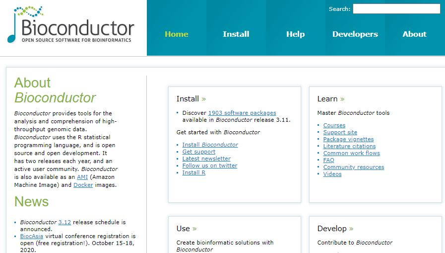

# Bioconductor

* https://www.bioconductor.org

Bioconductor는 바이오인포메틱스를 위한 R기반의 데이터, 메소드, 그리고 패키지들의 모음입니다. 2002년 microarray 데이터 분석을 위한 플랫폼으로 시작되었으며 현재 2000개 이상의 패키지로 구성되어 있습니다. R은 분산형 오픈소스이나 Bioconductor는 Full-time developer들에 의해서 유지되고 있습니다. `CRAN`에 배포되지 않고 `CRAN`에 비해 더 많은 필수 자료들 (vignettes 등)이 필요하며 높은 수준으로 quality control이 되고 있습니다. 

사용 가능한 패키지들은 [이곳](http://bioconductor.org/packages/release/BiocViews.html#___Software)을 참고하시면 되겠습니다. 

{width=600}


Bioconductor 코어 개발 그룹은 사용자들이 지놈스케일 데이터를 더 편리하게 다루룰 수 있도록 데이터의 구조를 개발하고 있습니다. Bioconductor의 주요 기능은 다음과 같습니다. 

 * 지놈스케일의 서열이나 발현등 대용량 유전자형 데이터 **관리** 및 **통계적 분석**을 위한 툴 제공
 * 분자수준의 현상과 생장이나 질병 등 표현형수준의 관계를 규명하기 위한 정량 데이터 통합 및 관리 


## Packages


메인화면 >> Use >> Software, Annotation, Experiment

 * Software: 데이터 분석을 위한 알고리즘/툴 모음
 * Annotation: 유전자 symbol/ID mapping, gene ontology 기반 유전자 분류, 유전체상에서 exon, transcript, gene 등의 위치, 단백질 기능 등. Annotation > Packagetype 참고
 * Experiment data: 검증된 실험 데이터
 * Workflow: 특정 데이터 분석을 위한 프로세스 모음 RNA-seq, ChIP seq, copy number analysis, microarray methylation, classic expression analysis, flow cytometry 등 

{width=600}
 
 
Annotation 리소스는 다음과 같이 몇 단계의 레벨로 구분할 수 있습니다. 

* ChipDb: 가장 낮은 단계, Affymatrix Chip 정보
* OrgDb: 특정 생물(Organism)의 기능적 annotations 
* TxDb/EnsDb:	전사체 정보, 위치 정보
* OrganismDb: meta-packages for OrgDb, TxDb
* BSgenome	특정 생물의 실제 염기 정보
* Others	GO.db; KEGG.db
* AnnotationHub:
* biomaRt: 


`Bioconductor`에서 제공하는 패키지를 설치하기 위해서는 `BiocManager`를 먼저 설치하고 해당 패키지를 설치하시기 바랍니다. `BiocManager`에는 `available()`이라는 함수로 (특정 문자가 포함된) 사용 가능한 패키지를 검색할 수 도 있습니다. 예를 들어 `IRanges`라는 패키지를 설치할 경우 bioconductor 상단 오른쪽의 `Search` 나 [software package list](https://www.bioconductor.org/packages/release/BiocViews.html#___Software)의 검색창에서 `IRanges`를 입력하여 해당 패키지를 찾고 다음과 같이 설치를 수행합니다. 


```r
if (!requireNamespace("BiocManager", quietly = TRUE))
    install.packages("BiocManager")

BiocManager::install("IRanges")
## .libPaths()
```


::: rmdnote
**Exercises **


OrganismDb는 meta-package의 형태로 OrgDb, TxDb, 그리고 GO.db 패키지들을 포함하는 정보를 가지고 있음. OrganismDB 중 인간의 정보를 가진 `Homo.sapiens`를 찾아 설치하시오 

:::


## Learning and support

각 패키지는 제목, 저자, 유지관리자, 설명, 참조, 설치법 등의 정보가 포함된 landing page가 있으며 패키지 내 함수들은 상세한 설명과 예제가 제공됩니다.  예를 들어 [IRanges](http://bioconductor.org/packages/release/bioc/html/IRanges.html)의 landing page를 참고하세요. `vignettes`는 bioconductor의 중요한 특징 중 하나로 R 코드와 함께 패키지를 사용하는 방법에 대한 상세한 설명을 제공하는 문서입니다.  


```r

library(IRanges)

vignette(package="IRanges")
browseVignettes("IRanges")
vignette("IRangesOverview", package="IRanges")

ir1 <- IRanges(start=1:10, width=10:1)
ir1
class(ir1)
methods(class="IRanges")

example(IRanges)
?IRanges
??IRanges
```


메인페이지 >> Learn >> Support site 게시판에는 관련된 여러 QnA 들이 있어서 유사 문제에 대한 도움을 받을 수 있습니다. 


## OOP - Class, Object and Method

객체지향프로그래밍 (OOP)은 복잡한 문제를 프로그래밍할 때 발생되는 코드의 복잡성을 해결할 수 있는 하나의 방안으로 1990년대부터 많이 사용되었습니다. 

R도 객체지향 프로그래밍 언어입니다. 그런데 R은 다른 언어들에 비해서 좀 어려운 (다른) 개념으로 사용됩니다. R에서 사용하는 Class에는 크게 base type, S3, S4, RC, 그리고 R6 등 다양한 타입이 있고 이 중 S3를 많이 사용해 왔으며 S3의 단점을 보완한 S4 형식의 class와 R6를 주로 사용합니다 [@AdvancedR]. 본 강의에서는 S3 형식의 class만 다루도록 하겠습니다. 

클래스를 사용하는 이유는 여러가지가 있겠지만 복잡한 개념의 데이터를 구조화하고 쉽게 관리하기 위해서 사용한다고 보면 될 것 같습니다. 여러분이 알아야할 개념은 Class와 Object 그리고 Method 입니다. 사실 R의 모든것이 Object이고 이러한 Object들의 정의가 Class 입니다.


```r

df <- data.frame(x=c(1:5), y=LETTERS[1:5])
df
class(df)

```
위에서 df는 변수라고 부르지만 object이기도 합니다. df의 class는 data.frame 입니다. 클래스는 누구든 원하는 만큼 얼마든지 만들 수 있습니다. 


```r

class(df) <- "myclass"
df
class(df)

class(df) <- c("data.frame", "myclass")
df
class(df)
```


그런데 모든 object들이 OOP 유래는 아닙니다 base object들이 그 예입니다. 


```r
x <- 1:10
class(x)
attr(x, "class")

mtcars
attr(mtcars, "class")
```


method는 위와 같은 클래스들에 특화된 어떤 기능을 하는 함수라고 생각하시면 됩니다. 
 

```r
mt <- matrix(1:9, 3,3)
df <- data.frame(1:3, 4:6, 7:9)

class(mt)
class(df)
str(mt)
str(df)


diamonds <- ggplot2::diamonds

summary(diamonds$carat)
summary(diamonds$cut)

methods(class="data.frame")
```

위 summary, str 등이 generic function이라 불리는 method들 입니다. class마다 사용 가능한 method가 어떠한 정보가 있는지 알기 위해서 `methods()`라는 함수를 사용합니다. R의 객체지향프로그래밍에 대한 상세한 내용은 [Advanced R](https://adv-r.hadley.nz/s3.html)를 참고하세요. 


::: rmdnote
**Exercises **

다음 두 종류의 객체에 대해서 class 가 `integer` 일 경우 평균을 계산하고 `character`일 경우 비율을 계산하는 (`table` 함수 사용) `mysummary` 함수를 만드시오 


```r

x <- c(1:10)
y <- c("A", "G", "G", "T", "A")

```


:::

## Bioconductor의 OOP

bioconductor에서 다루는 genome 스케일의 `experiment`나 `annotation`은 대표적인 복잡한 데이터 중 하나 입니다. Bioconductor에서 OOP 개념은 다음과 같습니다.   

> class - 복잡한 생물학적 데이터 구조의 틀 정의  
> object - 특정 클래스가 특정 구현된 실체  
> method - 특정 클래스에 대한 기능 수행 


예를 들어 앞에서 설치한 `Homo.sapience`의 class인 `OrganismDb`  살펴보면 다음과 같습니다. 


```r
library(Homo.sapiens)
class(Homo.sapiens)
?OrganismDb
```

> The OrganismDb class is a container for storing knowledge about existing Annotation packages and the relationships between these resources. The purpose of this object and it's associated methods is to provide a means by which users can conveniently query for data from several different annotation resources at the same time using a familiar interface.


```r
homo_seq <- seqinfo(Homo.sapiens)
class(homo_seq)
?Seqinfo

```

> A Seqinfo object is a table-like object that contains basic information about a set of genomic sequences. ...


```r
length(homo_seq)
seqnames(homo_seq)
```

bioconductor에는 대용량 정보가 object 형태로 구조화되어 저장되어 있으며 `library()`함수로 읽어올 수 있고 다양한 함수로 해당 object의 정보를 읽어올 수 있습니다. 

::: rmdnote
**Exercises **

`Homo.sapiens` 정보에서 상위 10개 유전자와 상위 10개 exon을 구하시오 


:::


---


<a rel="license" href="http://creativecommons.org/licenses/by-nc-nd/4.0/"></a><br />이 저작물은 <a rel="license" href="http://creativecommons.org/licenses/by-nc-nd/4.0/">크리에이티브 커먼즈 저작자표시-비영리-변경금지 4.0 국제 라이선스</a>에 따라 이용할 수 있습니다.

