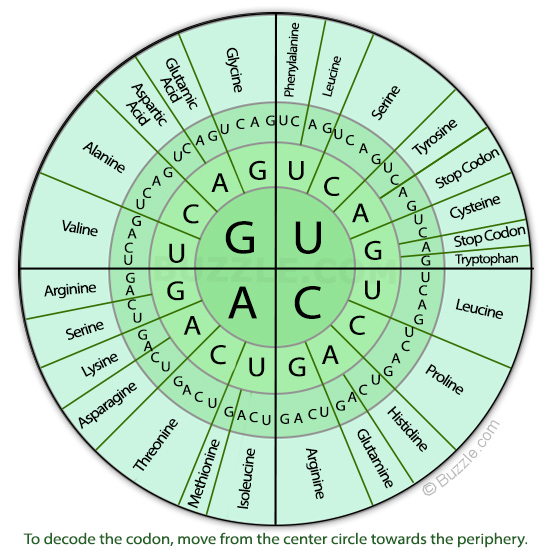

# Biostrings

High-throughput sequencing 데이터를 포함한 DNA나 Amino acid와 같은 생물학적 서열은 `Bioconductor`의 다양한 패키지들에 의해서 분석될 수 있으며 특히 `Biostrings` 패키지는 생물학적 서열을 효과적으로 활용하기 위한 핵심 도구로 활용됩니다. 

## Working with sequences

`Biostrings`는 DNA, RNA, amino acids와 같은 생물학적 string을 다루기 위한 다양한 함수를 제공하는 패키지 입니다. 특히 서열에서의 패턴 탐색이나 Smith-Waterman local alignments, Needleman-Wunsch global alignments 등의 서열 비교함수를 제공하여 간단한 서열 분석에 자주 활용되는 패키지 입니다 [@sippl1999biological]. `Biostrings` 패키지의 설치 방법은 아래와 같습니다. 


```r
if (!requireNamespace("BiocManager", quietly = TRUE))
    install.packages("BiocManager")

BiocManager::install("Biostrings")
```


```r
library(Biostrings)
```

Biostrings 패키지는 기본적으로 `XString, XStringSet, XStringViews` 3가지의 class를 정의하고 있습니다. `XString`은 DNA나 RNA, AA 등 생물학적 서열 한 가닥을 다루기위한 클래스이며 `XStringSet`은 여러 가닥을 다루기위한 클래스 입니다.


`DNAString` 함수를 이용해서 객체를 만들어낼 수 있으며 'A', 'C', 'G', 'T' 외에 '-' (insertion), 'N' 을 허용합니다. 


```r
dna1 <- DNAString("ACGT?")
dna1 <- DNAString("ACGT-N")
dna1[1]
dna1[2:3]

dna2 <- DNAStringSet(c("ACGT", "GTCA", "GCTA"))
dna2[1]
dna2[[1]]
dna2[[1]][1]
```

다음 내장변수 들은 `Biostrings` 패키지를 로드하면 자동으로 저장되는 변수들로 생물학적 서열을 미리 정의해 놓았습니다. IUPAC (International Union of Pure and Applied Chemistry, 국제 순수·응용 화학 연합)


```r
DNA_BASES
DNA_ALPHABET
IUPAC_CODE_MAP
GENETIC_CODE
```

{width=400}

위 변수들을 이용하면 다음처럼 `sample()` 함수를 이용해서 랜덤하게 DNA 서열을 얻을 수 있습니다. `DNA_BASES`가 4개 길이를 갖는 벡터인데 이 중 10개를 뽑으려면 `replace=T`로 해야 합니다.


```r
x0 <- sample(DNA_BASES, 10, replace = T)
x0
s1 <- "ATG"
s2 <- "CCC"
s3 <- paste(s1, s2, sep="")
s3
x1 <- paste(x0, collapse="")
x1
```

관련 함수는 [Cheat sheat](http://bioconductor.org/packages/release/bioc/vignettes/Biostrings/inst/doc/BiostringsQuickOverview.pdf) 참고

### XString

`XString` 클래스는 `DNAString`과 `RNAString`, `AAString`의 subclass로 나눌 수 있습니다. `DNAString` class에서 `length` 함수는 핵산의 갯수를 (`DNAStringSet` 타입의 변수에서 length는 DNA 가닥의 갯수) 계산하며 핵산의 갯수는 `nchar`함수로 얻어낼 수 있습니다. `toString`은 DNAString 타입을 단순 문자열로 변환해주는 함수이며 상보서열, 역상보서열 등의 정보도 `complement`, `reverseComplement` 등을 사용하여 찾아낼 수 있습니다.


```r
x0 <- paste(sample(DNA_BASES, 10, replace = T), collapse="")
x1 <- DNAString(x0)
class(x0)
class(x1)
length(x1)
toString(x1)
complement(x1)
Biostrings::complement(x1)
reverseComplement(x1)

```

`DNAString`의 인덱싱은 vector (string)과 같으며 `DNAStringSet`은 list의 인덱싱과 같습니다.


```r
## indexing
x1[1]
x1[1:3]
subseq(x1, start=3, end=5)
subseq(x1, 3, 5)

## letter frequency
alphabetFrequency(x1, baseOnly=TRUE, as.prob=TRUE)
letterFrequency(x1, c("G", "C"), as.prob=TRUE)

```


::: rmdnote
**Exercises **

1. 개시코돈과 스탑코돈을 포함한 30개 길이를 갖는 랜덤 유전자서열을 하나 만드시오

2. AA_ALPHABET은 IUPAC에서 정의된 아미노산 서열 알파벳이 저장된 내장변수임. "M"과 "*"를 포함하는 10개 길이를 갖는 랜덤 유전자서열을 하나 만드시오


:::


### XStringSet

`XStringSet`역시 `DNAStringSet`, `RNAStringSet`, 그리고 `AAStringSet`으로 나눌 수 있으며 `DNAStringSet` class는 여러개의 `DNAString` 을 모아 놓은 집합이라고 보면 됩니다. `length` 함수는 DNA string의 갯수이며 `width` 또는 `nchar` 함수로 각 string의 길이를 구할 수 있으며 이 외 대부분의 `DNAString` 에서 사용되는 함수가 동일하게 사용될 수 있습니다.


```r

x0 <- c("CTC-NACCAGTAT", "TTGA", "TACCTAGAG")
x1 <- DNAStringSet(x0)
class(x0)
class(x1)
names(x1)
names(x1) <- c("A", "B", "C")
length(x1)
width(x1)
subseq(x1, 2, 4)
x1[[1]]
x1[1]


x3 <- DNAString("ATGAGTAGTTAG")
x4 <- c(x1, DNAStringSet(x3))
x4[-1]
x4
alphabetFrequency(x1, baseOnly=TRUE, as.prob=TRUE)
letterFrequency(x1, c("G", "C"), as.prob=TRUE)
rowSums(letterFrequency(x1, c("G", "C"), as.prob=TRUE))
subseq(x4, 2, 4)
```

RNA나 아미노산 역시 동일한 방식으로 적용 가능하며 `c` 함수를 이용해서 XStringSet으로 변환 가능합니다.  


```r

x1 <- paste(sample(AA_ALPHABET, 10, replace = T), collapse="")
x2 <- paste(sample(AA_ALPHABET, 10, replace=T), collapse="")

x3 <- AAString(x1)
x4 <- AAString(x2)

AAStringSet(c(x1, x2))
AAStringSet(c(x3, x4))
```


::: rmdnote
**Exercises **

1. 시작코돈과 종결코돈이 있는 길이 36bp 짜리 DNA (랜덤) 서열을 하나 만드시오


2. 위와 같은 랜덤서열 10개 만들어서 DNAStringSet으로 변환하시오 

아래는 가장 직관적으로 생각할 수 있는 `for`를 이용한 방법입니다. 즉, 10개 저장소를 갖는 x0 변수를 미리 생성해 두고 for 문을 돌면서 서열을 하나씩 만들어 저장하는 방법입니다.


```r
x0 <- rep("", 10)
for(i in 1:length(x0)){
  tmp <- paste(sample(DNA_BASES, 30, replace = T), collapse="")
  x0[i] <- paste("ATG", tmp, "TAG", sep="")
}
x0
```

위 코드를 함수로 만들어 보겠습니다. random dna를 만들 때 길이만 다를뿐 같은 코드를 반복해서 사용하고 있습니다. 이럴 경우 DNA 길이를 사용자가 정해주도록 input parameter로 하고 해당 파라메터를 받아 DNA를 만들어 주는 함수를 만들어 사용하면 편리합니다.


```r
data(DNA_BASES)
random_dna <- function(len){
  tmp <- paste(sample(DNA_BASES, len, replace = T), collapse="")
  x0 <- paste("ATG", tmp, "TAG", sep="")
  return(x0)
}
random_dna(len=30)
random_dna(len=40)
```

파라메터로 넘겨진 len 값이 sample 함수의 len에 사용된 것을 참고하세요.

이제 길이 30bp짜리 10개의 서열을 반복해서 만들 때 위 함수를 앞서와 같이 for문을 이용하여 10번 반복해서 실행해 주면 같은 결과를 얻습니다. 위와 같이 함수를 만들어 두면 언제든 DNA 서열을 만들 때 재사용 할 수 있습니다.


```r
x0 <- rep("", 10)
for(i in 1:length(x0)){
  x0[i] <- random_dna(30)
}
x0
```

그런데 R에는 `apply` 와 같은 행렬연산 함수가 있어서 for문을 사용하지 않고 편리하게 반복문을 실행할 수 있습니다. `replicate` 함수는 `apply`와 같은 기능으로 list나 vector 변수에 대해서 사용할 수 있습니다. 즉, 다음과 같이 사용자가 원하는 함수를 반복해서 실행하고 반복 수 만큼의 길이를 갖는 결과를 반환합니다.


```r
x0 <- replicate(10, random_dna(30))
x0
x1 <- DNAStringSet(x0)
x1
```

3. 위 생성한 10개 서열의 GC 비율을 계산하고 bar그래프를 그리시오

위 x0 스트링들을 XStringSet으로 바꾸고 GC 비율을 구한 후 bargraph를 그리겠습니다. gc_ratio가 G와 C의 비율값을 저장한 10x2 테이블이므로 x축에 10개의 서열과 각 서열의 GC비율을 나타내고 y축에 비율 값을 그리는 것으로 생각한 후 ggplot의 aes와 파라메터를 적절히 지정해 줍니다.


```r
x1 <- DNAStringSet(x0)
gc_ratio1 <- letterFrequency(x1, c("G", "C"), as.prob=TRUE)
gc_ratio2 <- rowSums(gc_ratio1)
barplot(gc_ratio2, beside=T)

```


:::


### XStringView

`Biostrings`의 또 다른 class인 `XStringView`는 `XString` class의 DNA, RNA, AA서열을 사용자가 원하는대로 볼 수 있는 인터페이스를 제공합니다. 사용법은 다음과 같습니다.


```r
x2 <- x1[[1]]
Views(x2, start=1, width=20)
Views(x2, start=1, end=4)
Views(x2, start=c(1,3), end=4)
Views(x2, start=c(1,3,4), width=20)
Views(x2, start=c(1,3,4), width=20)
i <- Views(x2, start=c(1,3,4), width=20)
```

다음과 같이 한 서열에 대한 여러 부분의 서열 조각도 볼 수 있으며 `gaps` 함수는 매개변수로 주어진 서열 view의 구간을 제외한 나머지 구간의 서열을 보여주는 함수입니다. `successiveviews` 함수는 처음 서열부터 매개변수 width에 주어진 갯수 만큼의 서열을 보여주며 `rep()` 함수를 이용해서 서열의 처음부터 끝까지 보여주는 기능을 합니다.


```r
v <- Views(x2, start=c(1,10), end=c(3,15))
gaps(v)

successiveViews(x2, width=20)
successiveViews(x2, width=rep(20, 2))
successiveViews(x2, width=rep(20, 3))

```


::: rmdnote
**Exercises **

1. 1000bp 길이의 랜덤 DNA 서열을 만들고 40bp 단위의 길이로 보는 코드를 작성하시오. 

앞서 만들어둔 `random_dna()` 함수를 사용하면 되며 `successiveViews` 함수를 사용해야 하므로 `DNAString`으로 변환이 필요하며 서열의 길이에 따라서 `rep()` 를 이용하여 반복 횟수를 자동 계산합니다.


:::


## Sequence read and write

Biostrings 패키지의 `readDNAStringSet`이나 `writeXStringSet`을 사용하면 기본 DNA/RNA/AA 서열의 읽고 쓰기가 가능하며 fasta와 fastq 등의 파일타입으로 적용이 가능합니다. 


```r
x1 <- DNAStringSet(x0)
writeXStringSet(x1, "myfastaseq.fasta", format="fasta")

names(x1) <- "myfastaseq"
writeXStringSet(x1, "myfastaseq.fasta", format="fasta")

myseq <- readDNAStringSet("myfastaseq.fasta", format="fasta")
myseq
```

`successiveViews`로 나눈 여러개의 DNA 조각을 `myfastaseqs.fasta`에 저장하고 다시 읽을 수 있습니다. 


```r

myseqs <- DNAStringSet(sv)
names(myseqs) <- paste("myseqs", 1:length(myseqs), sep="")
writeXStringSet(myseqs, "myfastaseqs.fasta", format="fasta")

```


## Sequence statistics

`oligonucleotideFrequency` 는 width와 step 이라는 옵션에 따라서 해당 서열의 모든 핵산의 수를 세어주는 합수입니다. 다음에 사용되는 yeastSEQCHR1는 Biostrings 패키지에 포함된 내장 데이터로서 yeast의 첫 번째 염색체 정보를 담고 있습니다.  


```r
data(yeastSEQCHR1) #Biostrings
yeast1 <- DNAString(yeastSEQCHR1)

oligonucleotideFrequency(yeast1, 3)
dinucleotideFrequency(yeast1)
trinucleotideFrequency(yeast1)

tri <- trinucleotideFrequency(yeast1, as.array=TRUE)
tri
```


아미노산 정보를 얻기 위해서 ORF를 찾아보겠습니다. yeast의 첫 번째 염색체에 대한 정보는 annotation이 되어 있지만 학습을 위해 툴을 사용하겠습니다. 이미 많은 종류의 ORF 탐색 툴이 나와있지만 본 강의에서는 NCBI에서 제공하는 `orffinder`를 사용하도록 하겠습니다. 


```r
my_ORFs <- readDNAStringSet("yeast1orf.cds")
hist(nchar(my_ORFs), br=100)
codon_usage <- trinucleotideFrequency(my_ORFs, step=3)
global_codon_usage <- trinucleotideFrequency(my_ORFs, step=3, simplify.as="collapsed")

colSums(codon_usage) == global_codon_usage
names(global_codon_usage) <- GENETIC_CODE[names(global_codon_usage)]
codonusage2 <- split(global_codon_usage, names(global_codon_usage))
global_codon_usage2 <- sapply(codonusage2, sum) 

```

yeast 첫 번째 염색체에 대한 정보는 [bioconductor annotationData OrgDb](http://bioconductor.org/packages/release/BiocViews.html#___OrgDb) 또는 [bioconductor annotationData TxDb](https://www.bioconductor.org/packages/release/BiocViews.html#___TxDb) 에서 찾아볼 수 있습니다. 


```r
#BiocManager::install("org.Sc.sgd.db")
library(org.Sc.sgd.db)
class(org.Sc.sgd.db)
?org.Sc.sgd.db
ls("package:org.Sc.sgd.db")
columns(org.Sc.sgd.db)
mykeys <- keys(org.Sc.sgd.db, keytype = "ENTREZID")[1:10]
AnnotationDbi::select(org.Sc.sgd.db, 
                      keys=mykeys, 
                      columns = c("ORF","DESCRIPTION"),
                      keytype="ENTREZID")

```

TxDb


```r

BiocManager::install("TxDb.Scerevisiae.UCSC.sacCer3.sgdGene")
library(TxDb.Scerevisiae.UCSC.sacCer3.sgdGene)
class(TxDb.Scerevisiae.UCSC.sacCer3.sgdGene)
columns(TxDb.Scerevisiae.UCSC.sacCer3.sgdGene)
methods(class=class(TxDb.Scerevisiae.UCSC.sacCer3.sgdGene))
ygenes <- genes(TxDb.Scerevisiae.UCSC.sacCer3.sgdGene)

```


```r
library(tidyverse)

mydat <- global_codon_usage2 %>% 
  data.frame %>% 
  rownames_to_column %>% 
  rename(codon = "rowname", freq = ".") 

ggplot(mydat, aes(x=codon, y=freq)) +
  geom_bar(stat="identity") 

```

::: rmdnote
**Exercises **

`AMINO_ACID_CODE`를 이용해서 위 그래프의 1약자를 3약자로 변환, 라벨을 세로로 90도 회전, y축 라벨 "Frequency", x축 라벨 "Amino acid code", theme 옵션 "theme_bw" 등을 적용하여 다시 그림을 그리시오 (revisit ggplot2)

:::


## Pattern matching

`Biostrings` 패키지에는 하나의 subject 서열에 특정 pattern이 존재하는지 탐색하는 `matchPattern`함수를 제공합니다. 만약 여러개의 subject 서열에서 하나의 pattern을 찾을 경우에는 `vmatchPattern`함수를 사용하고 하나의 subject 서열에 여러개의 pattern을 찾는 경우에는 `matchPDict` 함수를 사용합니다.


```r

length(coi)
hits <- matchPattern("ATG", yeast1, min.mismatch=0, max.mismatch=0)
hits
class(hits)
methods(class="XStringViews")
ranges(hits)

hits <- vmatchPattern("ATG", my_ORFs, min.mismatch=0, max.mismatch=0)
stack(hits)

```


---


<a rel="license" href="http://creativecommons.org/licenses/by-nc-nd/4.0/"></a><br />이 저작물은 <a rel="license" href="http://creativecommons.org/licenses/by-nc-nd/4.0/">크리에이티브 커먼즈 저작자표시-비영리-변경금지 4.0 국제 라이선스</a>에 따라 이용할 수 있습니다.


