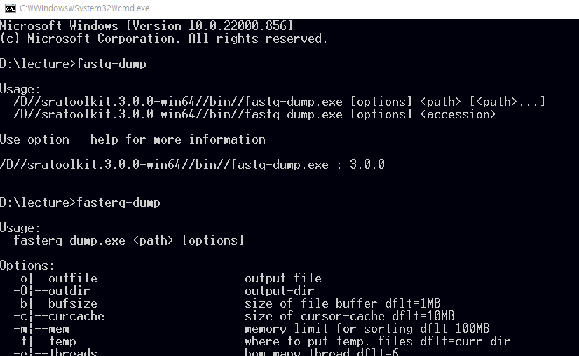
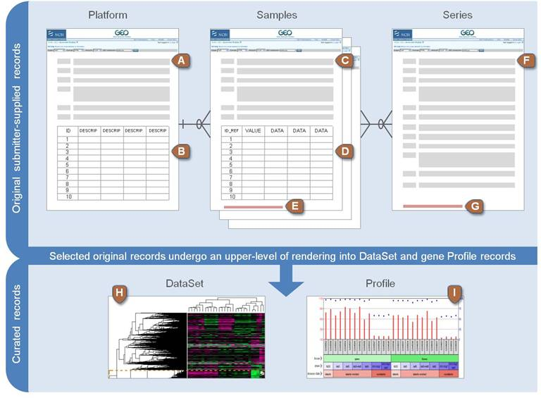
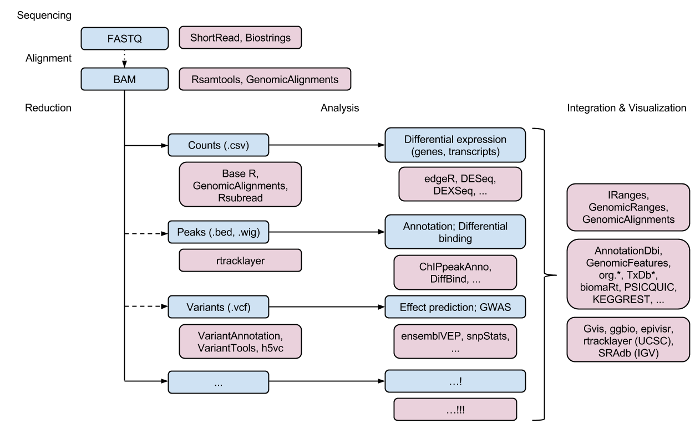

# Tools for High-throughput data


## High-throughput genomic data

{width=700}


**Sequence Read Archive**

[SRA](https://www.ncbi.nlm.nih.gov/sra) SRA (Sequence Read Archive)는 High-throughput 시퀀싱 데이터의 공개 데이터베이스 중 가장 큰 규모의 미국 국립 보건원(NIH)의 1차 데이터베이스로서 서열데이터 뿐만 아니라 메타데이터, 유전체, 및 환경 데이터를 포함합니다. NCBI와 EBI(European Bioinformatics Institute), DDBJ(DNA Database of Japan) 간 국제적 제휴를 통해 세 기관에서 제출 받은 데이터는 서로 공유되고 있습니다. 


간략한 사용법은 [NBK569238](https://www.ncbi.nlm.nih.gov/books/NBK569238/) 또는 [SRA download 문서](https://www.ncbi.nlm.nih.gov/sra/docs/sradownload/) 이곳을 참고하시기 바랍니다. 


데이터를 다운로드 할 수 있는 [NCBI SRA Toolkit](https://github.com/ncbi/sra-tools/wiki/01.-Downloading-SRA-Toolkit)을 제공하며 이 중 [MS Windows 64 bit architecture](https://ftp-trace.ncbi.nlm.nih.gov/sra/sdk/3.0.0/sratoolkit.3.0.0-win64.zip) 를 다운로드 받아 압축을 풀고 사용할 적절한 디렉토리로 옮겨 줍니다. 여기서는 `D:\sratoolkit.3.0.0-win64`이 곳에 이동해 두었고 전체 디렉토리 구성은 다음과 같습니다. 


명령을 어느 디렉토리에서나 사용하고 싶다면 위 경로의 `bin` 디렉토리를 `path`로 잡아주는 과정이 필요합니다. 다음 위치로 이동 후 "내PC > 속성 > 고급 시스템 설정 > 환경변수" 를 클릭하면 다음 창이 생성됩니다. 


Path를 선택후 편집을 클릭하면 다음 화면이 생성되고 새로만들기를 누른 후 `D:\sratoolkit.3.0.0-win64\bin`라고 입력해주고 모든 창에서 `확인`을 눌러주면 되겠습니다. 


이제 파일 탐색기로 파일을 다운로드 받을 작업 디렉토리로 이동한 후 주소창에 `cmd`이라고 입력해서 프롬프트가 있는 명령창을 실행합니다. 

fastq-dump.exe를 사용해서 다운로드 받을 수 있으며 최근에는 [fasterq-dump](https://github.com/ncbi/sra-tools/wiki/HowTo:-fasterq-dump)를 사용해서 더욱 빠르게 다운로드를 받을 수 있습니다. 



뒤에서 설명할 GEO 데이터베이스에서 [GSE148719](https://www.ncbi.nlm.nih.gov/geo/query/acc.cgi?acc=GSE148719) 데이터를 다운로드 해보겠습니다. 위 링크를 클릭해서 들어가면 화면 하단의 SRA Run Selector 라는 링크가 있고 이를 클릭하면 다음과 같은 화면이 보입니다. 

{width=600}

Metadata (SraRunTable.txt) 와 Accession list (SRR_Acc_List.txt)를 파일 형태로 다운로드 받은 후 적절한 전처리 후 사용하면 되겠습니다. 

~~~
prefetch --option-file SRR_Acc_List.txt
~~~

만약 하나의 fastq 데이터만 다운로드 받을 경우 다음과 같습니다. 

~~~
prefetch SRR11549076
~~~


이후 fasta 파일로 변환해 줍니다 

~~~
fasterq-dump --split-files SRR11549076
~~~

100000개 read만 별도로 저장 

~~~
fastq-dump -X 100000 --split-files SRR11549076
~~~


**Gene expression omnibus (GEO)**

GEO는 microarray, next-generation sequencing 등의 high-throughput 유전체 데이터를 보유한 공공 저장소입니다. 

* 대규모 기능유전체 데이터베이스 
* 데이터 기탁 쉽게 만들고 고수준 QC 유지
* 사용하기 쉬운 인터페이스 유지

[GEO](https://www.ncbi.nlm.nih.gov/geo/)

Platform, Sample, Series로 구성되어 있으며 Platform은 사용된 어레이 플랫폼에 대한 설명과 데이터 테이블로 구성되어 있습니다. GPLXXX 형태의 GEO 액세스 번호가 할당되며 하나의 플랫폼은 많은 샘플들에 사용될 수 있습니다. Sample은 개별 샘플이 처리된 조건 등의 설명이 있는 테이블로 구성되며 GSMxxx 형태의 GEO 등록 번호가 할당됩니다. Sample은 하나의 Platform만 참조 가능하며 여러 Series에 포함될 수 있습니다. Series는 관련된 샘플을 그룹화하고 전체 연구의 주요 설명을 제공합니다. GEO 등록 번호 GSExxx가 할당됩니다.


{width=700}


위 세 가지 타입 외에 Datasets 이 있으며 Datasets은 GDSxxx 아이디를 가집니다. 앞서 Series (GSExxx) 데이터가 연구자들이 업로드한 raw 데이터라고 한다면 Datasets (GDSxxx)는 관리자들에 의해 큐레이션된 데이터로 볼 수 있습니다. [브라우져](https://www.ncbi.nlm.nih.gov/geo/summary/)를 통해 쉽게 검색할 수 있습니다. Bioconductor에서는 `GEOquery`라는 패키지로 관련 파일들을 다운로드 받을 수 있습니다.  


```r
if (!requireNamespace("BiocManager", quietly = TRUE))
    install.packages("BiocManager")

BiocManager::install("GEOquery")

library(GEOquery)
#browseVignettes("GEOquery")
```

The `GDS` class


```r
gds <- getGEO(filename=system.file("extdata/GDS507.soft.gz",package="GEOquery"))
class(gds)
methods(class=class(gds))
Table(gds)
Columns(gds)
```

The `GSM` class - 샘플의 실제 측정값과 실험 조건 등 샘플별 정보 포함. 참고로 MAS 5.0 알고리즘은 서열의 Perfect-Match (PM)과 Mismatch (MM)를 이용해서 유전자의 발현을 정량화 하는 방법으로 (logged) PM-MM의 평균으로 계산함. 


```r
gsm <- getGEO(filename=system.file("extdata/GSM11805.txt.gz",package="GEOquery"))
methods(class=class(gsm))
head(Meta(gsm))
Table(gsm)
Columns(gsm)
```


The `GPL` class - 사용된 칩의 기본 Annotation 정보 


```r
gpl <- getGEO(filename=system.file("extdata/GPL97.annot.gz",package="GEOquery"))
gpl

```


The `GSE` class - 관련된 샘플, annotation 들의 집합 (실험) 


```r
gse <- getGEO(filename=system.file("extdata/GSE781_family.soft.gz",package="GEOquery"))
methods(class=class(gse))
Meta(gse)
head(GSMList(gse))
gsm <- GSMList(gse)[[1]]
Meta(gsm)
Table(gsm)
Columns(gsm)


GPLList(gse)
gpl <- GPLList(gse)[[1]]
class(gpl)
```


## ExpressionSet class

`Biobase` 패키지는 지놈 데이터를 관리하기 위한 표준화된 데이터 구조 class인 `ExpressionSet`를 제공합니다. ExpressionSet은 HT assay 데이터와 실험 meta를 포함하고 있습니다.

{width=700}
출처[BS831 lecture note](https://montilab.github.io/BS831/articles/docs/ExpressionSet.html)


GES 데이터 받기 [GSE2553](https://www.ncbi.nlm.nih.gov/geo/query/acc.cgi?acc=GSE2553) 


```r
gse2553 <- getGEO('GSE2553',GSEMatrix=TRUE)
gse2553
class(gse2553)
class(gse2553[[1]])
mygse <- gse2553[[1]]
?ExpressionSet
methods(class=class(mygse))
pData(mygse)
fData(mygse)
exprs(mygse)
```


GDS 데이터를 ExpressionSet class로 변환하기 

```r
gds <- getGEO(filename=system.file("extdata/GDS507.soft.gz",package="GEOquery"))
class(gds)
eset <- GDS2eSet(gds, do.log2=TRUE)
eset

```


## SummarizedExperiment Class

ExpressionSet은 일반적으로 행이 feature (유전자) 인 마이크로어레이 기반 실험 및 유전자 발현 데이터에 사용되었습니다. 그러나 유전체 분석을 위해서는 유전자 정보 외에도 유전체상의 위치 정보 등이 필요하며 이는 앞서 배운  GenomicRanges 형태의 데이터가 필요합니다. 따라서 최근에는 새로운 버전인 SummarizedExperiment class가  [SummarizedExperiment](https://bioconductor.org/packages/release/bioc/html/SummarizedExperiment.html) 개발되어 사용되고 있습니다.


```r
library(SummarizedExperiment)

#if (!requireNamespace("BiocManager", quietly = TRUE))
#    install.packages("BiocManager")

#BiocManager::install("airway")

library(airway)
data(airway, package="airway")
se <- airway
se
?RangedSummarizedExperiment 

# Row (features)
rowRanges(se)

# Column (sample)
colData(se)

# Experiment-wide metadata
metadata(se)

```


`SummarizedExperiment` 생성


```r
nrows <- 200
ncols <- 6
counts <- matrix(runif(nrows * ncols, 1, 1e4), nrows)
rowRanges <- GRanges(rep(c("chr1", "chr2"), c(50, 150)),
                     IRanges(floor(runif(200, 1e5, 1e6)), width=100),
                     strand=sample(c("+", "-"), 200, TRUE),
                     feature_id=sprintf("ID%03d", 1:200))
colData <- DataFrame(Treatment=rep(c("ChIP", "Input"), 3),
                     row.names=LETTERS[1:6])

se <- SummarizedExperiment(assays=list(counts=counts),
                     rowRanges=rowRanges, colData=colData)

# Row (regions-of-interest) data
rowRanges(se)

# Column (sample) data
colData(se)

# Experiment-wide metadata
metadata(se)

```


## High-throughput genomic data analysis


{width=700}


- Bioconductor에는 RNA-seq를 포함한 대규모 high-throughput 서열 데이터의 분석을 지원하는 많은 패키지가 있습니다. 


---


<a rel="license" href="http://creativecommons.org/licenses/by-nc-nd/4.0/"></a><br />이 저작물은 <a rel="license" href="http://creativecommons.org/licenses/by-nc-nd/4.0/">크리에이티브 커먼즈 저작자표시-비영리-변경금지 4.0 국제 라이선스</a>에 따라 이용할 수 있습니다.

